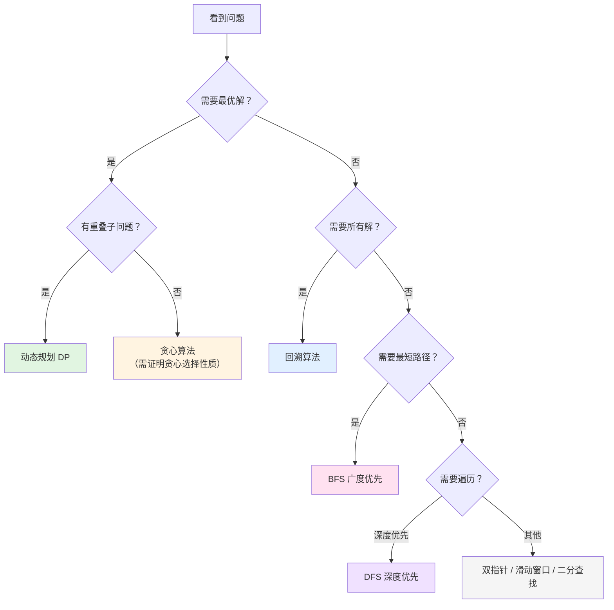

# 核心算法

!!! Quote

    **算法的本质是聪明地穷举。** 我们通过组合不同数据结构的特性，聪明地穷举问题，从而找到最优解。

## 算法思想

1. **空间换时间**：
   - **数据结构层面**：哈希表、前缀和、差分数组、记忆化递归（DP）
   - **系统层面**：Buffer（缓冲区，平滑速度差异）、Cache（缓存，避免重复计算/访问）
   - **核心思想**：用额外的存储空间来避免重复计算或加速访问
2. **边界条件**：差 1 问题、指针移动、数组越界、递归终止、整数溢出、循环条件（`<` vs `<=`）等，检查清单如下：

   | **通用边界**                                                                                                                                         | **数据结构特定边界**                                                                                                                                                           |
   | ---------------------------------------------------------------------------------------------------------------------------------------------------- | ------------------------------------------------------------------------------------------------------------------------------------------------------------------------------ |
   | □ 空输入（空数组、空字符串、nil）<br>□ 单元素<br>□ 两个元素（最小有意义输入）<br>□ 全部相同元素<br>□ 全部不同元素<br>□ 最大/最小值<br>□ 负数/零/正数 | □ **树**：空树、单节点、只有左子树、只有右子树<br>□ **链表**：空链表、单节点、环形链表<br>□ **字符串**：空串、单字符、回文、全部相同字符<br>□ **图**：无边、单节点、环、不连通 |

3. 小技巧：数组原地修改->逆序修改
4. 许多题目的关键在于推导出公式，公式推导步骤如下：
   1. 求什么？
   2. 哪些参数是变量？
   3. 变量变化的时机是什么时候？
   4. 终止条件是什么？
5. 题目想不出来的时候，手动模拟小数据推导，画出执行过程，比如递归树、DP 表格等

技巧

- 指针往复时，可以定义一个值为 -1 的变量，在开始和结束的地方反转反向，比如 [6. Z 字形变换](https://leetcode.cn/problems/zigzag-conversion/)

  ```go
  direction := -1
  if i == 0 || i == len(s)-1 {
      direction = -direction
  }
  ```

模板

堆（Heap）/优先队列

```go
type IntHeap []int
func (h IntHeap) Len() int           { return len(h) }
func (h IntHeap) Less(i, j int) bool { return h[i] < h[j] } // 小顶堆
func (h IntHeap) Swap(i, j int)      { h[i], h[j] = h[j], h[i] }
func (h *IntHeap) Push(x any)        { *h = append(*h, x.(int)) }
func (h *IntHeap) Pop() any {
    old := *h
    n := len(old)
    x := old[n-1]
    *h = old[0 : n-1]
    return x
}
```

二分查找

```go
func binarySearch(nums []int, target int) int {
    left, right := 0, len(nums)-1
    for left <= right { // 注意是 <=
        mid := left + (right-left)/2 // 防溢出
        if nums[mid] == target {
            return mid
        } else if nums[mid] < target {
            left = mid + 1
        } else {
            right = mid - 1
        }
    }
    return -1
}
```

快速排序 (Quick Sort) / 快速选择 (Quick Select)

滑动窗口

```go
for right < len(s) {
    // 1. 右窗口扩大，加入 s[right]
    window[s[right]]++
    right++

    // 2. 满足收缩条件（例如窗口过大或不满足要求）
    for needShrink {
        // 3. 左窗口收缩，移除 s[left]
        window[s[left]]--
        left++
    }
}
```

思维框架模板

BFS (层序遍历)：看到“最短路径”、“层序”，立刻在大脑里把 queue 和 visited map 初始化好。

DFS (回溯)：看到“全排列”、“所有组合”，立刻写出：

```go
func backtrack(path, choices) {
    if 结束条件 { add(path); return }
    for choice := range choices {
        make(choice)
        backtrack(path, choices)
        undo(choice) // 撤销
    }
}
```

单调栈：看到“下一个更大元素”，立刻想到用栈存索引

## 数据结构演进

数据结构的演进体现了从简单到复杂、从线性到网状的思维转变:

- **链表 → 二叉树**: 从线性思维到递归思维，每个节点从最多 1 个子节点扩展到 2 个
- **二叉树 → 树**: 从递归到分治，节点可以有任意多个子节点
- **树 → 图**: 从层次结构到网状结构，打破了"无环"的限制，节点间可以有任意连接

$$
\begin{array}{c c c c c c c}
  \textbf{链表}
  & \xtofrom[\text{每个节点最多1个子节点}]{\text{线性}\to\text{递归思维}}
  & \textbf{二叉树}
  & \xtofrom[\text{每个节点最多2个子节点}]{\text{分治思维}}
  & \textbf{树}
  & \xtofrom[\text{无环且连通}]{\text{网状思维}}
  & \textbf{图} \\

  \begin{matrix} \scriptsize\text{一对一} \\ \scriptsize\text{线性结构} \end{matrix} &&
  \begin{matrix} \scriptsize\text{一对二} \\ \scriptsize\text{层次结构} \end{matrix} &&
  \begin{matrix} \scriptsize\text{一对多} \\ \scriptsize\text{层次结构} \end{matrix} &&
  \begin{matrix} \scriptsize\text{多对多} \\ \scriptsize\text{网状结构} \end{matrix} &&
\end{array}
$$

# 算法选择指南

## 核心算法对比

| 算法         | 穷举对象             | 优化手段       | 问题类型           | 重叠子问题 | 时间复杂度          | 典型问题                           |
| ------------ | -------------------- | -------------- | ------------------ | ---------- | ------------------- | ---------------------------------- |
| **BFS**      | 按层遍历所有节点     | 队列 + visited | 最短路径、层级遍历 | 无         | $O(V+E)$            | 最短路径、层序遍历、岛屿数量       |
| **DFS**      | 深度优先遍历所有路径 | 递归/栈        | 路径探索、连通性   | 无         | $O(V+E)$            | 路径总和、岛屿数量、图遍历         |
| **回溯**     | 所有可能的路径/组合  | 剪枝           | 求所有解、可行解   | 通常没有   | $O(2^n)$ 或 $O(n!)$ | 全排列、N皇后、组合总和、数独      |
| **动态规划** | 所有可能的状态       | 记忆化（缓存） | 求最优解           | 必须有     | $O(n)$ ~ $O(n^2)$   | 背包、最长子序列、爬楼梯、硬币找零 |
| **贪心**     | 每步的局部最优       | 贪心选择       | 特定最优解         | 无         | $O(n \\log n)$      | 区间调度、跳跃游戏、分发饼干       |
| **二分查找** | 有序空间的中点       | 折半缩小范围   | 查找、边界         | 无         | $O(\\log n)$        | 搜索插入位置、寻找峰值             |
| **滑动窗口** | 连续子数组/子串      | 双指针动态调整 | 子串/子数组问题    | 无         | $O(n)$              | 最长无重复子串、最小覆盖子串       |
| **双指针**   | 数组/链表元素对      | 快慢/对撞指针  | 去重、两数之和     | 无         | $O(n)$              | 两数之和、移除元素、回文判断       |

## 详细决策指南

### 🔍 BFS（广度优先搜索）

**使用信号**：

- ✅ 需要找 **最短路径**（无权图）
- ✅ 需要 **层序遍历**（树的层级、距离）
- ✅ 需要找 **最少步数**
- ✅ 关键词：最短、最少、层、距离

**典型问题**：

- 二叉树层序遍历
- 最短路径（迷宫、网格）
- 岛屿数量
- 单词接龙

**模板**：

```go
queue := []Node{start}
visited := make(map[Node]bool)
for len(queue) > 0 {
    node := queue[0]
    queue = queue[1:]
    // 处理节点
    for _, next := range node.neighbors {
        if !visited[next] {
            queue = append(queue, next)
            visited[next] = true
        }
    }
}
```

---

### 🌲 DFS（深度优先搜索）

**使用信号**：

- ✅ 需要 **遍历所有路径**
- ✅ 需要 **检查连通性**
- ✅ 需要 **路径相关信息**（路径和、路径节点）
- ✅ 关键词：路径、连通、遍历

**典型问题**：

- 路径总和
- 岛屿数量
- 图的连通性
- 二叉树的所有路径

**模板**：

```go
func dfs(node Node, visited map[Node]bool) {
    if node == nil || visited[node] {
        return
    }
    visited[node] = true
    // 处理节点
    for _, next := range node.neighbors {
        dfs(next, visited)
    }
}
```

---

### 🔄 回溯（Backtracking）

**使用信号**：

- ✅ 需要找 **所有解** 或 **某一个可行解**
- ✅ 问题可以表示为 **决策树**
- ✅ 需要 **排列、组合、子集**
- ✅ 没有明显的重叠子问题
- ✅ 关键词：所有、全部、可能的组合

**典型问题**：

- 全排列
- N皇后
- 组合总和
- 数独
- 括号生成

**模板**：

```go
func backtrack(path []int, choices []int) {
    if 满足结束条件 {
        result = append(result, append([]int{}, path...))
        return
    }
    for i, choice := range choices {
        // 做选择
        path = append(path, choice)
        // 递归
        backtrack(path, choices[i+1:])
        // 撤销选择
        path = path[:len(path)-1]
    }
}
```

---

### 📊 动态规划（Dynamic Programming）

**使用信号**：

- ✅ 需要找 **最优解**（最大、最小、最长）
- ✅ 有 **重叠子问题**
- ✅ 有 **最优子结构**
- ✅ 关键词：最大、最小、最长、最多、最少

**典型问题**：

- 背包问题
- 硬币找零
- 最长递增子序列
- 爬楼梯
- 股票买卖

**模板**：

```go
// 一维 DP
dp := make([]int, n+1)
dp[0] = 初始值
for i := 1; i <= n; i++ {
    dp[i] = 状态转移方程
}
return dp[n]
```

---

### 💰 贪心（Greedy）

**使用信号**：

- ✅ 局部最优能导致全局最优
- ✅ 问题有 **贪心选择性质**
- ✅ 通常涉及 **排序** 后做选择
- ✅ 关键词：区间、调度、最优分配

**典型问题**：

- 区间调度
- 跳跃游戏
- 分发饼干
- 加油站

**注意**：贪心不一定正确，需要证明贪心选择性质！

---

### 🎯 二分查找（Binary Search）

**使用信号**：

- ✅ 数组 **有序** 或 **部分有序**
- ✅ 需要在 **O(log n)** 时间内查找
- ✅ 需要找 **边界**（第一个/最后一个）
- ✅ 关键词：有序、查找、边界

**典型问题**：

- 搜索插入位置
- 寻找峰值
- 搜索旋转排序数组
- 寻找两个正序数组的中位数

---

### 🪟 滑动窗口（Sliding Window）

**使用信号**：

- ✅ 需要找 **连续子数组/子串**
- ✅ 问题涉及 **区间/窗口**
- ✅ 需要动态调整窗口大小
- ✅ 关键词：子串、子数组、连续、窗口

**典型问题**：

- 最长无重复字符子串
- 最小覆盖子串
- 字符串的排列
- 找到字符串中所有字母异位词

**模板**：

```go
left := 0
for right := range s {
    // 扩大窗口
    window[s[right]]++

    // 收缩窗口
    for 窗口不满足条件 {
        window[s[left]]--
        left++
    }

    // 更新结果
}
```

---

### ↔️ 双指针（Two Pointers）

**使用信号**：

- ✅ 需要 **原地修改** 数组
- ✅ 需要在 **有序数组** 中查找
- ✅ 需要 **去重、移除元素**
- ✅ 关键词：原地、有序、对撞、快慢

**典型问题**：

- 两数之和（有序数组）
- 移除元素
- 反转字符串
- 链表环检测

**模板**：

```go
// 快慢指针
slow := 0
for fast := range nums {
    if 满足条件 {
        nums[slow] = nums[fast]
        slow++
    }
}

// 对撞指针
left, right := 0, len(nums)-1
for left < right {
    if 满足条件 {
        return
    } else if 需要增大 {
        left++
    } else {
        right--
    }
}
```

---

## 快速决策流程图



## 链表

## 二叉树

### 二分查找

### 树的遍历

## 数组

### 前缀和

**解决的问题：** 通过预构建前缀和数组，将 **频繁查询区间和** 的时间复杂度从 $O(n)$ 降低到 $O(1)$，典型的空间换时间思想。

**核心技巧：**

- 前缀和数组长度比原数组多 1（`prefixSum[0] = 0`），类似链表的 dummy head，避免边界判断
- 构造公式：`prefixSum[i+1] = prefixSum[i] + nums[i]`
- 查询公式：`sum[left, right] = prefixSum[right+1] - prefixSum[left]`（左右都是闭区间）

**应用场景：**

- 销售数据分析：快速查询任意时间段的销售总额
- 流量统计：网站流量监控，快速计算任意时间区间的访问量
- 股票分析：计算股票在任意时间段内的累计涨跌幅
- 账户余额查询：快速计算任意时间段的收支总和
- 传感器数据：快速查询温度、湿度等传感器在某时间段的平均值

详见：[前缀和算法总结](patterns/prefix_sum/README.md)

### 差分数组

**解决的问题：** 将 **频繁对数组区间进行修改** 的时间复杂度从 $O(n)$ 降低到 $O(1)$，是前缀和的逆运算。

**核心技巧：**

- 差分数组长度与原数组相同
- 构造公式：`diff[0] = nums[0]`，`diff[i] = nums[i] - nums[i-1]` (i > 0)
- 区间修改：`diff[left] += val`，`diff[right+1] -= val`（需要注意 right+1 的边界）
- 还原数组：对差分数组求前缀和

**应用场景：**

- 区间修改问题：航班预订、拼车等
- 判断是否超载：火车、拼车等场景

详见：[差分数组算法总结](patterns/difference_array/README.md)

---

## 算法技巧与注意事项

### 循环不变量（Loop Invariant）

**循环不变量** 是理解和编写正确算法的关键。它是一个在循环执行过程中始终保持为真的条件。

**示例：快慢指针**

```go
// 循环不变量：[0, slow) 区间内的元素都不等于 val
slow := 0
for fast := range nums {
    if nums[fast] != val {
        nums[slow] = nums[fast]
        slow++
    }
}
// 循环结束时，不变量仍然成立
```

**示例：二分查找**

```go
// 循环不变量：target 如果存在，必在 [left, right] 区间内
left, right := 0, len(nums)-1
for left <= right {
    mid := left + (right-left)/2
    if nums[mid] == target {
        return mid
    } else if nums[mid] < target {
        left = mid + 1  // 维护不变量：target > nums[mid]
    } else {
        right = mid - 1  // 维护不变量：target < nums[mid]
    }
}
```

**好处**：

- 帮助理解算法的正确性
- 指导边界条件的处理
- 简化调试过程

---

### 常见边界条件陷阱

#### 1. 循环条件：`<` vs `<=`

**对撞指针**：

| 循环条件        | 使用场景                       | 原因                                     |
| --------------- | ------------------------------ | ---------------------------------------- |
| `left < right`  | 成对处理元素（回文、两数之和） | `left == right` 时指向同一元素，无需处理 |
| `left <= right` | 需要处理所有元素（二分查找）   | `left == right` 时还有一个元素未检查     |

**判断技巧**：问自己"当 `left == right` 时，我还需要处理这个元素吗？"

#### 2. 指针/索引移动时机

**双指针问题**：

```go
// ❌ 错误：右边换来的元素可能也需要处理
if nums[left] == val {
    nums[left] = nums[right]
    right--
    left++  // 错误！
}

// ✅ 正确：重新检查新换来的元素
if nums[left] == val {
    nums[left] = nums[right]
    right--
} else {
    left++
}
```

**递归问题**：

```go
// ❌ 错误：可能导致无限递归
func dfs(i int) {
    if i == n {  // 边界条件不完整
        return
    }
    dfs(i + 1)
}

// ✅ 正确：完整的边界检查
func dfs(i int) {
    if i < 0 || i >= n {  // 检查上下界
        return
    }
    dfs(i + 1)
}
```

#### 3. 数组/切片越界

常见场景：

- **二分查找**：`mid = left + (right - left) / 2` 避免溢出
- **区间操作**：注意 `right + 1` 是否越界
- **链表**：检查 `node != nil` 再访问 `node.Next`
- **矩阵遍历**：检查 `i < rows && j < cols`
- **滑动窗口**：确保 `right < len(arr)` 再访问

#### 4. 整数溢出

```go
// ❌ 错误：可能溢出
mid := (left + right) / 2

// ✅ 正确
mid := left + (right - left) / 2

// ❌ 错误：乘法可能溢出
result := a * b

// ✅ 正确：先检查
if a > math.MaxInt64 / b {
    // 处理溢出
}
```

#### 5. 递归终止条件

```go
// ❌ 错误：缺少边界检查
func fibonacci(n int) int {
    return fibonacci(n-1) + fibonacci(n-2)
}

// ✅ 正确：完整的基准情况
func fibonacci(n int) int {
    if n <= 1 {
        return n
    }
    return fibonacci(n-1) + fibonacci(n-2)
}
```

#### 6. 动态规划初始化

```go
// ❌ 错误：初始值不正确
dp := make([]int, n)  // 默认为 0，可能不适合求最小值

// ✅ 正确：根据问题初始化
dp := make([]int, n)
for i := range dp {
    dp[i] = math.MaxInt  // 求最小值时初始化为最大值
}
dp[0] = 0  // 设置基准情况
```

---

### 调试策略

#### 1. 手动模拟小数据

**数组/双指针**：用 2-3 个元素手动走一遍

```
nums = [2, 3, 2], val = 2
初始：left=0, right=2
     [2, 3, 2]
      ↑     ↑
...
```

**递归/树**：画出递归树

```
        fib(4)
       /      \
    fib(3)   fib(2)
    /   \     /   \
fib(2) fib(1) ...
```

**动态规划**：列出 DP 表格

```
i:    0  1  2  3  4
dp:   0  1  1  2  3
```

#### 2. 边界条件检查清单

**通用**：

```markdown
□ 空输入（空数组、空字符串、nil）
□ 单元素
□ 两个元素（最小有意义输入）
□ 全部相同元素
□ 全部不同元素
□ 最大/最小值
□ 负数/零/正数
```

**特定类型**：

```markdown
□ 树：空树、单节点、只有左子树、只有右子树
□ 链表：空链表、单节点、环形链表
□ 字符串：空串、单字符、回文、全部相同字符
□ 图：无边、单节点、环、不连通
```

#### 3. 使用测试驱动开发

```go
tests := []struct{
    name     string
    input    []int
    expected int
}{
    {"空数组", []int{}, 0},
    {"单元素", []int{1}, 1},
    {"全部移除", []int{2,2,2}, 0},
    {"边界元素", []int{2,1,3}, 2},
    {"连续重复", []int{1,2,2,2,3}, 3},
}
```

#### 4. 添加断言和日志

```go
// 开发时添加断言
if slow < 0 || slow > len(nums) {
    panic("slow out of bounds")
}

// 调试时添加日志
fmt.Printf("left=%d, right=%d, nums=%v\n", left, right, nums)
```

---

### 常用算法模板

#### 双指针

**快慢指针**（数组去重/移除）：

```go
slow := 0
for fast := range nums {
    if 满足条件 {
        nums[slow] = nums[fast]
        slow++
    }
}
```

**对撞指针**（两数之和）：

```go
left, right := 0, len(nums)-1
for left < right {
    sum := nums[left] + nums[right]
    if sum == target {
        return []int{left, right}
    } else if sum < target {
        left++
    } else {
        right--
    }
}
```

**滑动窗口**：

```go
left := 0
for right := range s {
    // 扩大窗口
    窗口状态更新

    // 收缩窗口
    for 窗口不满足条件 {
        窗口状态更新
        left++
    }

    // 更新结果
}
```

#### 二分查找

**标准二分**：

```go
left, right := 0, len(nums)-1
for left <= right {
    mid := left + (right-left)/2
    if nums[mid] == target {
        return mid
    } else if nums[mid] < target {
        left = mid + 1
    } else {
        right = mid - 1
    }
}
return -1
```

**寻找左边界**：

```go
left, right := 0, len(nums)
for left < right {
    mid := left + (right-left)/2
    if nums[mid] < target {
        left = mid + 1
    } else {
        right = mid
    }
}
return left
```

#### 递归

**标准递归模板**：

```go
func dfs(参数) 返回值 {
    // 1. 终止条件
    if 到达边界 {
        return 边界值
    }

    // 2. 递归调用
    result := dfs(更小的问题)

    // 3. 处理当前层
    当前层处理逻辑

    return 结果
}
```

**回溯模板**：

```go
func backtrack(路径, 选择列表) {
    if 满足结束条件 {
        result = append(result, 路径)
        return
    }

    for 选择 in 选择列表 {
        做选择
        backtrack(路径, 新的选择列表)
        撤销选择
    }
}
```

#### 动态规划

**一维 DP**：

```go
dp := make([]int, n+1)
dp[0] = 初始值

for i := 1; i <= n; i++ {
    dp[i] = 状态转移方程
}
return dp[n]
```

**二维 DP**：

```go
dp := make([][]int, m+1)
for i := range dp {
    dp[i] = make([]int, n+1)
}

// 初始化
for i := 0; i <= m; i++ {
    dp[i][0] = 初始值
}

// 状态转移
for i := 1; i <= m; i++ {
    for j := 1; j <= n; j++ {
        dp[i][j] = 状态转移方程
    }
}
return dp[m][n]
```

#### 树的遍历

**前序遍历**（递归）：

```go
func preorder(root *TreeNode) {
    if root == nil {
        return
    }
    处理当前节点
    preorder(root.Left)
    preorder(root.Right)
}
```

**层序遍历**（BFS）：

```go
queue := []*TreeNode{root}
for len(queue) > 0 {
    size := len(queue)
    for i := 0; i < size; i++ {
        node := queue[0]
        queue = queue[1:]

        处理当前节点

        if node.Left != nil {
            queue = append(queue, node.Left)
        }
        if node.Right != nil {
            queue = append(queue, node.Right)
        }
    }
}
```

---

### 学习建议

1. **专注一个模式**：先掌握一种模式（如双指针），做 10-15 道类似题
2. **总结不变量**：每道题都明确循环不变量或递归不变量
3. **手动模拟**：遇到问题时，用小数据手动走一遍
4. **建立模板库**：总结常见模式的代码模板
5. **定期复习**：间隔重复，巩固记忆
6. **对比相似题**：找出同一模式下不同题目的共性和差异
7. **总结易错点**：记录自己容易出错的地方

**记住**：不要追求"一次写对"，通过测试发现问题、理解原因、总结规律，才是最有效的学习方式。
