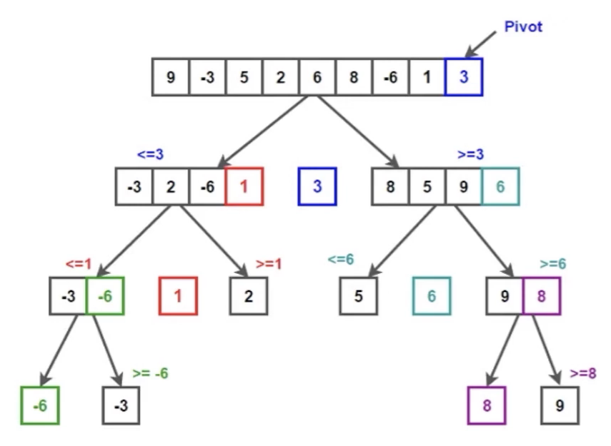
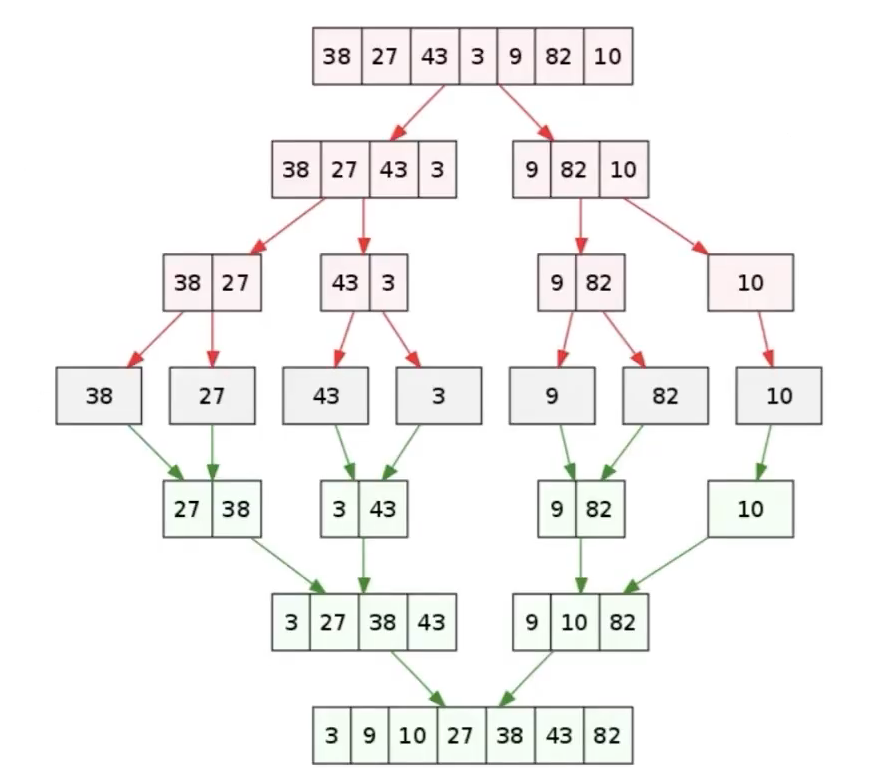
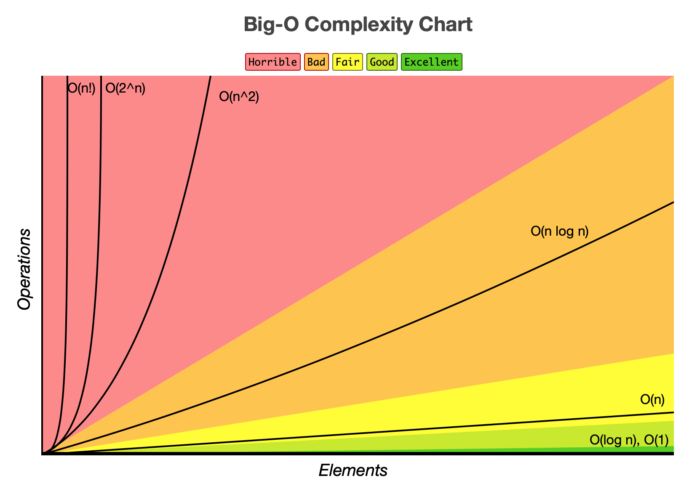
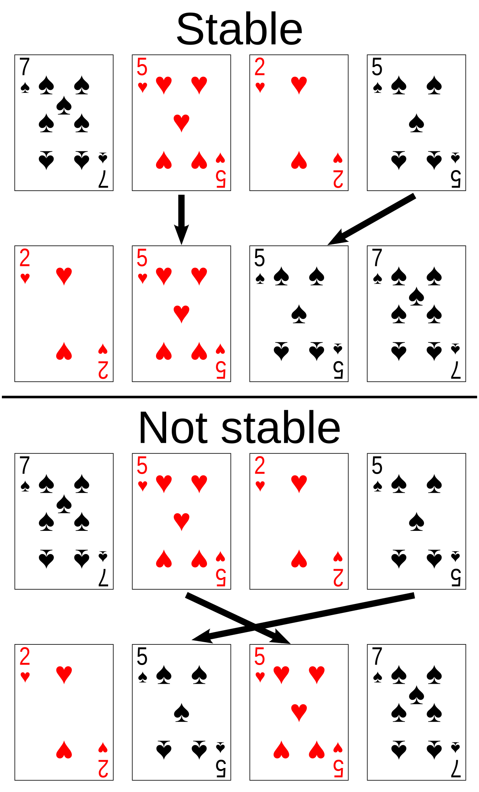

# 排序算法总结

排序算法是算法与数据结构领域的基础内容，广泛应用于数据处理、查找、去重等场景。掌握常见排序算法及其原理、复杂度和适用场景，是算法学习和面试的必备技能。

排序的方法有**插入**、**交换**、**选择**、**合并**等。

## 十大常用基础排序算法

| 名称                                 | 数据对象   | 稳定性 | 比较类？ | 时间复杂度（平均/最坏）              | 空间复杂度          | 原理                                            | 描述                                                                                                                                                     | 适用场景                       |
| :----------------------------------- | :--------- | :----- | -------- | :----------------------------------- | :------------------ | ----------------------------------------------- | :------------------------------------------------------------------------------------------------------------------------------------------------------- | ------------------------------ |
| **冒泡排序** （bubble sort）    | 数组       | ✓      | ✓        | _O_(*n*²)                            | _O_(1)              | 每轮将相邻元素两两比较，大的往后交换，重复 n 轮 | (无序区, 有序区)。 从无序区通过交换找出最大元素放到有序区前端。                                                                                     | 数据量小、对稳定性有要求       |
| **选择排序** （selection sort） | 数组       | ×      | ✓        | _O_(*n*²)                            | _O_(1)              | 每轮选择剩余元素中的最小值，放到前面            | (有序区, 无序区)。 在无序区里找一个最小的元素跟在有序区的后面。对数组：比较得多，换得少。                                                           | 数据量小                       |
|                                      | 链表       | ✓      | ✓        |                                      |                     |                                                 |                                                                                                                                                          |                                |
| **插入排序** （insertion sort） | 数组、链表 | ✓      | ✓        | _O_(*n*²)                            | _O_(1)              | 每次将一个元素插入到已排序部分的合适位置        | (有序区, 无序区)。 把无序区的第一个元素插入到有序区的合适位置。对数组：比较得少，换得多。                                                           | 数据量小、部分有序             |
| **堆排序** （heap sort）        | 数组       | ×      | ✓        | _O_(_n_ log _n_)                     | _O_(1)              | 构建最大/最小堆，依次取出堆顶元素               | (最大堆, 有序区)。 从堆顶把根卸出来放在有序区之前，再恢复堆。                                                                                       | 需要原地排序                   |
| **归并排序** （merge sort）     | 数组       | ✓      | ✓        | _O_(_n_ log² _n_) / _O_(_n_ log _n_) | _O_(n) + _O_(log n) | 递归分组，合并有序子数组                        | 把数据分为两段，从两段中逐个选最小的元素移入新数据段的末尾。可从上到下或从下到上进行。                                                                   | 大数据、链表排序、稳定性要求高 |
|                                      | 链表       | ✓      | ✓        | _O_(_n_ log _n_)                     | _O_(1)              |                                                 |                                                                                                                                                          |                                |
| **快速排序** （quick sort）     | 数组       | ×      | ✓        | _O_(_n_ log _n_) / _O_(*n*²)         | _O_(log _n_)        | 选定基准，分区递归排序左右两部分                | (小数, 基准元素, 大数)。 在区间中随机挑选一个元素作基准，将小于基准的元素放在基准之前，大于基准的元素放在基准之后，再分别对小数区与大数区进行排序。 | 通用、高效排序                 |
|                                      | 链表       | ✓      | ✓        |                                      |                     |                                                 |                                                                                                                                                          |                                |
| **希尔排序** （shell sort）     | 数组       | ×      | ✓        | _O_(_n_ log² _n_) / _O_(*n*²)        | _O_(1)              |                                                 | 每一轮按照事先决定的间隔进行插入排序，间隔会依次缩小，最后一次一定要是 1。                                                                               |                                |
| **计数排序** （counting sort）  | 数组、链表 | ✓      | ×        | _O_(_n_ + _m_)                       | _O_(_n_ + _m_)      | 利用元素值域特性进行分组计数或分桶              | 统计小于等于该元素的值的元素的个数 i，于是该元素就放在目标数组的索引 i 位 (i≥0)。                                                                        | 数据范围有限、整数排序         |
| **桶排序** （bucket sort）      | 数组、链表 | ✓      | ×        | _O_(_n_) / _O_(*n*²)                 | _O_(_m_)            |                                                 | 将值为 i 的元素放入 i 号桶，最后依次把桶里的元素倒出来。                                                                                                 |                                |
| **基数排序** （radix sort）     | 数组、链表 | ✓      | ×        | _O_(_k_ × _n_) / _O_(*n*²)           | _O_(n)              |                                                 | 一种多关键字的排序算法，可用桶排序实现。                                                                                                                 |                                |

表格说明：

- 均按从小到大排列
- k 代表数值中的"数位"个数
- n 代表数据规模
- m 代表数据的最大值减最小值

表格备注：

- 计数排序、桶排序、基数排序均为非比较类排序，现代编程语言的内置排序（比如 C++、Java、Python）都是**比较类排序**（一般 O(n log n)），因为要能支持**通用对象排序**。
- 排序算法是算法基础，建议至少熟练掌握冒泡、插入、选择、快排、归并五种实现。
- 选择合适的排序算法需结合数据规模、稳定性需求和空间限制。

  <table border="0" cellpadding="0" cellspacing="0">
    <tr>
      <td align="center" valign="bottom" style="padding-right: 20px;">
         
        快速排序示意图
      </td>
      <td align="center" valign="bottom" style="padding-left: 20px;">
         
        归并排序示意图
      </td>
    </tr>
  </table>

### 复杂度

在计算机科学中，我们通常用大O来描述某个特定算法时间与空间随着数据规模增加而变化的趋势。

    

### 稳定性与不稳定性

    

我们以纸牌排序为例，当纸牌用稳定排序按点值排序的时候，两个 5 之间必定保持它们最初的次序。在用不稳定排序来排序的时候，两个 5 可能被按相反次序来排序。

## 工程常用算法

### Tim 排序（归并+插入）

Timsort 是一中混合（归并+插入）稳定的排序算法。具有 _O_(_n_ log _n_) 的平均和最坏时间复杂度，最优可达 _O_(n)，空间复杂度为 _O_(n)。该算法是目前已知最快的排序算法，在 Python、Swift、Rust 等语言的内置排序功能中被用作默认算法。

### 内省排序（Introsort）（快排+堆排）

内省排序首先从快速排序开始，当递归深度超过一定深度（深度为排序元素数量的对数值）后转为堆排序。采用这个方法，内省排序既能在常规数据集上实现快速排序的高性能，又能在最坏情况下仍保持 _O_(_n_ log _n_) 的时间复杂度。由于这两种算法都属于比较排序算法，所以内省排序也是一个比较排序算法。

### 不同语言内置排序算法对比

| **语言 / 库**                          | **算法实现**                                  | **稳定性** | **特点**                                       |
| -------------------------------------- | --------------------------------------------- | ---------- | ---------------------------------------------- |
| **C (qsort)**                          | 快速排序为主（不同实现可能混合插入排序）      | ×          | 简单高效，但可能退化到 O(n²)                   |
| **C++ (std::sort)**                    | **Introsort**（快速排序 + 堆排序 + 插入排序） | ×          | 平均 O(n log n)，最坏 O(n log n)，避免快排退化 |
| **C++ (std::stable_sort)**             | 归并排序（常带优化）                          | ✓          | 保证稳定性，但需要额外内存                     |
| **Java (Arrays.sort, 基本类型)**       | **Dual-Pivot QuickSort**（双轴快排）          | ×          | 比普通快排常数更小，性能优越                   |
| **Java (Arrays.sort, 对象类型)**       | **Timsort**（归并 + 插入）                    | ✓          | 对部分有序数据非常快，最坏 O(n log n)          |
| **Python (list.sort / sorted)**        | **Timsort**                                   | ✓          | 专门为现实数据优化，利用已有有序片段           |
| **JavaScript (V8 引擎)**               | 小数组：插入排序；大数组：快排 + 混合         | ×          | 对象数组时可能使用归并变体                     |
| **JavaScript (SpiderMonkey, Firefox)** | **Timsort / 归并变体**                        | ✓          | 性能和 Python 类似                             |
| **Go (sort.Sort)**                     | **Introsort**（快排 + 堆排 + 插入）           | ×          | 类似 C++ std::sort                             |
| **Rust (sort)**                        | **Introsort**（快排 + 堆排 + 插入）           | ×          | 与 C++ 类似                                    |
| **Rust (sort_stable)**                 | **归并排序**                                  | ✓          | 保证稳定性                                     |

- 几乎所有标准库排序都是 **混合算法**，避免单一算法的缺陷，保证最坏复杂度不超过 O(n log n)
- 数值数组：大多用快速排序或 Introsort（追求性能）。
- 对象数组（需要稳定性）：多数用 Timsort / 归并排序。
- 小规模数据：经常用 插入排序 优化。
