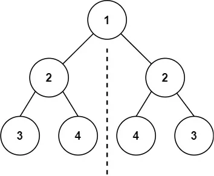

# Go 刷题清单

## 哈希表

=== "两数之和"

    ```go
    func twoSum(nums []int, target int) []int {
        // 哈希表记录出现的元素及索引
        // 遍历 nums，如果 target - num 在哈希表中，返回索引
        // 否则将 num 加入哈希表

        seen := map[int]int{}
        for i, num := range nums {
            if prevIndex, ok := seen[target-num]; ok {
                return []int{prevIndex, i}
            }
            seen[num] = i
        }

        return []int{}
    }
    ```

=== "字母异位词分组"

## 双指针

=== "无重复字符的最长子串"

    ```go
    func lengthOfLongestSubstring(s string) int {
        // 哈希表记录出现的元素及索引
        // 哈希表出现的元素，left 移动到哈希表中索引 +1 位置，否则右指针右移扩大窗口

        seen := map[byte]int{}
        left, right, maxWin := 0, 0, 0
        for right < len(s) {
            if prevIndex, ok := seen[s[right]]; ok {
                left = prevIndex + 1
            }

            seen[s[right]] = right
            right++

            maxWin = max(maxWin, right-left)
        }

        return maxWin
    }
    ```

=== "三数之和"

    对撞指针

=== "最长回文子串"

=== "下一个排列"

=== "合并两个有序数组"

=== "合并区间"

=== "比较版本号"

## 链表

=== "反转链表"

    ```go
    func reverseList(head *ListNode) *ListNode {
        var prev *ListNode
        // 暂存、反转、移动
        for head != nil {
            next := head.next
            head.Next = prev
            prev = head
            head = next
        }

        return prev
    }
    ```

=== "局部反转链表"

    头插法，将每个要反转的节点连接到 `prev` 后

    ```go
    func reverseBetween(head *ListNode, left, right int) *ListNode {
        dummy := &ListNode{Next: head}

        prev := dummy
        for range left - 1 {
            prev = prev.Next
        }

        cur := prev.Next
        for range right - left {
            next := cur.Next
            cur.Next = next.Next
            next.Next = prev.Next
            prev.Next = next
        }

        return dummy.Next
    }
    ```

    

=== "K个一组反转链表"

    分组+局部反转

    ```go
    func reverseKGroup(head *ListNode, k int) *ListNode {
    	dummy := &ListNode{Next: head}
    	pre := dummy

    	for {
    		tail := pre
    		for range k {
    			tail = tail.Next
    			if tail == nil {
    				return dummy.Next
    			}
    		}

    		nextGroup := tail.Next

    		cur := pre.Next
    		for range k - 1 {
    			next := cur.Next
    			cur.Next = next.Next
    			next.Next = pre.Next
    			pre.Next = next
    		}

    		cur.Next = nextGroup
    		pre = cur
    	}
    }
    ```

=== "判断链表是否有环"

    快慢指针解法：快指针走两步，慢指针走一步，相遇则有环

    ```go
    func hasCycle(head *ListNode) bool {
        slow, fast := head, head
        for fast != nil && fast.Next != nil {
            slow, fast = slow.Next, fast.Next.Next
            if slow == fast {
                return true
            }
        }

        return false
    }
    ```

=== "找到环形链表的入口"

    ```go
    func detectCycle(head *ListNode) *ListNode {
        seen := map[*ListNode]struct{}{}
        for head != nil {
            if _, ok := seen[head]; ok {
                return head
            }
            seen[head] = struct{}{}
            head = head.Next
        }

        return nil
    }
    ```

=== "合并两个有序链表"

=== "相交链表"

=== "重排链表"

=== "排序链表"

    归并排序

=== "LRU缓存"

    双向链表 + 哈希表

    ```go
    type Node struct {
    	key, value int
    	prev, next *Node
    }

    type LRUCache struct {
    	capacity int
    	cache    map[int]*Node // 哈希表：key -> 链表节点
    	head     *Node         // 虚拟头节点（最近使用）
    	tail     *Node         // 虚拟尾节点（最久未使用）
    }

    func Constructor(capacity int) LRUCache {
    	lru := LRUCache{
    		capacity: capacity,
    		cache:    make(map[int]*Node),
    		head:     &Node{},
    		tail:     &Node{},
    	}
    	lru.head.next = lru.tail
    	lru.tail.prev = lru.head
    	return lru
    }

    func (lc *LRUCache) Get(key int) int {
    	if node, exists := lc.cache[key]; exists {
    		// 将节点移到头部（标记为最近使用）
    		lc.moveToHead(node)
    		return node.value
    	}
    	return -1
    }

    func (lc *LRUCache) Put(key int, value int) {
    	if node, exists := lc.cache[key]; exists {
    		// 更新已存在的节点
    		node.value = value
    		lc.moveToHead(node)
    	} else {
    		// 创建新节点
    		newNode := &Node{key: key, value: value}
    		lc.cache[key] = newNode
    		lc.addToHead(newNode)

    		// 检查容量，必要时删除最久未使用的节点
    		if len(lc.cache) > lc.capacity {
    			removed := lc.removeTail()
    			delete(lc.cache, removed.key)
    		}
    	}
    }

    // 辅助方法：将节点添加到头部
    func (lc *LRUCache) addToHead(node *Node) {
    	node.prev = lc.head
    	node.next = lc.head.next
    	lc.head.next.prev = node
    	lc.head.next = node
    }

    // 辅助方法：移除节点
    func (lc *LRUCache) removeNode(node *Node) {
    	node.prev.next = node.next
    	node.next.prev = node.prev
    }

    // 辅助方法：将节点移到头部
    func (lc *LRUCache) moveToHead(node *Node) {
    	lc.removeNode(node)
    	lc.addToHead(node)
    }

    // 辅助方法：移除尾部节点
    func (lc *LRUCache) removeTail() *Node {
    	node := lc.tail.prev
    	lc.removeNode(node)
    	return node
    }
    ```

## 二叉树

### 遍历方式

=== "层序遍历"

    队列+双层循环（外循环控制深度，内循环控制宽度）

    ```go
    func levelOrder(root *TreeNode) [][]int {
      ans := [][]int{}
      if root == nil {
        return ans
      }

      queue := []*TreeNode{root}
      for len(queue) > 0 {
        level := make([]int, 0, len(queue))
        for range len(queue) {
          node := queue[0]
          queue = queue[1:]

          level = append(level, node.Val)
          if node.Left != nil {
            queue = append(queue, node.Left)
          }
          if node.Right != nil {
            queue = append(queue, node.Right)
          }
        }
        ans = append(ans, level)
      }

      return ans
    }
    ```

=== "前序遍历（最简单）"

    栈：先压右再压左

    ```go
    func preorderTraversal(root *TreeNode) []int {
      ans := []int}{}
      if root == nil {
        return ans
      }

    	stack := []*TreeNode{root}
      for len(stack) > 0 {
        node := stack[len(stack)-1]
        stack = stack[:len(stack)-1]

        ans = append(ans, node.Val)
        // 因为栈是先进后出，所以先压右节点
        if node.Right != nil {
          stack = append(stack, node.Right)
        }
        if node.Lfet != nil {
          stack = append(stack, node.Left)
        }
      }

    	return ans
    }
    ```

=== "中序遍历（仅限于二叉树）"

    栈：一路向左，先处理完左子树再处理右子树

    ```go
    func inorderTraversal(root *TreeNode) []int {
      ans := []int{}
      stack := []*TreeNode{}

      curr := root
      for curr != nil || len(stack) > 0 {
        // 把节点一路向左压入栈
        for curr != nil {
          stack = append(stack, curr)
          curr = curr.Left
        }

        // 开始倒序处理栈中的节点（即从下往上遍历树）
        curr = stack[len(stack)-1]
        stack = stack[:len(stack)-1]

        ans = append(ans, curr.Val)

        // 左子树处理完处理右子树
        curr = curr.Right
      }

      return ans
    }
    ```

=== "后序遍历（最复杂）"

    后序遍历和中序遍历有点像，主要不同点在于，中序遍历对每个节点只访问一次，而后序遍历则可能访问两次，且通过 `prev` 来记录是否已经访问。后序遍历的`prev` 类似于回溯中的 `used[]`

    !!! Note

        以 `[1,2,3,4,5]`为例，

        ```
            1
           / \
          2   3
         / \
        4   5
        ```

        第1次遇到节点2（检查阶段）：

        ```go
        // 一路向左：1 → 2 → 4
        stack = [1, 2, 4]

        // 访问完4后，回到节点2
        curr = stack[1] = 2  // ← 第1次遇到节点2

        // 判断
        if curr.Right == nil || curr.Right == prev {
            // 2.Right = 5, prev = 4
            // 5 != 4 不满足条件
        } else {
            curr = curr.Right  // ← 转向右子树5，暂时不访问2
        }
        ```

        第2次遇到节点2（访问阶段）：

        ```go
        // 访问完5后，再次回到节点2
        stack = [1, 2]
        curr = stack[1] = 2  // ← 第2次遇到节点2

        // 判断
        if curr.Right == nil || curr.Right == prev {
            // 2.Right = 5, prev = 5
            // 5 == 5 ✅ 满足条件（右子树已访问）

            stack = [1]
            nums = append(nums, 2)  // ← 现在才真正访问节点2
            prev = 2
            curr = nil
        }
        ```

        每个节点可能被访问两次：

        - 检查右子树

        - 右子树访问完后，才真正访问当前节点

    ```go
    func postorderTraversal(root *TreeNode) []int {
      ans := []int{}
      stack := []*TreeNode{}
      var prev *TreeNode

      curr := root
      for curr != nil || len(stack) > 0 {
        for curr != nil {
          stack = append(stack, curr)
          curr = curr.Left
        }

        // 查看栈顶不弹出
        curr = stack[Len(stack)-1]

        if curr.Right == nil || curr.Right == prev {
          stack = stack[:len(stack)-1]
          ans = append(ans, curr.Val)
          prev = curr
          curr = nil
        } else {
          curr = curr.Right
        }
      }

      return ans
    }
    ```

=== "DFS 递归解法"

    ```go
    func traversal(root *TreeNode) []int {
        if root == nil {
            return []int{}
        }

        // Preorder: 根 -> 左 -> 右
        // nums := []int{root.Val}
        // nums = append(nums, traversal(root.Left)...)
        // nums = append(nums, traversal(root.Right)...)

        // Inorder: 左 -> 根 -> 右
        nums := traversal(root.Left)
        nums = append(nums, root.Val)
        nums = append(nums, traversal(root.Right)...)

        // Postorder: 左 -> 右 -> 根
        // nums := traversal(root.Left)
        // nums = append(nums, traversal(root.Right)...)
        // nums = append(nums, root.Val)

        return nums
    }
    ```

### 后序遍历题目

当节点需要依赖左右子树的信息时，使用后序遍历

=== "最大深度"

    后序遍历的递归解法：**先钻到最底下，在返回时再做处理**

    ```go
    func maxDepth(root *TreeNode) int {
    	if root == nil {
    		return 0
    	}

    	left := maxDepth(root.Left)
    	right := maxDepth(root.Right)

    	return max(left, right) + 1
    }
    ```

=== "平衡树"

    平衡树就是左右子树高度差不超过 1，所以要基于后序遍历的树深度来求解

    ```go
    func abs(x int) int {
      if x < 0 {
    		return -x
    	}
    	return x
    }

    func isBalanced(root *TreeNode) bool {
    	return checkHeight(root) != -1
    }

    // 返回树的高度，如果不平衡则返回 -1
    // 后序遍历：先递归左右子树，返回时处理当前节点
    func checkHeight(root *TreeNode) int {
    	if root == nil {
    		return 0
    	}

    	// 后序遍历：先检查左子树
    	leftHeight := checkHeight(root.Left)
    	if leftHeight == -1 {
    		return -1 // 左子树不平衡，提前终止
    	}

    	// 后序遍历：再检查右子树
    	rightHeight := checkHeight(root.Right)
    	if rightHeight == -1 {
    		return -1 // 右子树不平衡，提前终止
    	}

    	// 返回时处理：检查当前节点是否平衡
    	if abs(leftHeight-rightHeight) > 1 {
    		return -1 // 当前节点不平衡
    	}

    	// 返回当前节点的高度（自底向上汇总信息）
    	return max(leftHeight, rightHeight) + 1
    }
    ```

=== "树的直径"

    ```go
    func diameterOfBinaryTree(root *TreeNode) int {
    	maxDiameter := 0

    	var depth func(*TreeNode) int
    	depth = func(node *TreeNode) int {
    		if node == nil {
    			return 0
    		}

    		// 后序遍历：先递归计算左右子树的深度
    		leftDepth := depth(node.Left)
    		rightDepth := depth(node.Right)

    		// 当前节点的直径 = 左子树深度 + 右子树深度
    		maxDiameter = max(maxDiameter, leftDepth+rightDepth)

    		// 计算当前节点的深度
    		return max(leftDepth, rightDepth) + 1
    	}

    	depth(root)

    	return maxDiameter
    }
    ```

=== "最大路径和"

    与树的直径类似，对于每个节点，`路径和 = 左子树贡献 + 右子树贡献 + 当前节点值`

    ```go
    func maxPathSum(root *TreeNode) int {
    	maxSum := math.MinInt32 // 初始化为最小值，因为节点值可能为负

    	var maxGain func(*TreeNode) int
    	maxGain = func(node *TreeNode) int {
    		if node == nil {
    			return 0
    		}

    		// 后序遍历：先递归计算左右子树的最大贡献
    		// 如果子树贡献为负，则不选择该子树（取 0）
    		leftGain := max(maxGain(node.Left), 0)
    		rightGain := max(maxGain(node.Right), 0)

    		// 以当前节点为"拐点"的路径和
    		// 路径和 = 左子树贡献 + 右子树贡献 + 当前节点值
    		currentPathSum := leftGain + rightGain + node.Val
    		maxSum = max(maxSum, currentPathSum)

    		// 返回给父节点的最大贡献：只能选择左或右其中一条路径
    		// 贡献 = 当前节点值 + max(左子树贡献, 右子树贡献)
    		return node.Val + max(leftGain, rightGain)
    	}

    	maxGain(root)
    	return maxSum
    }
    ```

=== "最近公共祖先"

    <div align="center">
      <table>
        <tr>
          <td align="center" style="vertical-align: bottom;">
            <br />
            <sub>最近公共祖先示例</sub>
          </td>
          <td align="center" style="vertical-align: bottom;">
            <br />
            <sub>LCA 判断逻辑</sub>
          </td>
        </tr>
      </table>
    </div>

    ```go
    func lowestCommonAncestor(root, p, q *TreeNode) *TreeNode {
    	// 递归终止条件：
    	// 1. 搜到底了（nil）
    	// 2. 找到目标节点（p 或 q）
    	if root == nil || root == p || root == q {
    		return root
    	}

    	// 后序遍历：先递归左右子树
    	left := lowestCommonAncestor(root.Left, p, q)
    	right := lowestCommonAncestor(root.Right, p, q)

    	// 根据左右子树的返回值判断 LCA 位置
    	// 情况1：p 和 q 分散在左右两侧 → 当前节点就是 LCA
    	if left != nil && right != nil {
    		return root
    	}

    	// 情况2：p 和 q 都在左子树 → 返回左子树的结果
    	if left != nil {
    		return left
    	}

    	// 情况3：p 和 q 都在右子树（或右子树找到一个）→ 返回右子树的结果
    	return right
    }
    ```

=== "二叉搜索树的最近公共祖先"

    由于 BST 的有序性，其解法与普通的 LCA 相似：如果 p 和 q 都小于当前节点，则 LCA 在左子树；如果 p 和 q 都大于当前节点，则 LCA 在右子树；否则当前节点就是 LCA。

    ```go
    // 迭代解法(推荐)
    // Time: O(h), Space: O(1)
    func lowestCommonAncestorIterative(root, p, q *TreeNode) *TreeNode {
    	for root != nil {
    		if p.Val < root.Val && q.Val < root.Val {
    			root = root.Left
    		} else if p.Val > root.Val && q.Val > root.Val {
    			root = root.Right
    		} else {
    			return root
    		}
    	}

    	return nil
    }
    ```

    ```go
    // 递归解法
    // Time: O(h), Space: O(h)
    func lowestCommonAncestorRecursive(root, p, q *TreeNode) *TreeNode {
    	if p.Val < root.Val && q.Val < root.Val {
    		return lowestCommonAncestorRecursive(root.Left, p, q)
    	}
    	if p.Val > root.Val && q.Val > root.Val {
    		return lowestCommonAncestorRecursive(root.Right, p, q)
    	}
    	return root
    }
    ```

### 中序遍历题目

=== "验证二叉搜索树"

    由于需要捕获外部变量，因此可以使用闭包避免二级指针

    ```go
    func isValidBST(root *TreeNode) bool {
        // prev 记录中序遍历中上一个访问的节点
        // 放在闭包外部，所有递归调用共享同一个变量
        var prev *TreeNode

        // 定义闭包函数，自动捕获外部的 prev 变量
        var inorder func(*TreeNode) bool
        inorder = func(node *TreeNode) bool {
            // 递归终止条件：空节点视为有效
            if node == nil {
                return true
            }

            // 中序遍历：左 -> 根 -> 右
            // 1. 先递归检查左子树
            if !inorder(node.Left) {
                return false // 左子树不合法，提前终止
            }

            // 2. 检查当前节点：BST 的中序遍历必须严格递增
            if prev != nil && node.Val <= prev.Val {
                return false // 不满足严格递增，不是 BST
            }
            prev = node // 更新 prev 为当前节点，供下一个节点比较

            // 3. 递归检查右子树
            return inorder(node.Right)
        }

        return inorder(root)
    }
    ```

### 前序遍历题目

当节点需要依赖左右子树的信息时，使用前序遍历，这样不仅代码简单，而且高效

=== "翻转二叉树"

    ```go
    func invertTree(root *TreeNode) *TreeNode {
      if root == nil {
          return nil
      }

      // 交换当前节点的左右子树
      root.Left, root.Right = root.Right, root.Left

      // 递归翻转子树
      invertTree(root.Left)
      invertTree(root.Right)

      return root
    }
    ```

=== "对称树"

    <div class="grid" markdown>
    <div markdown>
    对称树的定义：

    - 左子树的左节点 == 右子树的右节点

    - 左子树的右节点 == 右子树的左节点
    </div>
    <div markdown></div>
    </div>

    镜像递归

    ```go
    func isSymmetricMirrorRecursive(root *TreeNode) bool {
    	if root == nil {
    		return true
    	}
    	return isMirror(root.Left, root.Right)
    }

    func isMirror(left, right *TreeNode) bool {
    	// 递归终止条件
      // 检查节点存在的对称性
    	if left == nil && right == nil {
    		return true
    	}
    	if left == nil || right == nil {
    		return false
    	}

      // 递归处理逻辑
    	// 检查节点值的对称性
    	if left.Val != right.Val {
    		return false
    	}

    	// 递归处理：交叉比较子树（镜像对称）
    	return isMirror(left.Left, right.Right) &&
    		isMirror(left.Right, right.Left)
    }
    ```

=== "路径和"

    判断给定的树中是否有和为 targetSum 的路径存在。

    ```go
    func hasPathSum(root *TreeNode, targetSum int) bool {
    	if root == nil {
    		return false
    	}

    	// 到达叶子节点
    	if root.Left == nil && root.Right == nil {
    		return root.Val == targetSum
    	}

    	remainingSum := targetSum - root.Val
    	// 只需要左、右子树其中一个满足条件即可
      // 短路求值提前终止
    	return hasPathSum(root.Left, remainingSum) || hasPathSum(root.Right, remainingSum)
    }
    ```

=== "复制树"

=== "序列化与反序列化"

### 层序遍历题目

=== "右视图"

    ```go
    func rightSideView(root *TreeNode) []int {
    	ans := []int{}
    	if root == nil {
    		return ans
    	}

    	queue := []*TreeNode{root}
    	for len(queue) > 0 {
    		width := len(queue)
    		for i := range width {
    			node := queue[0]
    			queue = queue[1:]

    			// 只把每层的最后一个节点加入结果集
    			if i == width-1 {
    				ans = append(ans, node.Val)
    			}

    			if node.Left != nil {
    				queue = append(queue, node.Left)
    			}
    			if node.Right != nil {
    				queue = append(queue, node.Right)
    			}
    		}
    	}

    	return ans
    }
    ```

=== "最小深度"

    ```go
    func minDepth(root *TreeNode) int {
    	if root == nil {
    		return 0
    	}

    	depth := 1 // 非空节点的最小深度为 1
    	queue := []*TreeNode{root}

    	for len(queue) > 0 {
    		for range len(queue) {
    			node := queue[0]
    			queue = queue[1:]

    			// 找到第一个叶子节点，立即返回
    			if node.Left == nil && node.Right == nil {
    				return depth
    			}

    			if node.Left != nil {
    				queue = append(queue, node.Left)
    			}
    			if node.Right != nil {
    				queue = append(queue, node.Right)
    			}
    		}

    		depth++
    	}

    	return depth
    }
    ```

=== "左下角"

    ```go
    // Time: O(n), Space: O(n)
    func findBottomLeftValue(root *TreeNode) int {
    	firstNode := 0
    	queue := []*TreeNode{root}
    	for len(queue) > 0 {
    		for i := range len(queue) {
    			node := queue[0]
    			queue = queue[1:]

    			// 只记录每层的第一个节点
    			if i == 0 {
    				firstNode = node.Val
    			}

    			if node.Left != nil {
    				queue = append(queue, node.Left)
    			}
    			if node.Right != nil {
    				queue = append(queue, node.Right)
    			}
    		}
    	}

    	return firstNode
    }
    ```

## DFS

=== "岛屿数量"

    可用DFS、BFS、并查集3种解法，但推荐DFS

    ```go
    // Time: O(m×n), Space: O(m×n) 递归栈
    func numIslandsDFS(grid [][]byte) int {
    	if len(grid) == 0 {
    		return 0
    	}

    	count := 0
    	for i := range grid {
    		for j := range grid[0] {
    			if grid[i][j] == '1' {
    				count++
    				dfs(grid, i, j)
    			}
    		}
    	}

    	return count
    }

    func dfs(grid [][]byte, i, j int) {
    	// 边界检查
    	if i < 0 || i >= len(grid) || j < 0 || j >= len(grid[0]) || grid[i][j] == '0' {
    		return
    	}

    	// 标记为已访问
    	grid[i][j] = '0'

    	// 递归访问四个方向
    	dfs(grid, i-1, j) // 上
    	dfs(grid, i+1, j) // 下
    	dfs(grid, i, j-1) // 左
    	dfs(grid, i, j+1) // 右
    }
    ```

## 堆/优先队列

=== "数组中的第K个最大元素"

    使用小顶堆，维护K个最大元素

    ```go
    func findKthLargest(nums []int, k int) int {
        // 使用小顶堆（Go 的 heap 包）
        h := &IntHeap{}
        heap.Init(h)

        for _, num := range nums {
            heap.Push(h, num)
            if h.Len() > k {
                heap.Pop(h)  // 保持堆大小为 k
            }
        }

        return heap.Pop(h).(int)
    }
    ```

=== "合并K个升序链表"

=== "前K个高频元素"

## 栈

=== "有效的括号"

=== "最小栈"

=== "每日温度"

=== "字符串解码"

## 队列

=== "滑动窗口最大值"

## 二分查找

=== "二分查找"

=== "搜索插入位置"

=== "搜索旋转排序数组"

=== "在排序数组中查找元素的第一个和最后一个位置"

## 动态规划

=== "爬楼梯"

=== "最大子数组和"

=== "最长递增子序列"

=== "最长公共子序列"

=== "最小路径和"

=== "不同路径"

=== "打家劫舍"

=== "零钱兑换"

=== "接雨水"

=== "编辑距离"

=== "最大正方形"

=== "最长有效括号"

## 回溯

=== "全排列"

=== "组合总和"

=== "子集"

=== "括号生成"

## 贪心

=== "买卖股票的最佳时机"

    ```go
    func maxProfit(prices []int) int {
    	minPrice, maxProfit := math.MaxInt64, 0
    	for _, price := range prices {
    		minPrice = min(minPrice, price)
    		maxProfit = max(maxProfit, price-minPrice)
    	}

    	return maxProfit
    }
    ```

=== "跳跃游戏"

=== "加油站"

=== "分发糖果"

## 递归

编写递归步骤：

1. 明确输入输出
2. 明确递归终止条件（什么时候触底反弹？）
3. 明确递归处理逻辑（每层要做什么事？）
4. 明确递归过程（下楼做还是返回做？）

## 图论
