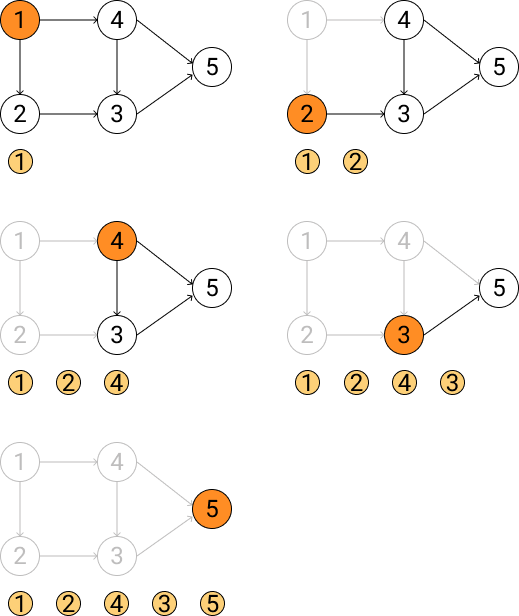

# 图

核心理念：由顶点(Vertex)和边(Edge)组成的网络结构。
为何重要：用于表示各种网络关系，如社交网络、地图路线、依赖关系等。

图有邻接表和邻接矩阵两种形式，算法中通常用邻接表。

必练操作：

- 图的表示方法：邻接矩阵和邻接表。
- 图的遍历：深度优先搜索(DFS)和广度优先搜索(BFS)。
- （进阶）最小生成树算法 (Prim, Kruskal)、最短路径算法 (Dijkstra)。

## 图的遍历框架

图的遍历与树的遍历最大的区别在于：**图可能存在环**，因此需要使用 `visited` 数组来避免重复访问节点。

### 图的表示(邻接表)

```python
# 邻接表表示图
graph: list[list[int]]  # graph[i] 存储节点 i 的所有邻居节点
```

### DFS vs BFS

=== "深度优先搜索 (DFS)"

    DFS 使用递归或栈来实现,适合解决路径、连通性、环检测等问题。

    ```python
    def dfs(graph: list[list[int]], start: int, visited: set[int]) -> None:
        # 标记当前节点已访问
        visited.add(start)

        # 前序位置:进入节点时的操作
        # ...

        # 遍历所有邻居节点
        for neighbor in graph[start]:
            if neighbor not in visited:
                dfs(graph, neighbor, visited)

        # 后序位置:离开节点时的操作
        # ...

    def traverse_graph(graph: list[list[int]]) -> None:
        visited = set()

        # 遍历所有节点,确保访问到所有连通分量
        for i in range(len(graph)):
            if i not in visited:
                dfs(graph, i, visited)
    ```

=== "广度优先搜索 (BFS)"

    BFS 使用队列来实现,适合解决最短路径、层级遍历等问题。

    ```python
    from collections import deque

    def bfs(graph: list[list[int]], start: int) -> None:
        visited = set()
        queue = deque([start])
        visited.add(start)

        while queue:
            # 取出队首节点
            node = queue.popleft()

            # 访问当前节点
            # ...

            # 将所有未访问的邻居加入队列
            for neighbor in graph[node]:
                if neighbor not in visited:
                    visited.add(neighbor)
                    queue.append(neighbor)
    ```

| 特性           | DFS                        | BFS                   |
| -------------- | -------------------------- | --------------------- |
| **数据结构**   | 栈(递归)                   | 队列                  |
| **空间复杂度** | $O(h)$ (h 为图的深度)      | $O(w)$ (w 为图的宽度) |
| **适用场景**   | 路径问题、拓扑排序、环检测 | 最短路径、层级遍历    |
| **遍历顺序**   | 深度优先,一条路走到底      | 广度优先,逐层扩散     |

### 常见应用场景

| **DFS 应用**     | **BFS 应用**     |
| ---------------- | ---------------- |
| 检测图中是否有环 | 无权图的最短路径 |
| 拓扑排序         | 层级遍历         |
| 寻找所有路径     | 最小步数问题     |
| 连通分量计数     | 二分图检测       |

### 关键注意事项

1. **visited 数组**: 防止重复访问,避免死循环
2. **非连通图**: 需要遍历所有节点作为起点,确保访问到所有连通分量
3. **有向图 vs 无向图**: 邻接表的构建方式不同
   - 无向图: `graph[u]` 包含 `v`,`graph[v]` 也包含 `u`
   - 有向图: 只在 `graph[u]` 中添加 `v`

## 图的 DFS vs 回溯 DFS

图的 DFS 和回溯算法都使用深度优先搜索,但它们的目的和实现细节有重要区别。

### 核心区别

| 维度             | 图的 DFS (遍历)       | 回溯 (找所有路径)               |
| ---------------- | --------------------- | ------------------------------- |
| **目的**         | 遍历每个节点一次      | 找所有可能的路径/组合           |
| **visited 含义** | "这个节点被访问过了"  | "这个节点在当前路径中"          |
| **做选择**       | ✅ for 循环外         | ✅ for 循环外                   |
| **撤销选择**     | ❌ 不撤销             | ✅ for 循环后撤销               |
| **节点重复访问** | ❌ 每个节点只访问一次 | ✅ 不同路径可以重复访问同一节点 |

### 代码对比

=== "图的 DFS (遍历)"

    **目的**: 遍历每个节点一次

    ```python
    def graph_dfs(graph: list[list[int]], start: int, visited: set[int]) -> None:
        # 做选择(for 循环外)
        visited.add(start)

        # 前序位置:访问节点
        print(start)

        # 遍历所有邻居
        for neighbor in graph[start]:
            if neighbor not in visited:
                graph_dfs(graph, neighbor, visited)

        # ✖️ 不撤销选择
    ```

=== "回溯 (找所有路径)"

    **目的**: 找所有可能的路径/组合

    ```python
    def backtrack_dfs(
        graph: list[list[int]],
        start: int,
        target: int,
        visited: set[int],
        path: list[int],
        result: list[list[int]]
    ) -> None:
        # 做选择(for 循环外)
        path.append(start)
        visited.add(start)

        # 到达目标,记录路径
        if start == target:
            result.append(path.copy())

        # 遍历所有邻居
        for neighbor in graph[start]:
            if neighbor not in visited:
                backtrack_dfs(graph, neighbor, target, visited, path, result)

        # ✅ 撤销选择(for 循环外) - 这是回溯的精髓!
        visited.remove(start)
        path.pop()
    ```

### 具体例子

假设有这样一个图:

```
    1
   / \
  2   3
   \ /
    4
```

=== "图的 DFS (遍历)"

    **执行过程:**

    - 访问顺序: `1 → 2 → 4 → 3`
    - 每个节点只访问一次
    - `visited[4] = true` 后,从 3 到 4 的边不会再走

    **使用场景:**

    - 遍历所有节点
    - 检测环
    - 拓扑排序
    - 连通分量计数

=== "回溯 (找从 1 到 4 的所有路径)"

    **执行过程:**

    - 路径 1: `1 → 2 → 4`
    - 路径 2: `1 → 3 → 4`
    - 节点 4 在两条路径中都被访问
    - 第一条路径结束后,`visited[4]` 被撤销,允许第二条路径再次访问

    **使用场景:**

    - 找所有路径
    - 找所有组合/排列
    - N 皇后问题
    - 数独求解

### 记忆要点

> **回溯 = DFS + 撤销选择**

图的 DFS 关注"是否访问过"，回溯关注"当前路径的状态"。撤销选择是回溯的精髓，它允许算法探索所有可能的解空间。

## 二分图

二分图是一种特殊的图,其顶点可以分成两个互不相交的集合,使得 **同一集合内的顶点之间没有边**。

### 二分图判定

使用 **染色法**(DFS/BFS):尝试用两种颜色给图着色,如果能成功着色且相邻节点颜色不同,则是二分图。

```python
def is_bipartite(graph: list[list[int]]) -> bool:
    n = len(graph)
    color = [0] * n  # 0: 未染色, 1: 颜色1, -1: 颜色2

    def dfs(node: int, c: int) -> bool:
        color[node] = c

        for neighbor in graph[node]:
            if color[neighbor] == c:
                # 相邻节点颜色相同,不是二分图
                return False
            if color[neighbor] == 0:
                # 染成相反的颜色
                if not dfs(neighbor, -c):
                    return False
        return True

    # 处理非连通图
    for i in range(n):
        if color[i] == 0:
            if not dfs(i, 1):
                return False
    return True
```

**应用场景:**

- 任务分配问题
- 配对问题
- LeetCode: [785. Is Graph Bipartite?](https://leetcode.com/problems/is-graph-bipartite/), [886. Possible Bipartition](https://leetcode.com/problems/possible-bipartition/)

---

## 环检测

=== "无向图环检测"

    **核心思想**: 使用 DFS，记录父节点。如果访问到已访问的节点且不是父节点，则存在环。

    ```python
    def has_cycle(graph: list[list[int]]) -> bool:
        n = len(graph)
        visited = set()

        def dfs_cycle(node: int, parent: int) -> bool:
            visited.add(node)

            for neighbor in graph[node]:
                if neighbor not in visited:
                    if dfs_cycle(neighbor, node):
                        return True
                elif neighbor != parent:
                    # 访问到已访问的节点且不是父节点,存在环
                    return True
            return False

        for i in range(n):
            if i not in visited:
                if dfs_cycle(i, -1):
                    return True
        return False
    ```

=== "有向图环检测"

    **核心思想**: 使用 DFS + **路径标记**。需要三种状态:未访问、访问中(在当前路径上)、已完成。

    ```python
    def has_cycle_directed(graph: list[list[int]]) -> bool:
        n = len(graph)
        # 0: 未访问, 1: 访问中(在路径上), 2: 已完成
        state = [0] * n

        def dfs_cycle_directed(node: int) -> bool:
            state[node] = 1  # 标记为访问中

            for neighbor in graph[node]:
                if state[neighbor] == 1:
                    # 遇到访问中的节点,存在环
                    return True
                if state[neighbor] == 0:
                    if dfs_cycle_directed(neighbor):
                        return True

            state[node] = 2  # 标记为已完成
            return False

        for i in range(n):
            if state[i] == 0:
                if dfs_cycle_directed(i):
                    return True
        return False
    ```

---

## 拓扑排序

拓扑排序是对 **有向无环图(DAG，Directed Acyclic Graph)** 的所有顶点进行线性排序,使得对于任何有向边 `u → v`,`u` 在排序中都出现在 `v` 之前。**简而言之，拓扑排序就是将依赖关系排成一条线。**

<div align="center">
    
</div>

拓扑排序有两种经典实现：**Kahn 算法**(BFS + 入度)和 **DFS 算法**(后序遍历反转)。两者时间复杂度相同 $O(V+E)$，本质等价，不分优劣。

=== "DFS + 后序遍历反转"

    **核心思想**: DFS 后序遍历的结果反转就是拓扑排序。

    ```python
    def topological_sort(graph: list[list[int]]) -> list[int]:
        visited = set()
        result = []

        def dfs(node: int) -> None:
            visited.add(node)

            for neighbor in graph[node]:
                if neighbor not in visited:
                    dfs(neighbor)

            # 后序位置:所有子节点都已访问完
            result.append(node)

        for i in range(len(graph)):
            if i not in visited:
                dfs(i)

        return result[::-1]  # 反转结果
    ```

=== "Kahn 算法 (BFS + 入度)"

    **核心思想**: 不断移除入度为 0 的节点,并更新其邻居的入度。

    ```python
    from collections import deque

    def topological_sort_kahn(graph: list[list[int]]) -> list[int]:
        n = len(graph)
        in_degree = [0] * n

        # 计算入度
        for i in range(n):
            for neighbor in graph[i]:
                in_degree[neighbor] += 1

        # 将入度为 0 的节点加入队列
        queue = deque([i for i in range(n) if in_degree[i] == 0])

        result = []
        while queue:
            node = queue.popleft()
            result.append(node)

            # 删除该节点的所有出边
            for neighbor in graph[node]:
                in_degree[neighbor] -= 1
                if in_degree[neighbor] == 0:
                    queue.append(neighbor)

        # 如果结果长度不等于节点数,说明存在环
        if len(result) != n:
            return []  # 存在环,无法拓扑排序

        return result
    ```

<div align="center">
  <table>
    <tr>
      <td align="center">
        <br />
        <sub>DFS + 后序遍历反转</sub>
      </td>
      <td align="center">
        <br />
        <sub>Kahn 算法 (BFS + 入度)</sub>
      </td>
    </tr>
  </table>
</div>

> 图片来源: [Jingsam](https://jingsam.github.io/)

**应用场景:**

- 课程安排（有先修课程要求）
- 任务调度（GitHub Actions 的任务依赖，比如环境初始化在构建前，部署在构建后）
- 编译依赖（Go 语言的循环依赖检测）
- LeetCode: [207. Course Schedule](https://leetcode.com/problems/course-schedule/), [210. Course Schedule II](https://leetcode.com/problems/course-schedule-ii/)

---

## 无权图

无权图的边没有权重，只表示节点之间的连接关系。这是最基础的图结构，适合表示二元关系。

### 无权图的表示

```python
# 邻接表表示无权图
graph: list[list[int]]  # graph[i] 存储节点 i 的所有邻居

# 邻接矩阵表示无权图
matrix: list[list[bool]]  # matrix[i][j] = True 表示 i 和 j 之间有边
```

### BFS 求最短路径

在 **无权图** 中，BFS 可以找到从起点到任意节点的 **最短路径**（边数最少）。

```python
from collections import deque

def shortest_path(graph: list[list[int]], start: int, target: int) -> int:
    visited = set()
    queue = deque([(start, 0)])  # (node, step)
    visited.add(start)

    while queue:
        node, step = queue.popleft()

        if node == target:
            return step

        # 将邻居加入队列
        for neighbor in graph[node]:
            if neighbor not in visited:
                visited.add(neighbor)
                queue.append((neighbor, step + 1))

    return -1  # 无法到达
```

### 双向 BFS 优化

当起点和终点都已知时，可以使用 **双向 BFS** 来优化搜索效率。

```python
def bidirectional_bfs(graph: list[list[int]], start: int, target: int) -> int:
    if start == target:
        return 0

    # 从起点和终点同时开始搜索
    visited_start = {start}
    visited_target = {target}
    queue_start = deque([start])
    queue_target = deque([target])
    step = 0

    while queue_start and queue_target:
        step += 1

        # 优化:总是扩展较小的队列
        if len(queue_start) > len(queue_target):
            queue_start, queue_target = queue_target, queue_start
            visited_start, visited_target = visited_target, visited_start

        for _ in range(len(queue_start)):
            node = queue_start.popleft()

            for neighbor in graph[node]:
                if neighbor in visited_target:
                    # 两个方向相遇
                    return step
                if neighbor not in visited_start:
                    visited_start.add(neighbor)
                    queue_start.append(neighbor)

    return -1
```

**双向 BFS 的优势:**

- 时间复杂度从 $O(b^d)$ 降低到 $O(b^{d/2})$ (b 为分支因子,d 为深度)
- 适合搜索空间很大的场景

### 应用场景

**无权图的典型应用:**

- **社交网络** - 好友关系、关注关系
  - 好友推荐(共同好友)
  - 六度分离理论
  - 影响力传播
- **网络拓扑** - 计算机网络、互联网连接
- **迷宫/棋盘** - 最短路径问题
- **单词接龙** - 词汇转换问题
- **基因序列** - DNA 序列相似度

**经典题目**

- [127. Word Ladder](https://leetcode.com/problems/word-ladder/) - 单词接龙(BFS 最短路径)
- [433. Minimum Genetic Mutation](https://leetcode.com/problems/minimum-genetic-mutation/) - 基因序列(BFS)
- [1091. Shortest Path in Binary Matrix](https://leetcode.com/problems/shortest-path-in-binary-matrix/) - 二进制矩阵最短路径
- [752. Open the Lock](https://leetcode.com/problems/open-the-lock/) - 开锁(双向 BFS)

---

## 加权图

加权图的边带有权重，常用于最短路径、最小生成树等问题。

### 加权图的表示

```python
from typing import NamedTuple

class Edge(NamedTuple):
    to: int
    weight: int

# 方法 1: 邻接表 + Edge 类
graph: list[list[Edge]]

# 方法 2: 邻接表 + 元组
# graph[i] = [(neighbor1, weight1), (neighbor2, weight2), ...]
graph: list[list[tuple[int, int]]]
```

### Dijkstra 算法(单源最短路径)

适用于 **非负权重** 的图,使用优先队列(最小堆)。

```python
import heapq
from typing import NamedTuple

class Edge(NamedTuple):
    to: int
    weight: int

def dijkstra(graph: list[list[Edge]], start: int) -> list[int]:
    n = len(graph)
    dist = [float('inf')] * n
    dist[start] = 0

    # 优先队列: (distance, node)
    pq = [(0, start)]

    while pq:
        d, node = heapq.heappop(pq)

        if d > dist[node]:
            continue

        for edge in graph[node]:
            new_dist = dist[node] + edge.weight
            if new_dist < dist[edge.to]:
                dist[edge.to] = new_dist
                heapq.heappush(pq, (new_dist, edge.to))

    return dist
```

### Bellman-Ford 算法

适用于 **有负权重** 的图,可以检测负权环。

```python
def bellman_ford(edges: list[tuple[int, int, int]], n: int, start: int) -> list[int]:
    # edges[i] = (from, to, weight)
    dist = [float('inf')] * n
    dist[start] = 0

    # 松弛 n-1 次
    for _ in range(n - 1):
        for from_node, to_node, weight in edges:
            if dist[from_node] != float('inf') and dist[from_node] + weight < dist[to_node]:
                dist[to_node] = dist[from_node] + weight

    # 检测负权环
    for from_node, to_node, weight in edges:
        if dist[from_node] != float('inf') and dist[from_node] + weight < dist[to_node]:
            # 存在负权环
            return []

    return dist
```

### 最短路径算法对比

| 算法               | 适用场景                         | 时间复杂度        | 空间复杂度 |
| ------------------ | -------------------------------- | ----------------- | ---------- |
| **Dijkstra**       | 非负权重,单源最短路径            | $O((V+E) \log V)$ | $O(V)$     |
| **Bellman-Ford**   | 有负权重,单源最短路径,检测负权环 | $O(VE)$           | $O(V)$     |
| **Floyd-Warshall** | 所有节点对最短路径               | $O(V^3)$          | $O(V^2)$   |

**应用场景:**

- 地图导航(最短路径) - 权重是距离/时间
- 网络路由 - 权重是延迟/带宽
- 航班网络 - 权重是票价/飞行时间
- 物流配送 - 权重是运输成本
- 社交网络影响力 - 权重是亲密度/互动频率
- LeetCode: [743. Network Delay Time](https://leetcode.com/problems/network-delay-time/), [787. Cheapest Flights Within K Stops](https://leetcode.com/problems/cheapest-flights-within-k-stops/)
