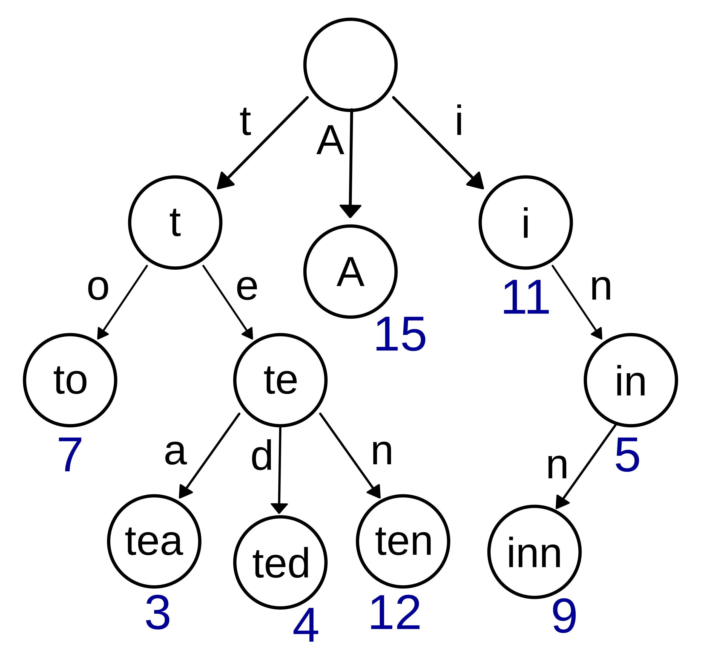

# Trie

{ align=right width=30% }
Trie（发音为 "try"，字典树、前缀树）是一种专门用于高效处理字符串集合的 **多叉树**，用于存储字符串集合。字符存储在边上，从根节点到某个节点的路径上的所有字符连接起来，就是该节点对应的字符串前缀。

**关键特性:**

- 根节点不包含字符
- 从父节点到子节点的 **边** 代表一个字符
- 从根节点到某一节点的路径，连接起来就是该节点对应的字符串
- 每个节点的所有子节点对应的字符都不相同

> 图片来源: [Wikipedia - Trie](https://en.wikipedia.org/wiki/Trie)

由于 Trie 具有前缀搜索极快（$O(m)$）、自动补全效率高、字符串排序天然有序等优点，在搜索引擎的自动补全、拼写检查、IP 路由等场景中有广泛应用。代价则是每个节点需要存储多个子节点指针所占据的空间。

| 操作           | 数组/列表      | 哈希表         | Trie                                       |
| -------------- | -------------- | -------------- | ------------------------------------------ |
| **插入字符串** | $O(n \cdot m)$ | $O(m)$         | $O(m)$                                     |
| **查找字符串** | $O(n \cdot m)$ | $O(m)$         | $O(m)$                                     |
| **前缀搜索**   | $O(n \cdot m)$ | $O(n \cdot m)$ | $O(m)$                                     |
| **空间复杂度** | $O(n \cdot m)$ | $O(n \cdot m)$ | $O(\text{ALPHABET\_SIZE} \cdot n \cdot m)$ |

其中 $n$ 是字符串数量，$m$ 是字符串平均长度。

---

## 实现

### 基本结构

```python
class TrieNode:
    def __init__(self):
        # 子节点字典: 字符 -> TrieNode
        self.children = {}
        # 标记是否为单词结尾
        self.is_end_of_word = False

class Trie:
    def __init__(self):
        self.root = TrieNode()
```

### 核心操作

=== "插入单词"

    ```python
    def insert(self, word: str) -> None:
        """插入一个单词到 Trie 中"""
        node = self.root

        for char in word:
            # 如果字符不存在,创建新节点
            if char not in node.children:
                node.children[char] = TrieNode()
            # 移动到子节点
            node = node.children[char]

        # 标记单词结尾
        node.is_end_of_word = True
    ```

    **时间复杂度**: $O(m)$,其中 $m$ 是单词长度
    **空间复杂度**: $O(m)$

=== "查找单词"

    ```python
    def search(self, word: str) -> bool:
        """查找单词是否存在于 Trie 中"""
        node = self.root

        for char in word:
            if char not in node.children:
                return False
            node = node.children[char]

        # 必须是完整单词,不能只是前缀
        return node.is_end_of_word
    ```

    **时间复杂度**: $O(m)$
    **空间复杂度**: $O(1)$

=== "前缀搜索"

    ```python
    def starts_with(self, prefix: str) -> bool:
        """判断是否存在以 prefix 为前缀的单词"""
        node = self.root

        for char in prefix:
            if char not in node.children:
                return False
            node = node.children[char]

        # 只要能走到这里,说明前缀存在
        return True
    ```

    **时间复杂度**: $O(m)$
    **空间复杂度**: $O(1)$

=== "删除单词"

    ```python
    def delete(self, word: str) -> bool:
        """删除一个单词"""
        def _delete(node: TrieNode, word: str, index: int) -> bool:
            if index == len(word):
                # 到达单词末尾
                if not node.is_end_of_word:
                    return False  # 单词不存在

                node.is_end_of_word = False
                # 如果没有子节点,可以删除
                return len(node.children) == 0

            char = word[index]
            if char not in node.children:
                return False  # 单词不存在

            child = node.children[char]
            should_delete_child = _delete(child, word, index + 1)

            if should_delete_child:
                del node.children[char]
                # 如果当前节点不是单词结尾且没有其他子节点,可以删除
                return not node.is_end_of_word and len(node.children) == 0

            return False

        return _delete(self.root, word, 0)
    ```

    **时间复杂度**: $O(m)$
    **空间复杂度**: $O(m)$ (递归栈)

---

## 进阶操作

=== "获取所有前缀单词"

    ```python
    def find_words_with_prefix(self, prefix: str) -> list[str]:
        """返回所有以 prefix 开头的单词"""
        node = self.root

        # 先找到前缀对应的节点
        for char in prefix:
            if char not in node.children:
                return []
            node = node.children[char]

        # DFS 收集所有单词
        result = []

        def dfs(node: TrieNode, path: str):
            if node.is_end_of_word:
                result.append(prefix + path)

            for char, child in node.children.items():
                dfs(child, path + char)

        dfs(node, "")
        return result
    ```

=== "统计前缀单词数量"

    ```python
    def count_words_with_prefix(self, prefix: str) -> int:
        """统计以 prefix 开头的单词数量"""
        node = self.root

        for char in prefix:
            if char not in node.children:
                return 0
            node = node.children[char]

        # DFS 统计
        def dfs(node: TrieNode) -> int:
            count = 1 if node.is_end_of_word else 0
            for child in node.children.values():
                count += dfs(child)
            return count

        return dfs(node)
    ```

---

## 变体

=== "压缩 Trie (Radix Tree)"

    将只有一个子节点的路径压缩成一个节点,节省空间。

    ```python
    class RadixNode:
        def __init__(self, label: str = ""):
            self.label = label  # 边上的字符串
            self.children = {}
            self.is_end_of_word = False
    ```

=== "后缀 Trie"

    存储一个字符串的所有后缀,用于字符串匹配。

=== "带计数的 Trie"

    每个节点记录经过该节点的单词数量。

    ```python
    class TrieNode:
        def __init__(self):
            self.children = {}
            self.is_end_of_word = False
            self.count = 0  # 经过该节点的单词数量
    ```

---

## 典型应用场景

=== "自动补全"

    ```python
    def autocomplete(self, prefix: str, limit: int = 10) -> list[str]:
        """返回最多 limit 个以 prefix 开头的单词"""
        words = self.find_words_with_prefix(prefix)
        return words[:limit]
    ```

=== "拼写检查"

    ```python
    def spell_check(self, word: str) -> list[str]:
        """返回与 word 相似的单词(编辑距离为1)"""
        suggestions = []

        # 1. 删除一个字符
        for i in range(len(word)):
            candidate = word[:i] + word[i+1:]
            if self.search(candidate):
                suggestions.append(candidate)

        # 2. 替换一个字符
        for i in range(len(word)):
            for c in 'abcdefghijklmnopqrstuvwxyz':
                candidate = word[:i] + c + word[i+1:]
                if self.search(candidate):
                    suggestions.append(candidate)

        # 3. 插入一个字符
        for i in range(len(word) + 1):
            for c in 'abcdefghijklmnopqrstuvwxyz':
                candidate = word[:i] + c + word[i:]
                if self.search(candidate):
                    suggestions.append(candidate)

        return list(set(suggestions))
    ```

=== "词频统计"

    ```python
    class TrieNode:
        def __init__(self):
            self.children = {}
            self.frequency = 0  # 该单词出现的次数

    def insert_with_frequency(self, word: str) -> None:
        """插入单词并统计频率"""
        node = self.root
        for char in word:
            if char not in node.children:
                node.children[char] = TrieNode()
            node = node.children[char]
        node.frequency += 1
    ```

---

## 经典题目

=== "基础题"

    - [208. 实现 Trie (前缀树)](https://leetcode.com/problems/implement-trie-prefix-tree/)
    - [720. 词典中最长的单词](https://leetcode.com/problems/longest-word-in-dictionary/)
    - [14. 最长公共前缀](https://leetcode.com/problems/longest-common-prefix/)

=== "进阶题"

    - [211. 添加与搜索单词 - 数据结构设计](https://leetcode.com/problems/design-add-and-search-words-data-structure/) - 支持通配符
    - [212. 单词搜索 II](https://leetcode.com/problems/word-search-ii/) - Trie + 回溯
    - [677. 键值映射](https://leetcode.com/problems/map-sum-pairs/) - 前缀求和
    - [648. 单词替换](https://leetcode.com/problems/replace-words/) - 词根替换
    - [1268. 搜索推荐系统](https://leetcode.com/problems/search-suggestions-system/) - 自动补全

---

## 优化技巧

=== "使用数组代替字典(固定字符集)"

    ```python
    class TrieNode:
        def __init__(self):
            # 假设只有小写字母
            self.children = [None] * 26
            self.is_end_of_word = False

    def insert(self, word: str) -> None:
        node = self.root
        for char in word:
            index = ord(char) - ord('a')
            if node.children[index] is None:
                node.children[index] = TrieNode()
            node = node.children[index]
        node.is_end_of_word = True
    ```

    **优势**: 访问速度更快
    **劣势**: 空间占用更大(即使字符不存在也要分配空间)

=== "延迟删除"

    不立即删除节点，而是标记为"已删除"，定期清理。

=== "路径压缩"

    合并只有一个子节点的节点，减少空间占用。

---

## 时间复杂度总结

| 操作             | 时间复杂度 | 空间复杂度 |
| ---------------- | ---------- | ---------- |
| 插入             | $O(m)$     | $O(m)$     |
| 查找             | $O(m)$     | $O(1)$     |
| 前缀搜索         | $O(m)$     | $O(1)$     |
| 删除             | $O(m)$     | $O(m)$     |
| 获取所有前缀单词 | $O(m + k)$ | $O(k)$     |

其中 $m$ 是字符串长度,$k$ 是结果数量。

---

## 对比其他数据结构

| 场景         | 推荐数据结构   | 原因            |
| ------------ | -------------- | --------------- |
| 精确查找单词 | 哈希表         | $O(1)$ 查找     |
| 前缀搜索     | **Trie**       | $O(m)$ 前缀匹配 |
| 范围查询     | 平衡树         | 有序存储        |
| 模糊匹配     | **Trie** + DFS | 支持通配符      |
| 后缀查询     | 后缀树/数组    | 专门优化        |
