# 模式

## 核心算法对比

| 算法         | 穷举对象             | 优化手段       | 问题类型           | 重叠子问题 | 时间复杂度          | 典型问题                           |
| ------------ | -------------------- | -------------- | ------------------ | ---------- | ------------------- | ---------------------------------- |
| **双指针**   | 数组/链表元素对      | 快慢/对撞指针  | 去重、两数之和     | 无         | $O(n)$              | 两数之和、移除元素、回文判断       |
| **滑动窗口** | 连续子数组/子串      | 双指针动态调整 | 子串/子数组问题    | 无         | $O(n)$              | 最长无重复子串、最小覆盖子串       |
| **BFS**      | 按层遍历所有节点     | 队列 + visited | 最短路径、层级遍历 | 无         | $O(V+E)$            | 最短路径、层序遍历、岛屿数量       |
| **DFS**      | 深度优先遍历所有路径 | 递归/栈        | 路径探索、连通性   | 无         | $O(V+E)$            | 路径总和、岛屿数量、图遍历         |
| **回溯**     | 所有可能的路径/组合  | 剪枝           | 求所有解、可行解   | 通常没有   | $O(2^n)$ 或 $O(n!)$ | 全排列、N皇后、组合总和、数独      |
| **动态规划** | 所有可能的状态       | 记忆化（缓存） | 求最优解           | 必须有     | $O(n)$ ~ $O(n^2)$   | 背包、最长子序列、爬楼梯、硬币找零 |
| **贪心**     | 每步的局部最优       | 贪心选择       | 特定最优解         | 无         | $O(n \\log n)$      | 区间调度、跳跃游戏、分发饼干       |
| **二分查找** | 有序空间的中点       | 折半缩小范围   | 查找、边界         | 无         | $O(\\log n)$        | 搜索插入位置、寻找峰值             |

## 详细决策指南

### 🔍 BFS（广度优先搜索）

**使用信号**：

- ✅ 需要找 **最短路径**（无权图）
- ✅ 需要 **层序遍历**（树的层级、距离）
- ✅ 需要找 **最少步数**
- ✅ 关键词：最短、最少、层、距离

**典型问题**：

- 二叉树层序遍历
- 最短路径（迷宫、网格）
- 岛屿数量
- 单词接龙

**模板**：

```go
queue := []Node{start}
visited := make(map[Node]bool)
for len(queue) > 0 {
    node := queue[0]
    queue = queue[1:]
    // 处理节点
    for _, next := range node.neighbors {
        if !visited[next] {
            queue = append(queue, next)
            visited[next] = true
        }
    }
}
```

---

### 🌲 DFS（深度优先搜索）

**使用信号**：

- ✅ 需要 **遍历所有路径**
- ✅ 需要 **检查连通性**
- ✅ 需要 **路径相关信息**（路径和、路径节点）
- ✅ 关键词：路径、连通、遍历

**典型问题**：

- 路径总和
- 岛屿数量
- 图的连通性
- 二叉树的所有路径

**模板**：

```go
func dfs(node Node, visited map[Node]bool) {
    if node == nil || visited[node] {
        return
    }
    visited[node] = true
    // 处理节点
    for _, next := range node.neighbors {
        dfs(next, visited)
    }
}
```

---

### 🔄 回溯（Backtracking）

**使用信号**：

- ✅ 需要找 **所有解** 或 **某一个可行解**
- ✅ 问题可以表示为 **决策树**
- ✅ 需要 **排列、组合、子集**
- ✅ 没有明显的重叠子问题
- ✅ 关键词：所有、全部、可能的组合

**典型问题**：

- 全排列
- N皇后
- 组合总和
- 数独
- 括号生成

**模板**：

```go
func backtrack(path []int, choices []int) {
    if 满足结束条件 {
        result = append(result, append([]int{}, path...))
        return
    }
    for i, choice := range choices {
        // 做选择
        path = append(path, choice)
        // 递归
        backtrack(path, choices[i+1:])
        // 撤销选择
        path = path[:len(path)-1]
    }
}
```

---

### 📊 动态规划（Dynamic Programming）

**使用信号**：

- ✅ 需要找 **最优解**（最大、最小、最长）
- ✅ 有 **重叠子问题**
- ✅ 有 **最优子结构**
- ✅ 关键词：最大、最小、最长、最多、最少

**典型问题**：

- 背包问题
- 硬币找零
- 最长递增子序列
- 爬楼梯
- 股票买卖

**模板**：

```go
// 一维 DP
dp := make([]int, n+1)
dp[0] = 初始值
for i := 1; i <= n; i++ {
    dp[i] = 状态转移方程
}
return dp[n]
```

---

### 💰 贪心（Greedy）

**使用信号**：

- ✅ 局部最优能导致全局最优
- ✅ 问题有 **贪心选择性质**
- ✅ 通常涉及 **排序** 后做选择
- ✅ 关键词：区间、调度、最优分配

**典型问题**：

- 区间调度
- 跳跃游戏
- 分发饼干
- 加油站

**注意**：贪心不一定正确，需要证明贪心选择性质！

---

### 🎯 二分查找（Binary Search）

**使用信号**：

- ✅ 数组 **有序** 或 **部分有序**
- ✅ 需要在 **O(log n)** 时间内查找
- ✅ 需要找 **边界**（第一个/最后一个）
- ✅ 关键词：有序、查找、边界

**典型问题**：

- 搜索插入位置
- 寻找峰值
- 搜索旋转排序数组
- 寻找两个正序数组的中位数

---

### 🪟 滑动窗口（Sliding Window）

**使用信号**：

- ✅ 需要找 **连续子数组/子串**
- ✅ 问题涉及 **区间/窗口**
- ✅ 需要动态调整窗口大小
- ✅ 关键词：子串、子数组、连续、窗口

**典型问题**：

- 最长无重复字符子串
- 最小覆盖子串
- 字符串的排列
- 找到字符串中所有字母异位词

**模板**：

```go
left := 0
for right := range s {
    // 扩大窗口
    window[s[right]]++

    // 收缩窗口
    for 窗口不满足条件 {
        window[s[left]]--
        left++
    }

    // 更新结果
}
```

---

### ↔️ 双指针（Two Pointers）

**使用信号**：

- ✅ 需要 **原地修改** 数组
- ✅ 需要在 **有序数组** 中查找
- ✅ 需要 **去重、移除元素**
- ✅ 关键词：原地、有序、对撞、快慢

**典型问题**：

- 两数之和（有序数组）
- 移除元素
- 反转字符串
- 链表环检测

**模板**：

```go
// 快慢指针
slow := 0
for fast := range nums {
    if 满足条件 {
        nums[slow] = nums[fast]
        slow++
    }
}

// 对撞指针
left, right := 0, len(nums)-1
for left < right {
    if 满足条件 {
        return
    } else if 需要增大 {
        left++
    } else {
        right--
    }
}
```

---

## 快速决策流程图

```mermaid
graph TD
    Start["看到问题"] --> Q1{"需要最优解？"}

    Q1 -->|是| Q2{"有重叠子问题？"}
    Q2 -->|是| DP["动态规划 DP"]
    Q2 -->|否| Greedy["贪心算法<br/>（需证明贪心选择性质）"]

    Q1 -->|否| Q3{"需要所有解？"}
    Q3 -->|是| Backtrack["回溯算法"]
    Q3 -->|否| Q4{"需要最短路径？"}

    Q4 -->|是| BFS["BFS 广度优先"]
    Q4 -->|否| Q5{"需要遍历？"}

    Q5 -->|深度优先| DFS["DFS 深度优先"]
    Q5 -->|其他| Other["双指针 / 滑动窗口 / 二分查找"]

    style DP fill:#e1f5e1
    style Greedy fill:#fff4e1
    style Backtrack fill:#e1f0ff
    style BFS fill:#ffe1f0
    style DFS fill:#f0e1ff
    style Other fill:#f5f5f5
```



## 常用算法模板

### 双指针

**快慢指针**（数组去重/移除）：

```go
slow := 0
for fast := range nums {
    if 满足条件 {
        nums[slow] = nums[fast]
        slow++
    }
}
```

**对撞指针**（两数之和）：

```go
left, right := 0, len(nums)-1
for left < right {
    sum := nums[left] + nums[right]
    if sum == target {
        return []int{left, right}
    } else if sum < target {
        left++
    } else {
        right--
    }
}
```

**滑动窗口**：

```go
left := 0
for right := range s {
    // 扩大窗口
    窗口状态更新

    // 收缩窗口
    for 窗口不满足条件 {
        窗口状态更新
        left++
    }

    // 更新结果
}
```

### 二分查找

**标准二分**：

```go
left, right := 0, len(nums)-1
for left <= right {
    mid := left + (right-left)/2
    if nums[mid] == target {
        return mid
    } else if nums[mid] < target {
        left = mid + 1
    } else {
        right = mid - 1
    }
}
return -1
```

**寻找左边界**：

```go
left, right := 0, len(nums)
for left < right {
    mid := left + (right-left)/2
    if nums[mid] < target {
        left = mid + 1
    } else {
        right = mid
    }
}
return left
```

### 递归

**标准递归模板**：

```go
func dfs(参数) 返回值 {
    // 1. 终止条件
    if 到达边界 {
        return 边界值
    }

    // 2. 递归调用
    result := dfs(更小的问题)

    // 3. 处理当前层
    当前层处理逻辑

    return 结果
}
```

**回溯模板**：

```go
func backtrack(路径, 选择列表) {
    if 满足结束条件 {
        result = append(result, 路径)
        return
    }

    for 选择 in 选择列表 {
        做选择
        backtrack(路径, 新的选择列表)
        撤销选择
    }
}
```

### 动态规划

**一维 DP**：

```go
dp := make([]int, n+1)
dp[0] = 初始值

for i := 1; i <= n; i++ {
    dp[i] = 状态转移方程
}
return dp[n]
```

**二维 DP**：

```go
dp := make([][]int, m+1)
for i := range dp {
    dp[i] = make([]int, n+1)
}

// 初始化
for i := 0; i <= m; i++ {
    dp[i][0] = 初始值
}

// 状态转移
for i := 1; i <= m; i++ {
    for j := 1; j <= n; j++ {
        dp[i][j] = 状态转移方程
    }
}
return dp[m][n]
```

### 树的遍历

**前序遍历**（递归）：

```go
func preorder(root *TreeNode) {
    if root == nil {
        return
    }
    处理当前节点
    preorder(root.Left)
    preorder(root.Right)
}
```

**层序遍历**（BFS）：

```go
queue := []*TreeNode{root}
for len(queue) > 0 {
    size := len(queue)
    for i := 0; i < size; i++ {
        node := queue[0]
        queue = queue[1:]

        处理当前节点

        if node.Left != nil {
            queue = append(queue, node.Left)
        }
        if node.Right != nil {
            queue = append(queue, node.Right)
        }
    }
}
```
