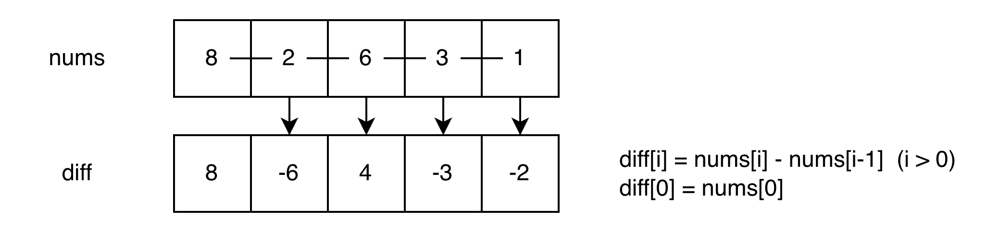
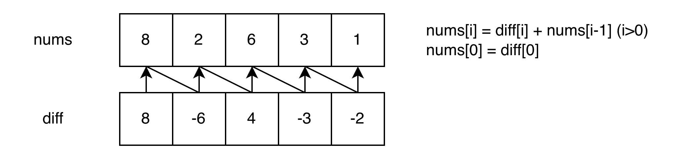
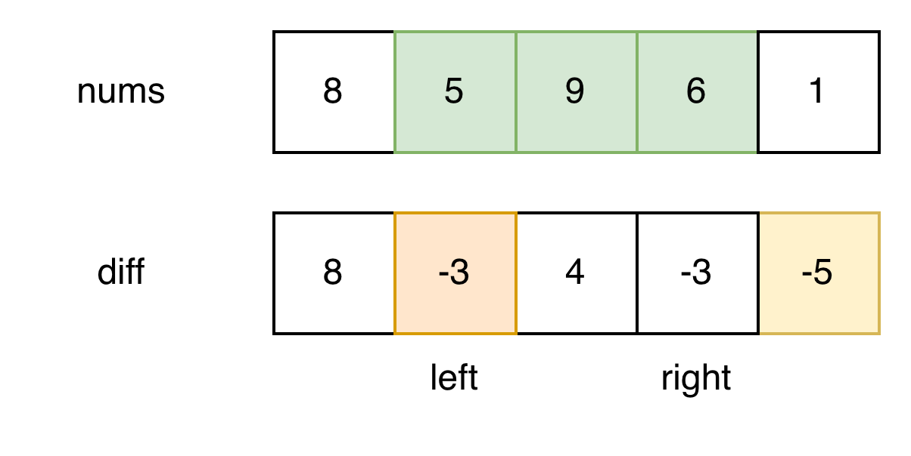

# 差分数组算法总结

差分数组（Difference Array）是前缀和的**逆运算**，通过预处理将**区间修改**的时间复杂度从 O(n) 优化到 O(1)。适用于**频繁对数组区间进行加减操作**的场景。

---

## 核心思想

对于数组 `nums`，构建差分数组 `diff`，其中：

```
diff[i] = nums[i] - nums[i-1]  (i > 0)
diff[0] = nums[0]
```

<p align="center">
    
</p>

**关键性质：**

- 通过差分数组可以还原出原数组（原数组是差分数组的前缀和），即

  ```
  nums[i] = diff[i] + nums[i-1] (i>0)
  nums[0] = diff[0]
  ```

<p align="center">
    
</p>

- 对区间 `[left, right]` 加上 `val`，只需修改两个位置：
  - `diff[left] += val`
  - `diff[right+1] -= val`

<p align="center">
    
</p>

---

## 典型应用场景

- 频繁对数组区间进行加减操作（如 LeetCode 370、1094）
- 航班预订统计、拼车问题
- 区间更新后查询最终结果
- 二维矩阵的区域修改

---

## 实现模板

### 1. 一维差分数组

```go
type Difference struct {
    diff []int
}

// 构建差分数组
func NewDifference(nums []int) *Difference {
    n := len(nums)
    diff := make([]int, n)

    diff[0] = nums[0]
    for i := 1; i < n; i++ {
        diff[i] = nums[i] - nums[i-1]
    }

    return &Difference{diff: diff}
}

// 对区间 [left, right] 增加 val
func (d *Difference) Increment(left, right, val int) {
    d.diff[left] += val
    if right+1 < len(d.diff) {
        d.diff[right+1] -= val
    }
}

// 还原为原数组（通过前缀和）
func (d *Difference) Result() []int {
    n := len(d.diff)
    result := make([]int, n)

    result[0] = d.diff[0]
    for i := 1; i < n; i++ {
        result[i] = result[i-1] + d.diff[i]
    }

    return result
}
```

**时间复杂度：**

- 构建：O(n)
- 区间修改：O(1)
- 还原数组：O(n)

**空间复杂度：** O(n)

### 2. 使用示例

```go
// 初始数组
nums := []int{1, 3, 5, 7, 9}
diff := NewDifference(nums)

// 对区间 [1, 3] 加 2
diff.Increment(1, 3, 2)

// 对区间 [2, 4] 减 1
diff.Increment(2, 4, -1)

// 获取最终结果
result := diff.Result()
// result = [1, 5, 6, 8, 8]
```

### 3. 二维差分数组

用于二维矩阵的区域修改。

```go
type Difference2D struct {
    diff [][]int
    m, n int
}

// 构建二维差分数组
func NewDifference2D(matrix [][]int) *Difference2D {
    if len(matrix) == 0 || len(matrix[0]) == 0 {
        return nil
    }

    m, n := len(matrix), len(matrix[0])
    diff := make([][]int, m+1)
    for i := range diff {
        diff[i] = make([]int, n+1)
    }

    // 构建差分数组
    for i := 0; i < m; i++ {
        for j := 0; j < n; j++ {
            diff[i][j] += matrix[i][j]
            diff[i+1][j] -= matrix[i][j]
            diff[i][j+1] -= matrix[i][j]
            diff[i+1][j+1] += matrix[i][j]
        }
    }

    return &Difference2D{diff: diff, m: m, n: n}
}

// 对矩形区域 (row1, col1) 到 (row2, col2) 增加 val
func (d *Difference2D) Increment(row1, col1, row2, col2, val int) {
    d.diff[row1][col1] += val
    d.diff[row2+1][col1] -= val
    d.diff[row1][col2+1] -= val
    d.diff[row2+1][col2+1] += val
}

// 还原为原矩阵（通过二维前缀和）
func (d *Difference2D) Result() [][]int {
    result := make([][]int, d.m)
    for i := range result {
        result[i] = make([]int, d.n)
    }

    for i := 0; i < d.m; i++ {
        for j := 0; j < d.n; j++ {
            if i > 0 {
                d.diff[i][j] += d.diff[i-1][j]
            }
            if j > 0 {
                d.diff[i][j] += d.diff[i][j-1]
            }
            if i > 0 && j > 0 {
                d.diff[i][j] -= d.diff[i-1][j-1]
            }
            result[i][j] = d.diff[i][j]
        }
    }

    return result
}
```

---

## 核心技巧

### 区间修改的原理

对区间 `[left, right]` 加 `val`：

```
原数组:  [1, 3, 5, 7, 9]
差分:    [1, 2, 2, 2, 2]

操作: [1, 3] + 2
修改差分:
  diff[1] += 2   → [1, 4, 2, 2, 2]
  diff[4] -= 2   → [1, 4, 2, 2, 0]

还原 (前缀和):
  [1, 5, 7, 9, 9]
```

**为什么只需修改两个位置？**

- `diff[left] += val`：从 `left` 开始，所有元素都增加 `val`
- `diff[right+1] -= val`：从 `right+1` 开始，抵消之前的增加

---

## 优势

- **区间修改高效**：O(1) 时间复杂度
- **批量操作**：可以先进行多次区间修改，最后一次性还原
- **空间友好**：只需额外 O(n) 空间

---

## 注意事项

- **边界检查**：修改 `diff[right+1]` 时，确保 `right+1 < n`
- **初始化**：差分数组的第一个元素等于原数组第一个元素
- **还原数组**：通过前缀和还原，注意不要修改原差分数组
- **负数操作**：减法操作就是加负数，`Increment(left, right, -val)`

---

## 经典题目

### 基础题

- [LeetCode 370. 区间加法](https://leetcode.com/problems/range-addition/) (Premium)
- [LeetCode 1109. 航班预订统计](https://leetcode.com/problems/corporate-flight-bookings/)
- [LeetCode 1094. 拼车](https://leetcode.com/problems/car-pooling/)

### 进阶题

- [LeetCode 995. K 连续位的最小翻转次数](https://leetcode.com/problems/minimum-number-of-k-consecutive-bit-flips/)
- [LeetCode 2536. 子矩阵元素加 1](https://leetcode.com/problems/increment-submatrices-by-one/)
- [LeetCode 2132. 用邮票贴满网格图](https://leetcode.com/problems/stamping-the-grid/)

---

## 对比：前缀和 vs 差分数组

| 特性           | 前缀和                        | 差分数组                        |
| -------------- | ----------------------------- | ------------------------------- |
| **核心操作**   | 区间查询                      | 区间修改                        |
| **预处理**     | `prefixSum[i] = sum(0...i-1)` | `diff[i] = nums[i] - nums[i-1]` |
| **时间复杂度** | 查询 O(1)                     | 修改 O(1)                       |
| **关系**       | 差分数组的前缀和 = 原数组     | 原数组的差分 = 差分数组         |
| **典型场景**   | 频繁查询区间和                | 频繁修改区间值                  |

**互为逆运算：**

```
原数组 --差分--> 差分数组 --前缀和--> 原数组
```

---

## 相关模式

- **前缀和**：差分数组的逆运算，用于区间查询
- **线段树**：支持区间查询和修改，但实现复杂
- **树状数组**：支持单点修改和区间查询，介于两者之间
- **扫描线算法**：结合差分思想处理区间问题
