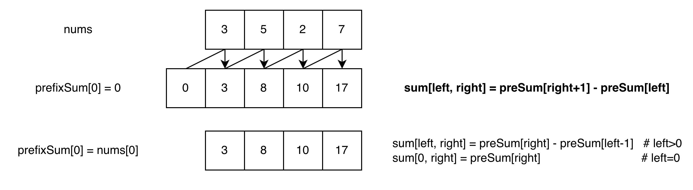
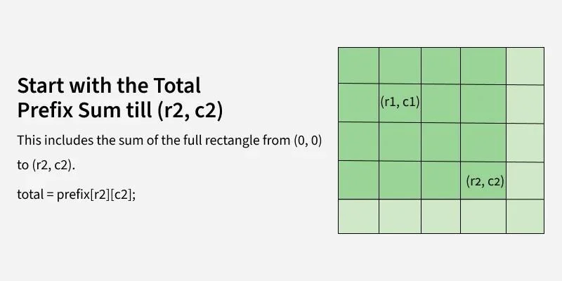
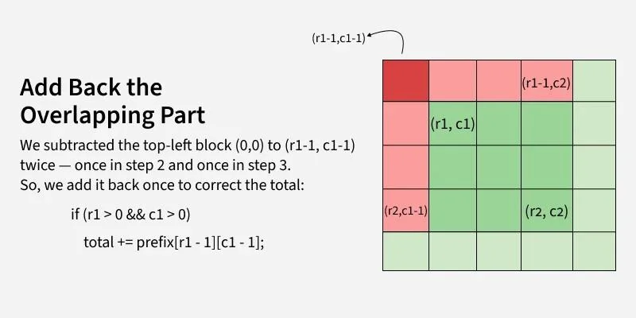

# 前缀和

前缀和（Prefix Sum）是一种预处理技巧，通过 **空间换时间** 的方式，将区间和查询的时间复杂度从 $O(n)$ 优化到 $O(1)$。适用于 **频繁查询数组区间和** 的场景。

---

## 典型应用场景

- 频繁查询数组区间和（如 LeetCode 303、304）
- 子数组和问题（如和为 K 的子数组个数）
- 二维矩阵区域和查询
- 结合哈希表优化查找（如两数之和的变体）

---

## 实现模板

### 1. 一维前缀和



从上图可以看出，**`prefixSum[0] = 0` 就像链表中的 dummy head**，使操作统一，避免容易出错的的边界判断。

```go
// 构建前缀和数组
func buildPrefixSum(nums []int) []int {
    prefixSum := make([]int, len(nums)+1) // prefixSum[0] = 0

    for i := range nums {
        prefixSum[i+1] = prefixSum[i] + nums[i]
    }

    return prefixSum
}

// 查询区间 [left, right] 的和
func rangeSum(prefixSum []int, left, right int) int {
    return prefixSum[right+1] - prefixSum[left] // 闭区间需要+1
}
```

| 操作 | 时间复杂度 | 空间复杂度 |
| :--: | :--------: | :--------: |
| 构建 |   $O(n)$   |   $O(n)$   |
| 查询 |   $O(1)$   |   $O(1)$   |

### 2. 二维前缀和

先来看一个 2×2 的矩阵，

$$
\begin{array}{c}
A=\begin{bmatrix}
1_{\substack{(0,0)}} & 2_{\substack{(0,1)}} \\
3_{\substack{(1,0)}} & 4_{\substack{(1,1)}}
\end{bmatrix} \\
\text{Matrix}
\end{array}
\quad
\begin{array}{c}
S=\begin{bmatrix}
0_{\substack{(0,0)}} & 0_{\substack{(0,1)}} & 0_{\substack{(0,2)}} \\
0_{\substack{(1,0)}} & 1_{\substack{(1,1)}} & 3_{\substack{(1,2)}} \\
0_{\substack{(2,0)}} & 4_{\substack{(2,1)}} & 10_{\substack{(2,2)}}
\end{bmatrix} \\
\text{Matrix Prefix Sum}
\end{array}
$$

再来看一个 3×3 的矩阵，

$$
\begin{array}{c}
A=\begin{bmatrix}
1_{\substack{(0,0)}} & 2_{\substack{(0,1)}} & 3_{\substack{(0,2)}} \\
4_{\substack{(1,0)}} & 5_{\substack{(1,1)}} & 6_{\substack{(1,2)}} \\
7_{\substack{(2,0)}} & 8_{\substack{(2,1)}} & 9_{\substack{(2,2)}}
\end{bmatrix} \\
\text{Matrix}
\end{array}
\quad
\begin{array}{c}
S=\begin{bmatrix}
0_{\substack{(0,0)}} & 0_{\substack{(0,1)}} & 0_{\substack{(0,2)}} & 0_{\substack{(0,3)}} \\
0_{\substack{(1,0)}} & 1_{\substack{(1,1)}} & 3_{\substack{(1,2)}} & 6_{\substack{(1,3)}} \\
0_{\substack{(2,0)}} & 5_{\substack{(2,1)}} & 12_{\substack{(2,2)}} & 21_{\substack{(2,3)}} \\
0_{\substack{(3,0)}} & 12_{\substack{(3,1)}} & 27_{\substack{(3,2)}} & 45_{\substack{(3,3)}}
\end{bmatrix} \\
\text{Matrix Prefix Sum}
\end{array}
$$

构建二维前缀和：上 + 左 - 左上 + 自己，即

$$
S[i][j]=S[i−1][j]+S[i][j−1]−S[i−1][j−1]+A[i-1][j-1] \quad (i>=1, j>=1)
$$

查询矩形和：右下 - 上方 - 左方 + 左上

$$
\text{sum}(r_1, c_1, r_2, c_2) = S[r_2+1][c_2+1] - S[r_1][c_2+1] - S[r_2+1][c_1] + S[r_1][c_1]
$$

由于矩阵 $S$ 比 $A$ 多一行一列，因此 $S[i+1][j+1] = A[i][j]$。

再来看一个 5×5 的矩阵（LeetCode 304 示例）：

$$
\begin{array}{c}
A=\begin{bmatrix}
3_{\substack{(0,0)}} & 0_{\substack{(0,1)}} & 1_{\substack{(0,2)}} & 4_{\substack{(0,3)}} & 2_{\substack{(0,4)}} \\
5_{\substack{(1,0)}} & 6_{\substack{(1,1)}} & 3_{\substack{(1,2)}} & 2_{\substack{(1,3)}} & 1_{\substack{(1,4)}} \\
1_{\substack{(2,0)}} & 2_{\substack{(2,1)}} & 0_{\substack{(2,2)}} & 1_{\substack{(2,3)}} & 5_{\substack{(2,4)}} \\
4_{\substack{(3,0)}} & 1_{\substack{(3,1)}} & 0_{\substack{(3,2)}} & 1_{\substack{(3,3)}} & 7_{\substack{(3,4)}} \\
1_{\substack{(4,0)}} & 0_{\substack{(4,1)}} & 3_{\substack{(4,2)}} & 0_{\substack{(4,3)}} & 5_{\substack{(4,4)}}
\end{bmatrix} \\
\text{Matrix}
\end{array}
$$

$$
\begin{array}{c}
S=\begin{bmatrix}
0_{\substack{(0,0)}} & 0_{\substack{(0,1)}} & 0_{\substack{(0,2)}} & 0_{\substack{(0,3)}} & 0_{\substack{(0,4)}} & 0_{\substack{(0,5)}} \\
0_{\substack{(1,0)}} & 3_{\substack{(1,1)}} & 3_{\substack{(1,2)}} & 4_{\substack{(1,3)}} & 8_{\substack{(1,4)}} & 10_{\substack{(1,5)}} \\
0_{\substack{(2,0)}} & 8_{\substack{(2,1)}} & 14_{\substack{(2,2)}} & 18_{\substack{(2,3)}} & 24_{\substack{(2,4)}} & 27_{\substack{(2,5)}} \\
0_{\substack{(3,0)}} & 9_{\substack{(3,1)}} & 17_{\substack{(3,2)}} & 21_{\substack{(3,3)}} & 28_{\substack{(3,4)}} & 36_{\substack{(3,5)}} \\
0_{\substack{(4,0)}} & 13_{\substack{(4,1)}} & 22_{\substack{(4,2)}} & 26_{\substack{(4,3)}} & 34_{\substack{(4,4)}} & 49_{\substack{(4,5)}} \\
0_{\substack{(5,0)}} & 14_{\substack{(5,1)}} & 23_{\substack{(5,2)}} & 30_{\substack{(5,3)}} & 38_{\substack{(5,4)}} & 58_{\substack{(5,5)}}
\end{bmatrix} \\
\text{Matrix Prefix Sum}
\end{array}
$$

**查询过程可视化：**

<table>
  <tr>
    <td align="center"></td>
    <td align="center"></td>
  </tr>
  <tr>
    <td align="center"></td>
    <td align="center"></td>
  </tr>
</table>

> Image From [Prefix Sum of Matrix - GeeksforGeeks](https://www.geeksforgeeks.org/dsa/prefix-sum-2d-array/)

**示例：** 查询区域 $(1, 1)$ 到 $(3, 3)$ 的和：

$$
\begin{aligned}
\text{sum}(1, 1, 3, 3) &= S[4][4] - S[1][4] - S[4][1] + S[1][1] \\
&= 34 - 8 - 13 + 3 \\
&= 16
\end{aligned}
$$

用于二维矩阵的区域和查询。

```go
// 构建二维前缀和
func buildPrefixSum2D(matrix [][]int) [][]int {
    row, column := len(matrix), len(matrix[0])
    if row == 0 || column == 0 {
        return nil
    }

    prefixSum := make([][]int, row+1)
    for i := range prefixSum {
        prefixSum[i] = make([]int, column+1)
    }

    for i := 1; i <= row; i++ {
        for j := 1; j <= column; j++ {
            prefixSum[i][j] = prefixSum[i-1][j] +
                             prefixSum[i][j-1] -
                             prefixSum[i-1][j-1] +
                             matrix[i-1][j-1]
        }
    }

    return prefixSum
}

// 查询矩形区域 (row1, col1) 到 (row2, col2) 的和
func regionSum(prefixSum [][]int, row1, col1, row2, col2 int) int {
    return prefixSum[row2+1][col2+1] -
           prefixSum[row1][col2+1] -
           prefixSum[row2+1][col1] +
           prefixSum[row1][col1]
}
```

| 操作 | 时间复杂度 | 空间复杂度 |
| :--: | :--------: | :--------: |
| 构建 | $O(m × n)$ | $O(m × n)$ |
| 查询 |   $O(1)$   |   $O(1)$   |

---

## 进阶技巧

### 结合哈希表

用于查找和为 K 的子数组个数（LeetCode 560）。

```go
func subarraySum(nums []int, k int) int {
    count := 0
    prefixSum := 0
    sumCount := map[int]int{0: 1} // 前缀和 -> 出现次数

    for _, num := range nums {
        prefixSum += num

        // 查找是否存在 prefixSum - k
        if cnt, exists := sumCount[prefixSum-k]; exists {
            count += cnt
        }

        sumCount[prefixSum]++
    }

    return count
}
```

**核心思想：**

- `prefixSum[j] - prefixSum[i] = k`
- 转化为：`prefixSum[i] = prefixSum[j] - k`
- 用哈希表记录前缀和出现次数，边遍历边查找

---

## 优势

- **查询高效**：$O(1)$ 时间复杂度查询区间和
- **实现简单**：只需一次预处理即可
- **适用广泛**：一维、二维、甚至高维数组

---

## 注意事项

- **数组越界**：前缀和数组长度为 `n+1`，注意索引范围
- **初始值**：`prefixSum[0] = 0`，表示空区间的和
- **区间端点**：查询 `[left, right]` 时，公式为 `prefixSum[right+1] - prefixSum[left]`
- **整数溢出**：如果数组元素很大，考虑使用 `int64` 或取模

---

## 经典题目

=== "基础题"

- [LeetCode 303. 区域和检索 - 数组不可变](https://leetcode.com/problems/range-sum-query-immutable/)
- [LeetCode 304. 二维区域和检索 - 矩阵不可变](https://leetcode.com/problems/range-sum-query-2d-immutable/)

=== "进阶题"

- [LeetCode 560. 和为 K 的子数组](https://leetcode.com/problems/subarray-sum-equals-k/)
- [LeetCode 974. 和可被 K 整除的子数组](https://leetcode.com/problems/subarray-sums-divisible-by-k/)
- [LeetCode 525. 连续数组](https://leetcode.com/problems/contiguous-array/)
- [LeetCode 1314. 矩阵区域和](https://leetcode.com/problems/matrix-block-sum/)

---

## 相关模式

- **差分数组**：前缀和的逆运算，用于区间修改
- **滑动窗口**：动态维护区间和，适用于可变窗口
- **线段树**：支持区间查询和修改，但实现复杂
