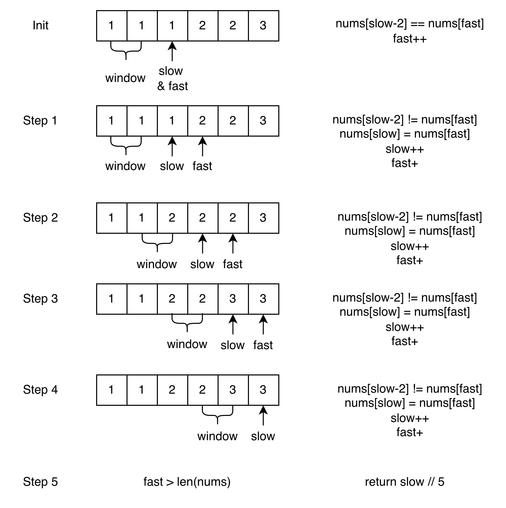

# 双指针

双指针（Two Pointers）是一种常用的数组、链表处理技巧，通过维护两个指针的不同移动策略，能高效解决查找、去重、区间统计等问题。

---

## 核心思想

双指针的本质是 **用空间换时间的逆向思维** ：通过巧妙地移动指针，避免暴力枚举，将时间复杂度从 $O(n²)$ 降低到 $O(n)$。

---

## 五种经典模式

### 1. 快慢指针

**特点**：两个指针同向移动，速度不同

**应用场景**：

- 数组去重、移除元素
- 链表找中点
- 链表判环（Floyd 判圈算法）

**代码模板**：

```go
slow := 0
for fast := 0; fast < len(nums); fast++ {
    if 满足条件 {
        nums[slow] = nums[fast]
        slow++
    }
}
// slow 即为新数组长度
```

#### 最多 k 个重复问题

该问题适用于 **有序数组**，允许每个元素最多出现 k 次。核心思路是维护一个大小为 k 的滑动窗口 `[slow-k, slow)`，通过比较 `nums[slow-k]` 和 `nums[fast]` 来决定是否保留当前元素。

**为什么比较窗口左边界？**

由于数组有序，相同元素必然相邻：

- **相同**（`nums[slow-k] == nums[fast]`）：窗口内已有 k 个相同元素，跳过 `fast`
- **不同**（`nums[slow-k] != nums[fast]`）：窗口内最多只有 k-1 个与 `fast` 相同的元素，可以安全添加

以 k=2 为例：

<figure>
    
</figure>

**代码模板**：

```go
// 最多 k 个重复
func removeDuplicates(nums []int, k int) int {
    if len(nums) <= k {
        return len(nums)
    }

    slow := k
    for fast := k; fast < len(nums); fast++ {
        if nums[slow-k] != nums[fast] {
            nums[slow] = nums[fast]
            slow++
        }
    }

    return slow
}
```

**经典题目**：

- [LeetCode 27. 移除元素](https://leetcode.cn/problems/remove-element/)
- [LeetCode 283. 移动零](https://leetcode.cn/problems/move-zeroes/)
- [LeetCode 2460. 对数组执行操作](https://leetcode.cn/problems/apply-operations-to-an-array/)
- [LeetCode 26. 删除有序数组中的重复项](https://leetcode.cn/problems/remove-duplicates-from-sorted-array/)
- [LeetCode 80. 删除有序数组中的重复项 II](https://leetcode.cn/problems/remove-duplicates-from-sorted-array-ii/)
- [LeetCode 876. 链表的中间结点](https://leetcode.cn/problems/middle-of-the-linked-list/)
- [LeetCode 141. 环形链表](https://leetcode.cn/problems/linked-list-cycle/)

---

### 2. 对撞指针

**特点**：两个指针从两端向中间移动

**应用场景**：

- 有序数组的两数之和
- 回文判断（已知边界用对撞（#125），未知边界用中心扩展（#5））
- 容器盛水问题
- 数组反转

**代码模板**：

```go
left, right := 0, len(nums)-1
for left < right {  // 或 left <= right，见下方说明
    if 满足条件 {
        // 处理结果
        break
    } else if 需要增大 {
        left++
    } else {
        right--
    }
}
```

**⚠️ 循环条件选择：`left < right` vs `left <= right`**

| 循环条件        | 使用场景                                       | 原因                                        | 示例                         |
| --------------- | ---------------------------------------------- | ------------------------------------------- | ---------------------------- |
| `left < right`  | 成对处理元素（回文判断、两数之和、数组反转）   | 当 `left == right` 时指向同一元素，无需处理 | 回文判断中间字符不影响结果   |
| `left <= right` | 需要处理所有元素（二分查找、某些移除元素场景） | 当 `left == right` 时还有一个元素未检查     | 二分查找必须检查最后一个元素 |

**判断技巧**：当 `left == right` 时，我还需要处理这个元素吗？`left <= right`:`left < right`（用三元运算符看）

**经典题目**：

- [LeetCode 167. 两数之和 II - 输入有序数组](https://leetcode.cn/problems/two-sum-ii-input-array-is-sorted/)
- [LeetCode 125. 验证回文串](https://leetcode.cn/problems/valid-palindrome/)
- [LeetCode 11. 盛最多水的容器](https://leetcode.cn/problems/container-with-most-water/)
- [LeetCode 15. 三数之和](https://leetcode.cn/problems/3sum/)

---

### 3. 滑动窗口

**特点**：维护一个动态区间 `[left, right]`，`right++` 是扩大窗口，`left++` 是缩小窗口，每个元素最多被访问两次（进入和离开各一次），因此时间复杂度为 $O(n)$

**应用场景**：

- 最长/最短子串问题
- 子数组和问题
- 字符串匹配

**代码模板**：

```go
left := 0
for right := 0; right < len(s); right++ {
    // 扩大窗口：加入 right 元素
    窗口状态更新

    // 收缩窗口：移除 left 元素
    for 窗口不满足条件 {
        窗口状态更新
        left++
    }

    // 更新结果
}
```

**经典题目**：

- [LeetCode 3. 无重复字符的最长子串](https://leetcode.cn/problems/longest-substring-without-repeating-characters/)
- [LeetCode 76. 最小覆盖子串](https://leetcode.cn/problems/minimum-window-substring/)
- [LeetCode 209. 长度最小的子数组](https://leetcode.cn/problems/minimum-size-subarray-sum/)
- [LeetCode 438. 找到字符串中所有字母异位词](https://leetcode.cn/problems/find-all-anagrams-in-a-string/)

---

### 4. 分离双指针

**特点**：两个指针分别在不同数组/链表上移动

**应用场景**：

- 合并两个有序数组/链表
- 比较两个序列
- 链表相交判断

**代码模板**：

```go
i, j := 0, 0
for i < len(nums1) && j < len(nums2) {
    if nums1[i] < nums2[j] {
        // 处理 nums1[i]
        i++
    } else {
        // 处理 nums2[j]
        j++
    }
}
// 处理剩余元素
```

**经典题目**：

- [LeetCode 88. 合并两个有序数组](https://leetcode.cn/problems/merge-sorted-array/)
- [LeetCode 21. 合并两个有序链表](https://leetcode.cn/problems/merge-two-sorted-lists/)
- [LeetCode 986. 区间列表的交集](https://leetcode.cn/problems/interval-list-intersections/)

---

### 5. 固定间距指针

**特点**：两个指针保持固定距离 k

**应用场景**：

- 删除链表倒数第 N 个节点
- 寻找距离为 K 的元素对

**代码模板**：

```go
fast, slow := head, head
// fast 先走 k 步
for i := 0; i < k; i++ {
    fast = fast.Next
}
// 然后一起走
for fast != nil {
    fast = fast.Next
    slow = slow.Next
}
// slow 现在指向目标位置
```

**经典题目**：

- [LeetCode 19. 删除链表的倒数第 N 个结点](https://leetcode.cn/problems/remove-nth-node-from-end-of-list/)

---

## 优势

- **时间复杂度低**：通常为 $O(n)$，避免嵌套循环
- **空间复杂度低**：只需常数级指针变量
- **代码简洁**：逻辑清晰，易于理解和维护

---

## 注意事项

1. **有序性要求**：对撞指针通常需要有序数组
2. **边界条件**：注意数组越界、空数组等情况
3. **去重处理**：在三数之和等题目中需要跳过重复元素
4. **窗口维护**：滑动窗口要正确维护窗口状态和边界

---

## 如何选择合适的模式？

| 问题特征               | 推荐模式     |
| ---------------------- | ------------ |
| 数组去重、移除元素     | 快慢指针     |
| 有序数组查找、回文判断 | 对撞指针     |
| 子串/子数组问题        | 滑动窗口     |
| 合并两个序列           | 分离双指针   |
| 链表倒数第 k 个        | 固定间距指针 |

---

## 进阶技巧

### 多指针组合

某些复杂问题需要组合使用多种模式：

- **三数之和**：外层循环 + 内层对撞指针
- **接雨水**：双指针 + 动态规划思想
- **合并 K 个有序链表**：分离双指针 + 优先队列
