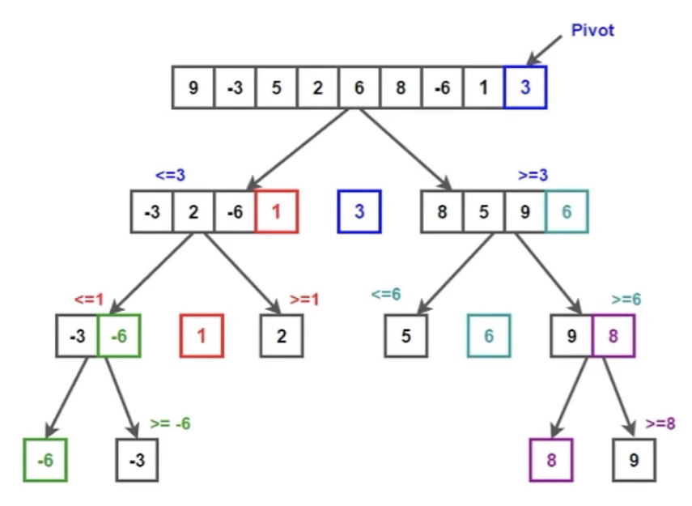
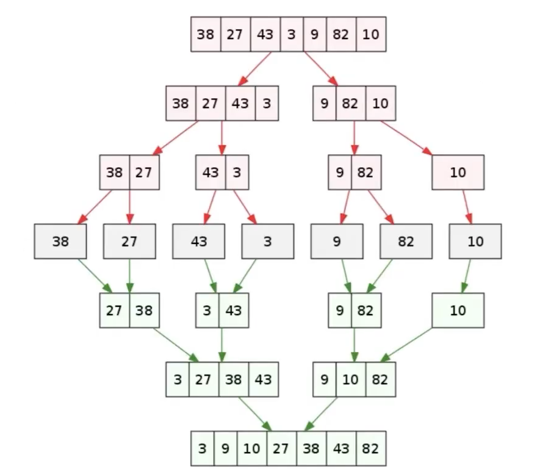
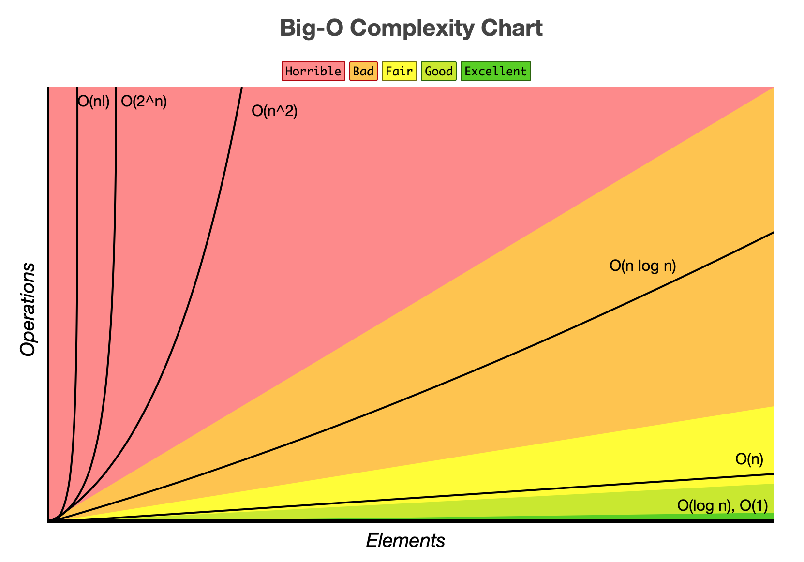
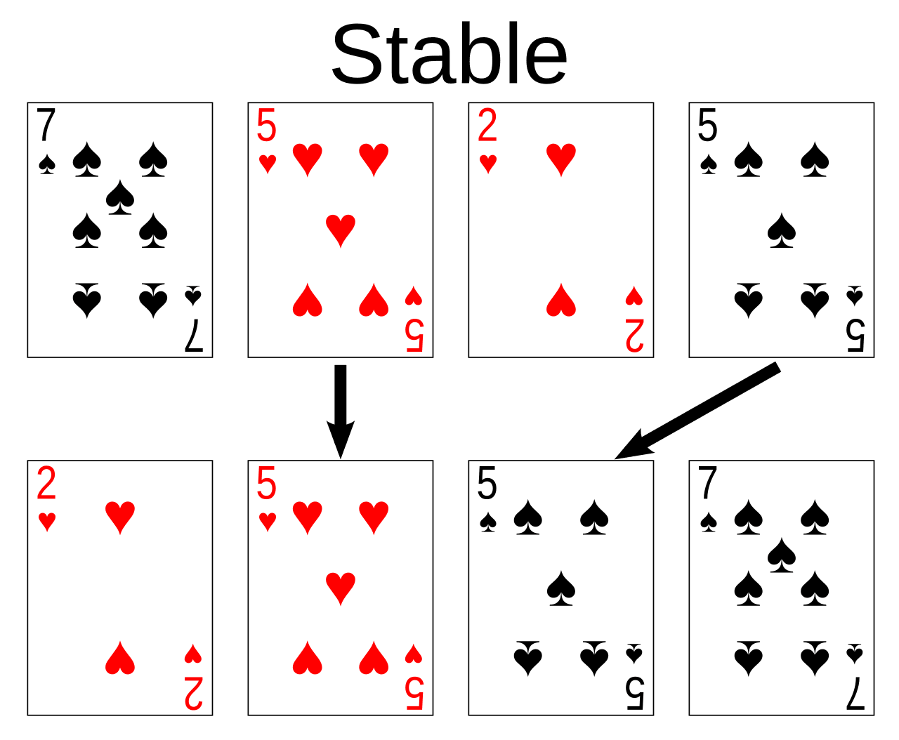
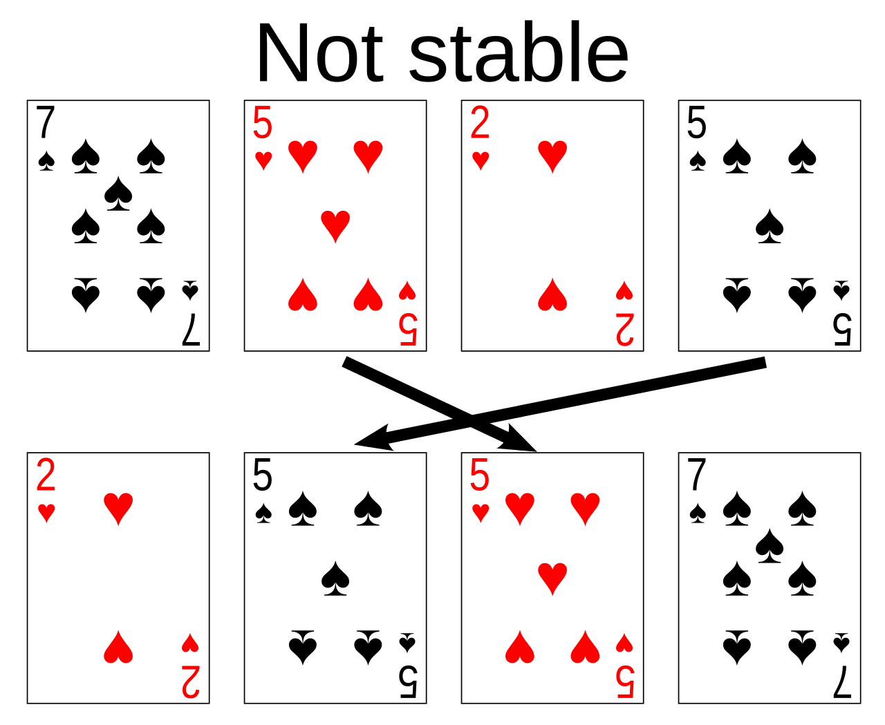

# 排序

排序算法是算法与数据结构领域的基础内容，广泛应用于数据处理、查找、去重等场景。掌握常见排序算法及其原理、复杂度和适用场景，是算法学习和面试的必备技能。

排序的方法有 **插入**、**交换**、**选择**、**合并** 等。

## 十大常用排序算法

<table style="width: 100%;">
  <thead>
    <tr>
      <th>名称</th>
      <th>数据对象</th>
      <th>稳定性</th>
      <th>比较类</th>
      <th>时间复杂度<br/>（平均/最坏）</th>
      <th>空间复杂度</th>
      <th>原理</th>
      <th>描述</th>
      <th>适用场景</th>
    </tr>
  </thead>
  <tbody>
    <tr>
      <td><a href="https://b23.tv/BV181421876R">冒泡排序</a><br />bubble sort</td>
      <td>数组</td>
      <td>✓</td>
      <td>✓</td>
      <td>$O(n^2)$</td>
      <td>$O(1)$</td>
      <td>每轮将相邻元素两两比较，大的往后交换，重复 n 轮</td>
      <td>(无序区, 有序区)。<br />从无序区通过交换找出最大元素放到有序区前端。</td>
      <td>数据量小、对稳定性有要求</td>
    </tr>
    <tr>
      <td rowspan="2"><a href="https://b23.tv/BV1kjsuenE8v">选择排序</a><br />selection sort</td>
      <td>数组</td>
      <td>×</td>
      <td rowspan="2">✓</td>
      <td rowspan="2">$O(n^2)$</td>
      <td rowspan="2">$O(1)$</td>
      <td rowspan="2">每轮选择剩余元素中的最小值，放到前面</td>
      <td rowspan="2">(有序区, 无序区)。<br />在无序区里找一个最小的元素跟在有序区的后面。对数组：比较得多，换得少。</td>
      <td rowspan="2">数据量小</td>
    </tr>
    <tr>
      <td>链表</td>
      <td>✓</td>
    </tr>
    <tr>
      <td><a href="https://b23.tv/BV1tf421Q7eh">插入排序</a><br />insertion sort</td>
      <td>数组、链表</td>
      <td>✓</td>
      <td>✓</td>
      <td>$O(n^2)$</td>
      <td>$O(1)$</td>
      <td>每次将一个元素插入到已排序部分的合适位置</td>
      <td>(有序区, 无序区)。<br />把无序区的第一个元素插入到有序区的合适位置。对数组：比较得少，换得多。</td>
      <td>数据量小、部分有序</td>
    </tr>
    <tr>
      <td><a href="https://b23.tv/BV1HYtseiEQ8">堆排序</a><br />heap sort</td>
      <td>数组</td>
      <td>×</td>
      <td>✓</td>
      <td>$O(n \log n)$</td>
      <td>$O(1)$</td>
      <td>构建最大/最小堆，依次取出堆顶元素</td>
      <td>(最大堆, 有序区)。<br />从堆顶把根卸出来放在有序区之前，再恢复堆。</td>
      <td>原地排序</td>
    </tr>
    <tr>
      <td rowspan="2"><a href="https://b23.tv/BV1em1oYTEFf">归并排序</a><br />merge sort</td>
      <td>数组</td>
      <td rowspan="2">✓</td>
      <td rowspan="2">✓</td>
      <td rowspan="2">$O(n \log n)$</td>
      <td>$O(n) + O(\log n)$</td>
      <td rowspan="2">递归分组，合并有序子数组</td>
      <td rowspan="2">把数据分为两段，从两段中逐个选最小的元素移入新数据段的末尾。可从上到下或从下到上进行。</td>
      <td rowspan="2">大数据、链表排序、稳定性要求高</td>
    </tr>
    <tr>
      <td>链表</td>
      <td>$O(1)$</td>
    </tr>
    <tr>
      <td rowspan="2"><a href="https://b23.tv/BV1y4421Z7hK">快速排序</a><br />quick sort</td>
      <td>数组</td>
      <td>×</td>
      <td rowspan="2">✓</td>
      <td rowspan="2">$O(n \log n) / O(n^2)$</td>
      <td rowspan="2">$O(\log n)$</td>
      <td rowspan="2">选定基准，分区递归排序左右两部分</td>
      <td rowspan="2">(小数, 基准元素, 大数)。<br />在区间中随机挑选一个元素作基准，将小于基准的元素放在基准之前，大于基准的元素放在基准之后，再分别对小数区与大数区进行排序。</td>
      <td rowspan="2">通用、高效排序</td>
    </tr>
    <tr>
      <td>链表</td>
      <td>✓</td>
    </tr>
    <tr>
      <td><a href="https://b23.tv/BV1bm42137UZ">希尔排序</a><br />shell sort</td>
      <td>数组</td>
      <td>×</td>
      <td>✓</td>
      <td>$O(n \log^2 n) / O(n^2)$</td>
      <td>$O(1)$</td>
      <td></td>
      <td>每一轮按照事先决定的间隔进行插入排序，间隔会依次缩小，最后一次一定要是 1。</td>
      <td></td>
    </tr>
    <tr>
      <td>计数排序<br />counting sort</td>
      <td rowspan="3">数组、链表</td>
      <td rowspan="3">✓</td>
      <td rowspan="3">×</td>
      <td>$O(n + m)$</td>
      <td>$O(n + m)$</td>
      <td rowspan="3">利用元素值域特性进行分组计数或分桶</td>
      <td>统计小于等于该元素的值的元素的个数 i，于是该元素就放在目标数组的索引 i 位 (i≥0)。</td>
      <td rowspan="3">数据范围有限、整数排序</td>
    </tr>
    <tr>
      <td>桶排序<br />bucket sort</td>
      <td>$O(n)$ / $O(n^2)$</td>
      <td>$O(m)$</td>
      <td>将值为 i 的元素放入 i 号桶，最后依次把桶里的元素倒出来。</td>
    </tr>
    <tr>
      <td><a href="https://b23.tv/BV1KrzrYeEDw">基数排序</a><br />radix sort</td>
      <td>$O(k \times n) / O(n^2)$</td>
      <td>$O(n)$</td>
      <td>一种多关键字的排序算法，可用桶排序实现。</td>
    </tr>
  </tbody>
</table>

!!! Info "表格说明"

    - **n**：数据规模
    - **m**：数据的最大值减最小值
    - **k**：数值中的"数位"个数
    - 所有排序均按从小到大排列

!!! Note "重要说明"

    - **比较类 vs 非比较类**：计数排序、桶排序、基数排序均为非比较类排序。现代编程语言的内置排序（如 C++、Java、Python）都是 **比较类排序**（一般 $O(n \log n)$），因为要能支持 **通用对象排序**。
    - **必须掌握**：排序算法是算法基础，建议至少熟练掌握冒泡、插入、选择、快排、归并五种实现。
    - **选择依据**：选择合适的排序算法需结合数据规模、稳定性需求和空间限制。

<div class="grid cards" markdown>
- <figure>
    
    <figcaption>快速排序示意图</figcaption>
  </figure>
- <figure>
    
    <figcaption>归并排序示意图</figcaption>
  </figure>
</div>

!!! Tip "快速记忆口诀"

    - 冒泡两两换，选择找最小，插入往前挪，希尔改插入，归并分两半。
    - 快排选基准，堆排建大堆，计数靠统计，桶排序分区，基数按位排。

### 复杂度

在计算机科学中，我们通常用大 $O$ 来描述某个特定算法时间与空间随着数据规模增加而变化的趋势。

<figure markdown>
  { width=50% }
</figure>

### 稳定性与不稳定性

我们以纸牌排序为例，当纸牌用稳定排序按点值排序的时候，两个 5 之间必定保持它们最初的次序。在用不稳定排序来排序的时候，两个 5 可能被按相反次序来排序。

<div class="grid cards" markdown>
- <figure>
    
    <figcaption>稳定排序</figcaption>
  </figure>
- <figure>
    
    <figcaption>不稳定排序</figcaption>
  </figure>
</div>

稳定排序通常是通过相邻交换或辅助空间来实现的，比较温柔，不会乱跳。而不稳定排序则通常包含长距离交换实现，容易把顺序搞乱。

- 稳定排序包括：冒泡排序、插入排序、归并排序、计数排序、桶排序、基数排序。
- 不稳定排序包括：快速排序、选择排序、堆排序、希尔排序。

## 排序算法实现

=== "冒泡排序"

    通过不断两两比较交换，直到所有元素有序。

    优化点：已排序区可跳过；全部有序可提前结束遍历

    ```python

    # Time: O(n^2)
    def bubble(nums: list[int]) -> list[int]:
        n = len(nums)
        if n < 2:
            return nums

        # 外层循环控制轮数，最后一个数不需要比较
        for i in range(n - 1):
            swapped = False

            # 内层循环进行比较交换
            # 由于每次外层循环结束后最大的元素会被移动到数组的末尾，因此内层循环的范围可以逐渐缩小
            for j in range(1, n - i):
                if nums[j - 1] > nums[j]:
                    nums[j - 1], nums[j] = nums[j], nums[j - 1]
                    swapped = True

            # 未发生交换则已排好序，提前结束比较
            if not swapped:
                break

        return nums
    ```

=== "选择排序"

    在待排序区不停选择最小值，然后与待排序区首个元素交换（已排序区末尾或待排序区头部）。不断循环，即可对所有元素排序。

    ```python
    # Time: O(n^2)
    def selection(nums: list[int]) -> list[int]:
        n = len(nums)
        if n < 2:
            return nums

        for i in range(n - 1):
            min_idx = i
            for j in range(i + 1, n):
                if nums[j] < nums[min_idx]:
                    min_idx = j
            nums[i], nums[min_idx] = nums[min_idx], nums[i]

        return nums
    ```

=== "插入排序"

    像插扑克牌一样，从第二个元素开始，不断将之后的元素放在之前的已排序位置。

    ```python
    # Time: O(n^2)
    def insertion(nums: list[int]) -> list[int]:
        n = len(nums)
        if n < 2:
            return nums

        # [0,i) 为已排序区，[i,n) 为待排序区
        for i in range(1, n):
            key = nums[i]  # key 为从桌上拿起的新牌
            j = i - 1
            # j 负责逆序遍历已排序区，为 key 找到插入位置
            while j >= 0 and nums[j] > key:
                # 向右移动元素，腾出插入空间
                nums[j + 1] = nums[j]
                j -= 1
            # 将 key 插入正确位置
            nums[j + 1] = key

        return nums
    ```

=== "快速排序"

    像军训整理队伍一样，根据基准点来排序。

    ```python
    # Time: 平均 O(n log n), 最坏 O(n^2)
    def quick(nums: list[int]) -> list[int]:
        if len(nums) < 2:
            return nums

        def partition(left: int, right: int) -> int:
            # 三数取中，降低接近有序数据时的退化概率
            mid = left + (right - left) // 2
            if nums[mid] < nums[left]:
                nums[left], nums[mid] = nums[mid], nums[left]
            if nums[right] < nums[left]:
                nums[left], nums[right] = nums[right], nums[left]
            if nums[right] < nums[mid]:
                nums[mid], nums[right] = nums[right], nums[mid]

            nums[left], nums[mid] = nums[mid], nums[left]
            pivot_value = nums[left]
            left_ptr, right_ptr = left, right
            while left_ptr < right_ptr:
                # 从右向左找第一个小于 pivot 的数
                while left_ptr < right_ptr and nums[right_ptr] >= pivot_value:
                    right_ptr -= 1
                nums[left_ptr] = nums[right_ptr]
                # 从左向右找第一个大于 pivot 的数
                while left_ptr < right_ptr and nums[left_ptr] <= pivot_value:
                    left_ptr += 1
                nums[right_ptr] = nums[left_ptr]
            # 将 pivot 放回正确的位置
            nums[left_ptr] = pivot_value
            return left_ptr

        def quick_sort_range(left: int, right: int) -> None:
            if left >= right:
                return
            # 分区并拿到 pivot 的最终位置
            pivot_index = partition(left, right)
            # 递归地对左右两部分进行排序
            quick_sort_range(left, pivot_index - 1)
            quick_sort_range(pivot_index + 1, right)

        quick_sort_range(0, len(nums) - 1)
        return nums
    ```

=== "归并排序"

    像锦标赛那样两两PK快速收敛。

    ```python
    # Time: O(nlogn)
    def merge(nums: list[int]) -> list[int]:
        if len(nums) < 2:
            return nums

        def merge_halves(left: int, mid: int, right: int) -> None:
            # 创建一个临时列表来存储合并后的结果
            merged = []
            i, j = left, mid + 1
            # 比较左右两部分，将较小的元素放入 merged
            while i <= mid and j <= right:
                if nums[i] <= nums[j]:
                    merged.append(nums[i])
                    i += 1
                else:
                    merged.append(nums[j])
                    j += 1
            # 将剩余的元素拷贝到 merged
            while i <= mid:
                merged.append(nums[i])
                i += 1
            while j <= right:
                merged.append(nums[j])
                j += 1
            # 将排好序的 merged 内容拷贝回原始的 nums 列表的对应位置
            nums[left:right + 1] = merged

        def merge_sort_range(left: int, right: int) -> None:
            if left >= right:
                return
            mid = left + (right - left) // 2
            merge_sort_range(left, mid)
            merge_sort_range(mid + 1, right)
            merge_halves(left, mid, right)

        merge_sort_range(0, len(nums) - 1)
        return nums
    ```

=== "希尔排序"

    插入排序的改进算法，又称递减增量排序算法。

    ```python
    def shell(nums: list[int]) -> list[int]:
        n = len(nums)
        if n < 2:
            return nums

        gap = n // 2
        while gap > 0:
            for i in range(gap, n):
                temp = nums[i]
                j = i
                while j >= gap and nums[j - gap] > temp:
                    nums[j] = nums[j - gap]
                    j -= gap
                nums[j] = temp
            gap //= 2

        return nums
    ```

=== "堆排序"

    ```python
    # Time: O(n log n), Space: O(1)
    def heap_sorting(nums: list[int]) -> list[int]:
        n = len(nums)
        if n < 2:
            return nums

        def heapify_down(root: int, size: int) -> None:
            """将 root 向下调整，维护最大堆性质"""
            while True:
                largest = root
                left, right = 2 * root + 1, 2 * root + 2
                if left < size and nums[left] > nums[largest]:
                    largest = left
                if right < size and nums[right] > nums[largest]:
                    largest = right
                if largest == root:
                    break
                nums[root], nums[largest] = nums[largest], nums[root]
                root = largest

        # 建堆：从最后一个非叶子节点开始向下调整
        for i in range(n // 2 - 1, -1, -1):
            heapify_down(i, n)

        # 逐步将堆顶（最大值）移到末尾，缩小堆范围
        for size in range(n - 1, 0, -1):
            nums[0], nums[size] = nums[size], nums[0]
            heapify_down(0, size)

        return nums
    ```

=== "计数排序"

    ```python
    # 假设 nums 非负且最大值不大
    # Time: O(n+m)
    def counting(nums: list[int]) -> list[int]:
        n = len(nums)
        if n < 2:
            return nums

        max_val = max(nums)
        counts = [0] * (max_val + 1)
        for v in nums:
            counts[v] += 1

        idx = 0
        for i, c in enumerate(counts):
            while c > 0:
                nums[idx] = i
                idx += 1
                c -= 1

        return nums
    ```

=== "桶排序"

    ```python
    # 假设 nums 非负且分布均匀
    # Time: 平均 O(n), 最坏 O(n^2)
    import math

    def bucket(nums: list[int]) -> list[int]:
        n = len(nums)
        if n < 2:
            return nums

        def insertion_sort(arr: list[int]) -> None:
            for i in range(1, len(arr)):
                key = arr[i]
                j = i - 1
                while j >= 0 and arr[j] > key:
                    arr[j + 1] = arr[j]
                    j -= 1
                arr[j + 1] = key

        max_val, min_val = max(nums), min(nums)
        bucket_num = n
        buckets: list[list[int]] = [[] for _ in range(bucket_num)]
        interval = math.ceil((max_val - min_val + 1) / bucket_num)
        for v in nums:
            bucket_idx = (v - min_val) // interval
            buckets[bucket_idx].append(v)

        write_idx = 0
        for b in buckets:
            insertion_sort(b)
            for v in b:
                nums[write_idx] = v
                write_idx += 1

        return nums
    ```

=== "基数排序"

    ```python
    # 假设 nums 非负整数
    # Time: O(k*n)
    def radix(nums: list[int]) -> list[int]:
        n = len(nums)
        if n < 2:
            return nums

        max_val = max(nums)
        exp = 1
        buf = [0] * n
        while max_val // exp > 0:
            count = [0] * 10
            for v in nums:
                count[(v // exp) % 10] += 1
            for i in range(1, 10):
                count[i] += count[i - 1]
            for i in range(n - 1, -1, -1):
                digit = (nums[i] // exp) % 10
                buf[count[digit] - 1] = nums[i]
                count[digit] -= 1
            nums[:] = buf
            exp *= 10

        return nums
    ```

## 工程常用算法

### Tim 排序（归并+插入）

Timsort 是一种混合（归并+插入）稳定的排序算法。具有 $O(n \log n)$ 的平均和最坏时间复杂度，最优可达 $O(n)$，空间复杂度为 $O(n)$。该算法是目前已知最快的排序算法，在 Python、Swift、Rust 等语言的内置排序功能中被用作默认算法。

### 内省排序（Introsort）（快排+堆排）

内省排序首先从快速排序开始，当递归深度超过一定深度（深度为排序元素数量的对数值）后转为堆排序。采用这个方法，内省排序既能在常规数据集上实现快速排序的高性能，又能在最坏情况下仍保持 $O(n \log n)$ 的时间复杂度。由于这两种算法都属于比较排序算法，所以内省排序也是一个比较排序算法。

### 不同语言内置排序算法对比

| **语言 / 库**                      | **算法实现**                                  | **稳定性** | **特点**                                           |
| ---------------------------------- | --------------------------------------------- | ---------- | -------------------------------------------------- |
| C (qsort)                          | 快速排序为主（不同实现可能混合插入排序）      | ×          | 简单高效，但可能退化到 $O(n²)$                     |
| C++ (std::sort)                    | **Introsort**（快速排序 + 堆排序 + 插入排序） | ×          | 平均 $O(n log n)$，最坏 $O(n log n)$，避免快排退化 |
| C++ (std::stable_sort)             | 归并排序（常带优化）                          | ✓          | 保证稳定性，但需要额外内存                         |
| Java (Arrays.sort, 基本类型)       | **Dual-Pivot QuickSort**（双轴快排）          | ×          | 比普通快排常数更小，性能优越                       |
| Java (Arrays.sort, 对象类型)       | **Timsort**（归并 + 插入）                    | ✓          | 对部分有序数据非常快，最坏 $O(n log n)$            |
| Python (list.sort / sorted)        | **Timsort**                                   | ✓          | 专门为现实数据优化，利用已有有序片段               |
| JavaScript (V8 引擎)               | 小数组：插入排序；大数组：快排 + 混合         | ×          | 对象数组时可能使用归并变体                         |
| JavaScript (SpiderMonkey, Firefox) | **Timsort / 归并变体**                        | ✓          | 性能和 Python 类似                                 |
| Go (sort.Sort)                     | **Introsort**（快排 + 堆排 + 插入）           | ×          | 类似 C++ std::sort                                 |
| Rust (sort)                        | **Introsort**（快排 + 堆排 + 插入）           | ×          | 与 C++ 类似                                        |
| Rust (sort_stable)                 | **归并排序**                                  | ✓          | 保证稳定性                                         |

- 几乎所有标准库排序都是 **混合算法**，避免单一算法的缺陷，保证最坏复杂度不超过 $O(n log n)$
- 数值数组：大多用快速排序或 Introsort（追求性能）
- 对象数组：多数用 Timsort / 归并排序（追求稳定性）
- 小规模数据：经常用插入排序优化
