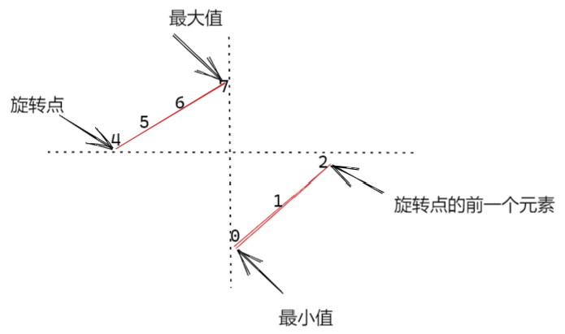

# Python 刷题清单

## 数组

**综合常考**

=== "#560 和为 K 的子数组"

    本题可用暴力枚举和前缀和两种方法求解。以 `nums=[1,-1,2,3,-2,4], k=3` 为例，满足条件的子数组共有 3 个，分别是 `[1,-1,2,3,-2]`、`[2,3,-2]` 和 `[3]`。其前缀和如下表所示。由于 `prefixSum[5]-prefixSum[0]=3`，说明区间 `[1,-1,2,3,-2]` 的元素和恰好为 3。因此，只要在遍历过程中查询哈希表中是否存在 `prefixSum-k`，并累加它的出现次数，就能统计出和为 `k` 的子数组个数。

    | nums      |       | 1    | -1   | 2     | 3    | -2   | 4    |
    | --------- | ----- | ---- | ---- | ----- | ---- | ---- | ---- |
    | prefixSum | 0     | 1    | 0    | 2     | 5    | 3    | 7    |
    | count     | **2** | 1    |      | **1** | 1    | 1    | 1    |

    ```python
    # Time: O(n), Space: O(n)
    def subarraySum(nums: list[int], k: int) -> int:
        count, prefix_sum = 0, 0
        prefix_sum_map = {0: 1}  # 兼容 nums=[3], k=3
        for num in nums:
            prefix_sum += num  # 计算前缀和
            if prefix_sum - k in prefix_sum_map:  # 查找是否存在
                count += prefix_sum_map[prefix_sum - k]  # 累计频率
            prefix_sum_map[prefix_sum] = prefix_sum_map.get(prefix_sum, 0) + 1  # 对前缀和值的出现次数统计

        return count
    ```

## 哈希表

**基础必会**

=== "#1 两数之和"

    ```python
    # Time: O(n), Space: O(n)
    def twoSum(nums: list[int], target: int) -> list[int]:
        # 哈希表记录出现的元素及索引
        # 遍历 nums，如果 target - num 在哈希表中，返回索引
        # 否则将 num 加入哈希表

        seen = {}
        for i, num in enumerate(nums):
            if target - num in seen:
                return [i, seen[target - num]]
            seen[num] = i

        return []
    ```

**综合常考**

=== "128 最长连续序列"

    在本题中，要求 $O(n)$ 求解，排序后复杂度为 $O(logn)$，不符合要求。因此需要把输入存入哈希表，然后遍历哈希表，如果取值的前一位不在哈希表，则当前值作为序列起始值；如果下一位在哈希表，则认为是连续序列。

    ```python
    # Time: O(n), Space: O(n)
    def longestConsecutive(nums: list[int]) -> int:
        has = set(nums)  # 使用集合简化判断

        ans = 0
        for num in has:
            if num - 1 in has:  # 上一个数存在于哈希表，说明 num 不是序列的起点
                continue

            next_num = num + 1
            while next_num in has:  # 不断查找下一个序列是否在哈希表中
                next_num += 1

            ans = max(ans, next_num - num)

        return ans
    ```

=== "#49 字母异位词分组"

    <div class="grid cards" markdown>

    - <figure>
        
        <figcaption>排序解法</figcaption>
    </figure>
    - <figure>
        
        <figcaption>计数解法</figcaption>
    </figure>

    </div>

    ```python
    # 排序解法
    # Time: O(m*nlogn), Space: O(m*n)
    def groupAnagrams(strs: list[str]) -> list[list[str]]:
        groups = {}
        for s in strs:
            key = "".join(sorted(s))
            groups.setdefault(key, []).append(s)

        return list(groups.values())
    ```

    ```python
    # 计数解法
    # Time: O(m*n), Space: O(m*n)
    def groupAnagrams(strs: list[str]) -> list[list[str]]:
        groups = {}
        for s in strs:
            count = [0] * 26
            for ch in s:
                count[ord(ch) - ord('a')] += 1
            key = tuple(count)  # 列表不可哈希，转为元组作为键
            groups.setdefault(key, []).append(s)

        return list(groups.values())
    ```

## 双指针

**基础必会**

=== "#11 盛水最多的容器"

    对撞指针计算面积，只移动较矮的一边。

    ```python
    # Time: O(n), Space: O(1)
    def maxArea(height: list[int]) -> int:
        max_area, left, right = 0, 0, len(height) - 1
        while left < right:
            area = (right - left) * min(height[left], height[right])  # 以较矮的作为高计算面积
            max_area = max(max_area, area)
            # 只移动较矮的一边
            if height[left] < height[right]:
                left += 1
            else:
                right -= 1

        return max_area
    ```

=== "#88 合并两个有序数组"

    双指针倒序填充

    ```python
    # Time: O(m+n), Space: O(1)
    def merge(nums1: list[int], m: int, nums2: list[int], n: int) -> None:
        p1, p2, tail = m - 1, n - 1, m + n - 1

        # 只需检查 p2 >= 0，因为 nums2 处理完后，nums1 剩余元素已在正确位置
        while p2 >= 0:
            if p1 >= 0 and nums1[p1] > nums2[p2]:
                nums1[tail] = nums1[p1]
                p1 -= 1
            else:
                nums1[tail] = nums2[p2]
                p2 -= 1
            tail -= 1
    ```

=== "#283 移动零"

    注意移动零时还要保持非零元素的相对位置，因此不能使用对撞指针，而应该用快慢指针不断交换零和非零元素

    ```python
    # Time: O(n), Space: O(1)
    def moveZeroes(nums: list[int]) -> None:
        slow = 0  # 并不能确定 nums[0] 是否为非零值
        for fast in range(len(nums)):  # fast 要从0开始遍历，否则可能遗漏首位的零值交换。首位是非零值会发生自己和自己交换
            if nums[fast] != 0:
                nums[slow], nums[fast] = nums[fast], nums[slow]
                slow += 1
    ```

=== "#26 删除有序数组中的重复项"

    题目描述不清楚，本意是想把 `nums` 中不重复的元素移动到数组左边，然后返回数组中不重复元素的个数，因此不能使用哈希表求解。

    注意本题是有序数组，也就意味着重复项是相邻的，因此可以类似 #283 通过快慢指针把重复元素交换到尾部。注意 #283 为了避免遗漏首位的零值交换，`fast` 要从 0 开始，本题是判断重复元素，`fast` 可以从 1 开始

    ```python
    # Time: O(n), Space: O(1)
    def removeDuplicates(nums: list[int]) -> int:
        slow = 0
        for fast in range(1, len(nums)):
            if nums[slow] != nums[fast]:
                slow += 1  # 注意要交换到 slow 的下一个位置
                nums[slow] = nums[fast]

        return slow + 1  # 注意差1问题
    ```

**综合常考**

=== "#3 无重复字符的最长子串"

    ```python
    # Time: O(n), Space: O(n)
    def lengthOfLongestSubstring(s: str) -> int:
        # 哈希表记录出现的元素及索引
        # 哈希表出现的元素，left 移动到哈希表中索引 +1 位置，否则右指针右移扩大窗口

        seen = {}
        left, right, max_win = 0, 0, 0
        while right < len(s):
            if s[right] in seen:
                left = seen[s[right]] + 1

            seen[s[right]] = right
            right += 1

            max_win = max(max_win, right - left)

        return max_win
    ```

=== "#15 三数之和"

    ```python
    # Time: O(n²), Space: O(1)
    def threeSum(nums: list[int]) -> list[list[int]]:
        if len(nums) < 3:
            return []

        nums.sort()

        ans = []
        # 先固定第一个数
        for i in range(len(nums) - 2):
            # 提前剪枝：如果第一个数已经大于0，后面都是正数，不可能和为0
            if nums[i] > 0:
                break

            if i > 0 and nums[i] == nums[i - 1]:
                continue  # 跳过重复的第一个数

            # 用双指针让剩余两数之和与第一个数的和为0
            left, right = i + 1, len(nums) - 1
            while left < right:
                total = nums[i] + nums[left] + nums[right]

                # 注意此时已经排序
                if total < 0:  # 和太小，需要右移靠近较大数
                    left += 1
                elif total > 0:  # 和太大，需要左移靠近较小数
                    right -= 1
                else:  # 和为 0
                    ans.append([nums[i], nums[left], nums[right]])

                    # 跳过重复的第二个数
                    while left < right and nums[left] == nums[left + 1]:
                        left += 1

                    # 跳过重复的第三个数
                    while left < right and nums[right] == nums[right - 1]:
                        right -= 1

                    left += 1
                    right -= 1

        return ans
    ```

=== "#5 最长回文子串"

    由于本题查找最长回文子串，我们并不清楚回文边界，因此 **无法使用对撞指针**，只能用回文中心对称的特点，从中心向两侧扩展求解。

    ```python
    # Time: O(n²), Space: O(1)
    def longestPalindrome(s: str) -> str:
        start, max_len = 0, 0

        # 从中心向两侧扩展，返回回文长度
        def expand(l: int, r: int) -> None:
            nonlocal start, max_len
            while l >= 0 and r < len(s) and s[l] == s[r]:
                l -= 1
                r += 1
            # 此时 [l+1, r-1] 是回文
            if r - l - 1 > max_len:
                start = l + 1
                max_len = r - l - 1

        for i in range(len(s)):
            # 无法预知以某个位置为中心的最长回文是奇数还是偶数长度，因此需要同时遍历两种情况，取最长的那个
            expand(i, i)      # 奇数长度回文（如 "aba"）
            expand(i, i + 1)  # 偶数长度回文（如 "abba"）

        return s[start:start + max_len]
    ```

=== "#31 下一个排列"

    题目解释：将数组视为一个数字，在所有排列中找到**恰好比当前排列大的下一个排列**；若已是最大排列，则回绕到最小排列。

    - `nums = [1,2,3]`：对应数字 123，所有排列按大小排序为 123 → **132** → 213 → …，下一个排列为 `[1,3,2]`
    - `nums = [3,2,1]`：对应数字 321，已是最大排列，回绕到最小排列 `[1,2,3]`

    解题思路：

    1. 从右往左，找到第一个满足 `nums[k] < nums[k+1]` 的位置 `k`（即第一个"下降点"）。若不存在，说明已是最大排列，直接翻转整个数组即可。（可以通过折线图可视化查找过程）
    2. 再从右往左，找到第一个满足 `nums[l] > nums[k]` 的位置 `l`。
    3. 交换 `nums[k]` 与 `nums[l]`。
    4. 翻转 `nums[k+1:]`，使其从降序变为升序，得到恰好大一点的排列。

    以 `nums = [1,2,7,4,3,1]` 为例：

    - 找下降点：从右往左扫描，`nums[1]=2 < nums[2]=7`，故 `k=1`
    - 找交换点：从右往左找第一个大于 2 的数，`nums[4]=3`，故 `l=4`
    - 交换：`nums = [1,3,7,4,2,1]`
    - 翻转 `nums[2:]`：`nums = [1,3,1,2,4,7]` ✅

    ```python
    # Time: O(n), Space: O(1)
    def nextPermutation(nums: list[int]) -> None:
        # 从右往左找到第一个下降点 i
        i = len(nums) - 2
        while i >= 0 and nums[i] >= nums[i + 1]:
            i -= 1

        if i >= 0:
            # 从右往左找到第一个大于 nums[i] 的数 j
            j = len(nums) - 1
            while nums[j] <= nums[i]:
                j -= 1
            # 交换 i 和 j
            nums[i], nums[j] = nums[j], nums[i]

        # 反转 i 之后的部分
        left, right = i + 1, len(nums) - 1
        while left < right:
            nums[left], nums[right] = nums[right], nums[left]
            left += 1
            right -= 1
    ```

=== "#165 比较版本号"

    ```python
    # Time: O(n+m), Space: O(1)
    def compareVersion(version1: str, version2: str) -> int:
        n, m = len(version1), len(version2)
        i, j = 0, 0
        while i < n or j < m:
            x = 0
            while i < n and version1[i] != '.':
                x = x * 10 + int(version1[i])
                i += 1
            i += 1  # 跳过点号

            y = 0
            while j < m and version2[j] != '.':
                y = y * 10 + int(version2[j])
                j += 1
            j += 1  # 跳过点号

            if x > y:
                return 1
            if x < y:
                return -1

        return 0
    ```

## 链表

**基础必会**

=== "#206 反转链表"

    ```python
    # Time: O(n), Space: O(1)
    def reverseList(head: ListNode) -> ListNode:
        prev = None
        # 暂存、反转、移动
        while head:
            next_node = head.next
            head.next = prev
            prev = head
            head = next_node

        return prev
    ```

=== "#92 局部反转链表"

    头插法，把 `curr.Next` 节点插入区间头部（即 `prev` 后）。

    ```python
    # Time: O(n), Space: O(1)
    def reverseBetween(head: ListNode, left: int, right: int) -> ListNode:
        dummy = ListNode(next=head)  # 可能从头结点开始反转

        prev = dummy
        for _ in range(1, left):
            prev = prev.next

        curr = prev.next
        for _ in range(left, right):  # 这段代码画个步骤图就出来了
            next_node = curr.next      # 暂存操作节点的移动路径
            curr.next = next_node.next # 摘下节点
            next_node.next = prev.next # 插到区间头部
            prev.next = next_node      # 移动操作的节点

        return dummy.next
    ```

    

=== "#876 链表的中间节点"

    本题使用快慢指针求解，但要注意链表奇偶长度的处理

    ```python
    # Time: O(n), Space: O(1)
    def middleNode(head: ListNode) -> ListNode:
        if not head:
            return None

        slow, fast = head, head
        while fast and fast.next:
            slow, fast = slow.next, fast.next.next

        return slow
    ```

=== "#141 判断环形链表"

    快慢指针解法：快指针走两步，慢指针走一步，相遇则有环

    ```python
    # Time: O(n), Space: O(1)
    def hasCycle(head: ListNode) -> bool:
        slow, fast = head, head
        while fast and fast.next:
            slow, fast = slow.next, fast.next.next
            if slow == fast:
                return True

        return False
    ```

=== "#142 找到环形链表的入口"

    ```python
    # Time: O(n), Space: O(n)
    def detectCycle(head: ListNode) -> ListNode:
        seen = set()
        while head:
            if head in seen:
                return head
            seen.add(head)
            head = head.next

        return None
    ```

=== "#160 相交链表"

    本题可以使用哈希表来简单求解，也可以用双指针把空间复杂度优化到 $O(1)$

    ```python
    # Time: O(m+n), Space: O(1)
    def getIntersectionNode(headA: ListNode, headB: ListNode) -> ListNode:
        pA, pB = headA, headB
        while pA != pB:
            pA = headB if pA is None else pA.next
            pB = headA if pB is None else pB.next

        return pA  # 没有相交时，遍历结束的链表最终指向 None
    ```

=== "#21 合并两个有序链表"

    ```python
    # Time: O(m+n), Space: O(1)
    def mergeTwoLists(l1: ListNode, l2: ListNode) -> ListNode:
        dummy = ListNode()
        current = dummy

        # 注意该遍历需同时操作3个链表
        while l1 and l2:  # 注意是 and
            if l1.val < l2.val:      # 将较小的值挂载在新链表上
                current.next = l1
                l1 = l1.next         # 移动原链表
            else:
                current.next = l2
                l2 = l2.next
            current = current.next   # 移动新链表

        # 将链表剩余部分挂载，同时处理原链表为空
        current.next = l1 if l1 else l2

        # 注意返回的是 dummy.next
        return dummy.next
    ```

**综合常考**

=== "#25 K 个一组反转链表"

    分组+局部反转（k=3）：

    ```
    // 反转前
    // dummy -> A -> B -> C -> D -> E
    //   ↑      ↑         ↑    ↑
    // prev    cur      tail  nextGroup

    // 反转后（第一组）
    // dummy -> C -> B -> A -> D -> E
    //          ↑         ↑    ↑
    //         tail      cur  nextGroup
    //                   prev
    ```

    ```python
    # Time: O(n), Space: O(1)
    def reverseKGroup(head: ListNode, k: int) -> ListNode:
        dummy = ListNode(next=head)
        prev = dummy

        while True:
            tail = prev
            for _ in range(k):
                tail = tail.next
                if not tail:
                    return dummy.next  # 不足 k 个时结束反转

            next_group = tail.next  # 下一组起始位置

            # 头插法局部反转链表
            cur = prev.next
            for _ in range(k - 1):
                next_node = cur.next
                cur.next = next_node.next
                next_node.next = prev.next
                prev.next = next_node

            # 区间反转完成后，准备下一组的反转，此时 curr 移动到了区间末尾
            cur.next = next_group
            prev = cur
    ```

=== "#23 合并 K 个升序链表"

    本题有归并和最小堆两种解法，并且复杂度相同

    归并解法：类似于锦标赛两两合并快速收敛

    ```python
    # 归并解法
    # Time: O(n·logk), Space: O(logk)
    def mergeKLists(lists: list[ListNode]) -> ListNode:
        if not lists:
            return None

        return merge_range(lists, 0, len(lists) - 1)

    def merge_range(lists: list[ListNode], left: int, right: int) -> ListNode:
        if left == right:
            return lists[left]

        mid = left + (right - left) // 2
        l1 = merge_range(lists, left, mid)
        l2 = merge_range(lists, mid + 1, right)

        return merge_two_lists(l1, l2)

    def merge_two_lists(l1: ListNode, l2: ListNode) -> ListNode:
        dummy = ListNode()
        cur = dummy

        while l1 and l2:
            if l1.val <= l2.val:
                cur.next = l1
                l1 = l1.next
            else:
                cur.next = l2
                l2 = l2.next
            cur = cur.next

        cur.next = l1 if l1 else l2

        return dummy.next
    ```

    最小堆：利用小顶堆排序

    ```python
    # 最小堆
    # Time: O(n·logk), Space: O(k)
    import heapq

    def mergeKLists(lists: list[ListNode]) -> ListNode:
        heap = []
        for i, node in enumerate(lists):
            if node:
                heapq.heappush(heap, (node.val, i, node))

        dummy = ListNode()
        cur = dummy

        while heap:
            val, i, node = heapq.heappop(heap)
            cur.next = node
            cur = cur.next

            if node.next:
                heapq.heappush(heap, (node.next.val, i, node.next))

        return dummy.next
    ```

=== "#148 排序链表"

    本题与 #23 类似，采用归并排序，其中又用到了 #876 和 #21 来查找链表中点和进行链表排序

    ```python
    # Time: O(n·logn), Space: O(logn)
    def sortList(head: ListNode) -> ListNode:
        if not head or not head.next:
            return head

        mid = split(head)
        left = sortList(head)
        right = sortList(mid)

        return merge_two_lists(left, right)

    def split(head: ListNode) -> ListNode:
        prev, slow, fast = head, head, head
        while fast and fast.next:
            prev, slow, fast = slow, slow.next, fast.next.next

        prev.next = None  # 注意需要切断链表

        return slow

    def merge_two_lists(l1: ListNode, l2: ListNode) -> ListNode:
        dummy = ListNode()
        curr = dummy
        while l1 and l2:
            if l1.val < l2.val:
                curr.next = l1
                l1 = l1.next
            else:
                curr.next = l2
                l2 = l2.next
            curr = curr.next

        if l1:
            curr.next = l1
        if l2:
            curr.next = l2

        return dummy.next
    ```

=== "#143 重排链表"

    利用快慢指针找中点并反转后半链表进行重排。

    ```python
    # Time: O(n), Space: O(1)
    def reorderList(head: ListNode) -> None:
        mid = middleNode(head)
        reversed_head = reverseList(mid)
        p1, p2 = head, reversed_head
        while p2.next:                             # 注意结束条件
            p1_next, p2_next = p1.next, p2.next    # 保存指针避免断链
            p1.next, p2.next = p2, p1_next         # 交叉连接
            p1, p2 = p1_next, p2_next              # 移动节点

    def middleNode(head: ListNode) -> ListNode:
        slow, fast = head, head
        while fast and fast.next:
            slow, fast = slow.next, fast.next.next

        return slow

    def reverseList(head: ListNode) -> ListNode:
        prev = None
        while head:
            next_node = head.next
            head.next = prev
            prev = head
            head = next_node

        return prev
    ```

=== "#146 LRU 缓存"

    LRU 模型如下，哈希表中的 Key 和双向链表中的 Key 是完全一样的，这主要提供了淘汰链表数据时同步更新哈希表，避免哈希表的内存泄露。

    ```
      哈希表 (O(1) 查找)     双向链表 (O(1) 移动/删除)
    ┌─────────────────┐    ┌─────────────────────┐
    │    cache map    │    │  head (dummy)       │
    │                 │    │    ↕                │
    │ key=A → *Node1 ←┼────┼→ [Node1: k=A, v=10] │
    │                 │    │    ↕ (prev/next)    │
    │ key=B → *Node2 ←┼────┼→ [Node2: k=B, v=20] │
    │                 │    │    ↕                │
    │ key=C → *Node3 ←┼────┼→ [Node3: k=C, v=30] │
    │                 │    │    ↕                │
    │                 │    │  tail (dummy)       │
    └─────────────────┘    └─────────────────────┘
    ```

    ```python
    # Time: O(1) per get/put, Space: O(capacity)
    class Node:  # 内部实现，不允许外部访问
        def __init__(self, key=0, value=0):
            self.key = key
            self.value = value
            self.prev = None
            self.next = None

    class LRUCache:
        def __init__(self, capacity: int):
            self.capacity = capacity
            self.cache = {}               # 哈希表：key -> 链表节点
            self.head = Node()            # 虚拟头节点（最近使用）
            self.tail = Node()            # 虚拟尾节点（最久未使用）
            self.head.next = self.tail
            self.tail.prev = self.head

        def get(self, key: int) -> int:
            if key in self.cache:
                node = self.cache[key]
                # 将节点移到头部（标记为最近使用）
                self._move_to_head(node)
                return node.value
            return -1

        def put(self, key: int, value: int) -> None:
            if key in self.cache:
                # 更新已存在的节点
                node = self.cache[key]
                node.value = value
                self._move_to_head(node)
            else:
                # 创建新节点
                new_node = Node(key, value)
                self.cache[key] = new_node
                self._add_to_head(new_node)

                # 检查容量，必要时删除最久未使用的节点
                if len(self.cache) > self.capacity:
                    removed = self._remove_tail()
                    del self.cache[removed.key]

        # 辅助方法：将节点添加到头部
        # 画一个三角插入图形理解分析：先把新节点与左右节点相连，再把右侧节点指向新节点，最后把head指向新节点。插入头部的节点操作要基于 head。
        def _add_to_head(self, node: Node) -> None:
            node.prev = self.head
            node.next = self.head.next
            self.head.next.prev = node
            self.head.next = node

        # 辅助方法：移除节点
        def _remove_node(self, node: Node) -> None:
            node.prev.next = node.next
            node.next.prev = node.prev

        # 辅助方法：将节点移到头部
        def _move_to_head(self, node: Node) -> None:
            self._remove_node(node)
            self._add_to_head(node)

        # 辅助方法：移除尾部节点
        def _remove_tail(self) -> Node:
            node = self.tail.prev
            self._remove_node(node)
            return node
    ```

## 二叉树

### 遍历方式

=== "DFS 递归解法"

    ```python
    # Time: O(n), Space: O(n)
    def traversal(root: TreeNode) -> list[int]:
        if not root:
            return []

        # Preorder: 根 -> 左 -> 右
        # return [root.val] + traversal(root.left) + traversal(root.right)

        # Inorder: 左 -> 根 -> 右
        return traversal(root.left) + [root.val] + traversal(root.right)

        # Postorder: 左 -> 右 -> 根
        # return traversal(root.left) + traversal(root.right) + [root.val]
    ```

=== "#102 层序遍历"

    队列+双层循环（外循环控制深度，内循环控制宽度），以 `[1, 2, 3, 4, 5, 6, 7]` 为例，其层序遍历的执行过程如下：
    <table style="text-align:center; width:100%; border-collapse: collapse;" border="1">
        <thead>
            <tr>
                <th>层数</th>
                <th>操作</th>
                <th>queue</th>
                <th>level</th>
                <th>ans</th>
            </tr>
        </thead>
        <tbody>
            <!-- 层数 0 -->
            <tr>
                <td>0</td>
                <td>初始</td>
                <td>[1]</td>
                <td>[]</td>
                <td rowspan="4">[]</td>
            </tr>
            <!-- 层数 1 -->
            <tr>
                <td rowspan="3">1</td>
                <td>出队 1</td>
                <td>[]</td>
                <td rowspan="3">[1]</td>
            </tr>
            <tr>
                <td>加子节点</td>
                <td rowspan="2">[2,3]</td>
            </tr>
            <tr>
                <td>层结束</td>
            </tr>
            <!-- 层数 2 -->
            <tr>
                <td rowspan="5">2</td>
                <td>出队 2</td>
                <td>[3]</td>
                <td rowspan="2">[2]</td>
                <td rowspan="5">[[1]]</td>
            </tr>
            <tr>
                <td>加子节点</td>
                <td>[3,4,5]</td>
            </tr>
            <tr>
                <td>出队 3</td>
                <td>[4,5]</td>
                <td rowspan="3">[2,3]</td>
            </tr>
            <tr>
                <td>加子节点</td>
                <td rowspan="2">[4,5,6,7]</td>
            </tr>
            <tr>
                <td>层结束</td>
            </tr>
            <!-- 层数 3 -->
            <tr>
                <td rowspan="5">3</td>
                <td>出队 4</td>
                <td>[5,6,7]</td>
                <td>[4]</td>
                <td rowspan="4">[[1],[2,3]]</td>
            </tr>
            <tr>
                <td>出队 5</td>
                <td>[6,7]</td>
                <td>[4,5]</td>
            </tr>
            <tr>
                <td>出队 6</td>
                <td>[7]</td>
                <td>[4,5,6]</td>
            </tr>
            <tr>
                <td>出队 7</td>
                <td rowspan="2">[]</td>
                <td rowspan="2">[4,5,6,7]</td>
            </tr>
            <tr>
                <td>层结束</td>
                <td>[[1],[2,3],[4,5,6,7]]</td>
            </tr>
        </tbody>
    </table>

    可以看出，`queue` 中存放着每层的节点，通过遍历 `queue` 来使节点入队和出队，`level` 负责收集每层的节点，然后再交给 `ans`。

    ```python
    # Time: O(n), Space: O(n)
    from collections import deque

    def levelOrder(root: TreeNode) -> list[list[int]]:
        ans = []
        if not root:
            return ans

        queue = deque([root])  # 初始化队列，放入根节点
        while queue:  # 遍历树的深度
            level = []
            for _ in range(len(queue)):  # 遍历当前层的宽度
                # 从队列头部弹出节点
                node = queue.popleft()

                # 收集当前层的值
                level.append(node.val)

                # 将子节点加入队列，为下层遍历准备
                if node.left:
                    queue.append(node.left)
                if node.right:
                    queue.append(node.right)

            ans.append(level)

        return ans
    ```

=== "#144 前序遍历（最简单）"

    与层序遍历很像，只不过是把 queue 换为 stack。注意 stack 后进先出的特性需要**先压右再压左**

    ```python
    # Time: O(n), Space: O(n)
    def preorderTraversal(root: TreeNode) -> list[int]:
        ans = []
        if not root:
            return ans

        stack = [root]
        while stack:
            node = stack.pop()

            ans.append(node.val)
            # 因为栈是先进后出，所以先压右节点
            if node.right:
                stack.append(node.right)
            if node.left:
                stack.append(node.left)

        return ans
    ```

=== "#94 中序遍历（仅限于二叉树）"

    栈：一路向左，先处理完左子树再处理右子树

    ```python
    # Time: O(n), Space: O(n)
    def inorderTraversal(root: TreeNode) -> list[int]:
        ans = []
        stack = []

        curr = root
        while curr or stack:
            # 把从根节点到叶节点的左节点都压入栈
            while curr:
                stack.append(curr)
                curr = curr.left

            # 弹出栈中的节点（即从下往上遍历树）
            curr = stack.pop()

            ans.append(curr.val)

            # 左子树处理完处理右子树
            curr = curr.right

        return ans
    ```

=== "#145 后序遍历（最复杂）"

    后序遍历的迭代实现由中序遍历演化而来，而区别在于，中序的 `左 → 根 → 右` 可以在每次弹出节点就直接访问，而后序的 `左 → 右 → 根` 则需要先访问右节点才能弹出根节点。

    注意需要引入 `prev` 来记录前驱节点。

    以 `[1,2,3,4,5]` 为例，其执行过程如下表：

    ```
           1
          / \
         2   3
        / \
       4   5
      / \ / \
    nil nil nil
    ```

    <table>
    <thead>
        <tr>
        <th>步骤</th>
        <th>操作</th>
        <th>curr</th>
        <th>stack<br>(底→顶)</th>
        <th>prev</th>
        <th>nums</th>
        </tr>
    </thead>
    <tbody>
        <tr>
        <td>0</td>
        <td>初始</td>
        <td>1</td>
        <td>[]</td>
        <td rowspan="4">nil</td>
        <td rowspan="4">[]</td>
        </tr>
        <tr>
        <td>1</td>
        <td>向左压栈 1</td>
        <td>2</td>
        <td>[1]</td>
        </tr>
        <tr>
        <td>2</td>
        <td>向左压栈 2</td>
        <td>4</td>
        <td>[1,2]</td>
        </tr>
        <tr>
        <td>3</td>
        <td>向左压栈 4</td>
        <td rowspan="2">nil</td>
        <td>[1,2,4]</td>
        </tr>
        <tr>
        <td>4</td>
        <td>看栈顶=4，右为空，弹出并访问</td>
        <td rowspan="2">[1,2]</td>
        <td rowspan="3">4</td>
        <td rowspan="3">[4]</td>
        </tr>
        <tr>
        <td>5</td>
        <td>看栈顶=2，右=5 且 5≠prev(4)，转去右子树</td>
        <td>5</td>
        </tr>
        <tr>
        <td>6</td>
        <td>向左压栈 5</td>
        <td rowspan="3">nil</td>
        <td>[1,2,5]</td>
        </tr>
        <tr>
        <td>7</td>
        <td>看栈顶=5，右为空，弹出并访问</td>
        <td>[1,2]</td>
        <td>5</td>
        <td>[4,5]</td>
        </tr>
        <tr>
        <td>8</td>
        <td>看栈顶=2，右=5 且 5=prev，弹出并访问</td>
        <td rowspan="2">[1]</td>
        <td rowspan="3">2</td>
        <td rowspan="3">[4,5,2]</td>
        </tr>
        <tr>
        <td>9</td>
        <td>看栈顶=1，右=3 且 3≠prev(2)，转去右子树</td>
        <td>3</td>
        </tr>
        <tr>
        <td>10</td>
        <td>向左压栈 3</td>
        <td rowspan="4">nil</td>
        <td>[1,3]</td>
        </tr>
        <tr>
        <td>11</td>
        <td>看栈顶=3，右为空，弹出并访问</td>
        <td>[1]</td>
        <td>3</td>
        <td>[4,5,2,3]</td>
        </tr>
        <tr>
        <td>12</td>
        <td>看栈顶=1，右=3 且 3=prev，弹出并访问</td>
        <td rowspan="2">[]</td>
        <td rowspan="2">1</td>
        <td rowspan="2">[4,5,2,3,1]</td>
        </tr>
        <tr>
        <td>13</td>
        <td>结束（curr=nil 且 stack 空）</td>
        </tr>
    </tbody>
    </table>

    代码实现如下：

    ```python
    # Time: O(n), Space: O(n)
    def postorderTraversal(root: TreeNode) -> list[int]:
        ans = []
        stack = []
        prev = None

        curr = root
        while curr or stack:
            while curr:
                stack.append(curr)
                curr = curr.left

            # 查看栈顶不弹出
            curr = stack[-1]

            if not curr.right or curr.right == prev:
                stack.pop()
                ans.append(curr.val)
                prev = curr
                curr = None  # 重置，避免重复访问左子树
            else:
                curr = curr.right

        return ans
    ```

### 后序遍历题目

当节点需要依赖左右子树的信息时，使用后序遍历

=== "#104 最大深度"

    与递归翻转二叉树类似，只是这个需要后序遍历计算最大深度。

    ```python
    # Time: O(n), Space: O(n)
    def maxDepth(root: TreeNode) -> int:
        if not root:
            return 0

        left = maxDepth(root.left)
        right = maxDepth(root.right)

        return max(left, right) + 1
    ```

=== "#110 平衡树"

    平衡树就是左右子树高度差不超过 1，所以要基于后序遍历的树深度来求解

    ```python
    # Time: O(n), Space: O(n)
    def isBalanced(root: TreeNode) -> bool:
        return dfs(root) != -1

    # 返回树的高度，如果不平衡则返回 -1
    # 后序遍历：先递归左右子树，返回时处理当前节点
    def dfs(root: TreeNode) -> int:
        if not root:
            return 0

        # 先检查左、右子树
        left = dfs(root.left)
        right = dfs(root.right)
        if left == -1 or right == -1:
            return -1  # 左子树或右子树不平衡，提前终止

        # 检查当前节点是否平衡
        if abs(left - right) > 1:
            return -1  # 当前节点不平衡

        # 返回当前节点的高度（自底向上汇总信息）
        return max(left, right) + 1
    ```

=== "#543 树的直径"

    ```python
    # Time: O(n), Space: O(n)
    def diameterOfBinaryTree(root: TreeNode) -> int:
        max_diameter = 0

        def depth(node: TreeNode) -> int:
            nonlocal max_diameter
            if not node:
                return 0

            # 后序遍历：先递归计算左右子树的深度
            left_depth = depth(node.left)
            right_depth = depth(node.right)

            # 当前节点的直径 = 左子树深度 + 右子树深度
            max_diameter = max(max_diameter, left_depth + right_depth)

            # 计算当前节点的深度
            return max(left_depth, right_depth) + 1

        depth(root)

        return max_diameter
    ```

=== "#124 最大路径和"

    与树的直径类似，对于每个节点，`路径和 = 左子树贡献 + 右子树贡献 + 当前节点值`

    ```python
    # Time: O(n), Space: O(n)
    def maxPathSum(root: TreeNode) -> int:
        max_sum = float('-inf')  # 初始化为最小值，因为节点值可能为负

        def max_gain(node: TreeNode) -> int:
            nonlocal max_sum
            if not node:
                return 0

            # 后序遍历：先递归计算左右子树的最大贡献
            # 如果子树贡献为负，则不选择该子树（取 0）
            left_gain = max(max_gain(node.left), 0)
            right_gain = max(max_gain(node.right), 0)

            # 以当前节点为"拐点"的路径和
            # 路径和 = 左子树贡献 + 右子树贡献 + 当前节点值
            current_path_sum = left_gain + right_gain + node.val
            max_sum = max(max_sum, current_path_sum)

            # 返回给父节点的最大贡献：只能选择左或右其中一条路径
            # 贡献 = 当前节点值 + max(左子树贡献, 右子树贡献)
            return node.val + max(left_gain, right_gain)

        max_gain(root)
        return max_sum
    ```

=== "#236 最近公共祖先"

    <div class="grid cards" markdown>

    - <figure>
        
        <figcaption>最近公共祖先示例</figcaption>
    </figure>
    - <figure>
        
        <figcaption>LCA 判断逻辑</figcaption>
    </figure>

    </div>

    ```python
    # Time: O(n), Space: O(n)
    def lowestCommonAncestor(root: TreeNode, p: TreeNode, q: TreeNode) -> TreeNode:
        # 递归终止条件：
        # 1. 搜到底了（None）
        # 2. 找到目标节点（p 或 q）
        if not root or root == p or root == q:
            return root

        # 后序遍历：先递归左右子树
        left = lowestCommonAncestor(root.left, p, q)
        right = lowestCommonAncestor(root.right, p, q)

        # 根据左右子树的返回值判断 LCA 位置
        # 情况 1：p 和 q 分散在左右两侧 → 当前节点就是 LCA
        if left and right:
            return root

        # 情况 2：p 和 q 都在左子树 → 返回左子树的结果
        if left:
            return left

        # 情况 3：p 和 q 都在右子树（或右子树找到一个）→ 返回右子树的结果
        return right
    ```

=== "#235 二叉搜索树的最近公共祖先"

    由于 BST 的有序性，其解法与普通的 LCA 相似：如果 $p$ 和 $q$ 都小于当前节点，则 LCA 在左子树；如果 $p$ 和 $q$ 都大于当前节点，则 LCA 在右子树；否则当前节点就是 LCA。

    ```python
    # 迭代解法(推荐)
    # Time: O(h), Space: O(1)
    def lowestCommonAncestor(root: TreeNode, p: TreeNode, q: TreeNode) -> TreeNode:
        while root:
            if p.val < root.val and q.val < root.val:
                root = root.left
            elif p.val > root.val and q.val > root.val:
                root = root.right
            else:
                return root

        return None
    ```

    ```python
    # 递归解法
    # Time: O(h), Space: O(h)
    def lowestCommonAncestor(root: TreeNode, p: TreeNode, q: TreeNode) -> TreeNode:
        if p.val < root.val and q.val < root.val:
            return lowestCommonAncestor(root.left, p, q)
        if p.val > root.val and q.val > root.val:
            return lowestCommonAncestor(root.right, p, q)
        return root
    ```

### 中序遍历题目

=== "#98 验证二叉搜索树"

    由于需要捕获外部变量，因此可以使用闭包避免二级指针。本题使用递归的系统栈来代替手动维护的栈。

    ```python
    # Time: O(n), Space: O(n)
    def isValidBST(root: TreeNode) -> bool:
        # prev 记录中序遍历中上一个访问的节点
        # 放在闭包外部，所有递归调用共享同一个变量
        prev = None

        # 定义闭包函数，自动捕获外部的 prev 变量
        def inorder(node: TreeNode) -> bool:
            nonlocal prev
            # 递归终止条件：空节点视为有效
            if not node:
                return True

            # 中序遍历：左 -> 根 -> 右
            # 1. 先递归检查左子树
            if not inorder(node.left):
                return False  # 左子树不合法，提前终止

            # 2. 检查当前节点：BST 的中序遍历必须严格递增
            if prev is not None and node.val <= prev.val:
                return False  # 不满足严格递增，不是 BST
            prev = node  # 更新 prev 为当前节点，供下一个节点比较

            # 3. 递归检查右子树
            return inorder(node.right)

        return inorder(root)
    ```

### 前序遍历题目

当节点需要依赖左右子树的信息时，使用前序遍历，这样不仅代码简单，而且高效

=== "#226 翻转二叉树"

    递归交换左右节点即可，本题前序和后序递归都可以。

    ```python
    # Time: O(n), Space: O(1)
    def invertTree(root: TreeNode) -> TreeNode:
        if not root:
            return None

        # 交换当前节点的左右子树
        root.left, root.right = root.right, root.left

        # 递归翻转子树
        invertTree(root.left)
        invertTree(root.right)

        return root
    ```

=== "#101 对称树"

    <div class="grid" markdown>
    <div markdown>
    对称树的定义：

    - 左子树的左节点 == 右子树的右节点
    - 左子树的右节点 == 右子树的左节点
    </div>
    <div markdown></div>
    </div>

    镜像递归

    ```python
    # Time: O(n), Space: O(n)
    def isSymmetric(root: TreeNode) -> bool:
        if not root:
            return True
        return is_mirror(root.left, root.right)

    def is_mirror(left: TreeNode, right: TreeNode) -> bool:
        # 递归终止条件
        # 检查节点存在的对称性
        if not left and not right:
            return True
        if not left or not right:
            return False

        # 递归处理逻辑
        # 检查节点值的对称性
        if left.val != right.val:
            return False

        # 递归处理：交叉比较子树（镜像对称）
        return is_mirror(left.left, right.right) and \
            is_mirror(left.right, right.left)
    ```

=== "#112 路径和"

    判断给定的树中是否有和为 targetSum 的路径存在。

    ```python
    # Time: O(n), Space: O(n)
    def hasPathSum(root: TreeNode, targetSum: int) -> bool:
        if not root:
            return False

        # 到达叶子节点
        if not root.left and not root.right:
            return root.val == targetSum

        remaining_sum = targetSum - root.val
        # 只需要左、右子树其中一个满足条件即可
        # 短路求值提前终止
        return hasPathSum(root.left, remaining_sum) or hasPathSum(root.right, remaining_sum)
    ```

=== "复制树"

=== "#297 序列化与反序列化"

### 层序遍历题目

=== "#103 锯齿形层序遍历"

    本题的解题关键在于水平方向开关 `leftToRight`

    ```python
    # Time: O(n), Space: O(n)
    from collections import deque

    def zigzagLevelOrder(root: TreeNode) -> list[list[int]]:
        ans = []
        if not root:
            return ans

        left_to_right = True
        queue = deque([root])
        while queue:
            level_size = len(queue)
            level = [0] * level_size

            for i in range(level_size):
                node = queue.popleft()

                # 根据方向决定插入位置
                idx = i if left_to_right else level_size - 1 - i
                level[idx] = node.val

                if node.left:
                    queue.append(node.left)
                if node.right:
                    queue.append(node.right)

            ans.append(level)
            left_to_right = not left_to_right

        return ans
    ```

=== "#199 右视图"

    ```python
    # Time: O(n), Space: O(n)
    from collections import deque

    def rightSideView(root: TreeNode) -> list[int]:
        ans = []
        if not root:
            return ans

        queue = deque([root])
        while queue:
            width = len(queue)
            for i in range(width):
                node = queue.popleft()

                # 只把每层的最后一个节点加入结果集
                if i == width - 1:
                    ans.append(node.val)

                if node.left:
                    queue.append(node.left)
                if node.right:
                    queue.append(node.right)

        return ans
    ```

=== "#111 最小深度"

    找到第一个叶子节点（`node.Left == nil && node.Right == nil`）返回深度即可

    ```python
    # Time: O(n), Space: O(n)
    from collections import deque

    def minDepth(root: TreeNode) -> int:
        if not root:
            return 0

        depth = 1  # 非空节点的最小深度为 1
        queue = deque([root])

        while queue:
            for _ in range(len(queue)):
                node = queue.popleft()

                # 找到第一个叶子节点，立即返回
                if not node.left and not node.right:
                    return depth

                if node.left:
                    queue.append(node.left)
                if node.right:
                    queue.append(node.right)

            depth += 1

        return depth
    ```

## DFS

=== "#200 岛屿数量"

    可用 DFS、BFS、并查集 3 种解法，但推荐 DFS

    ```python
    # Time: O(m×n), Space: O(m×n) 递归栈
    def numIslands(grid: list[list[str]]) -> int:
        if not grid:
            return 0

        count = 0
        for i in range(len(grid)):
            for j in range(len(grid[0])):
                if grid[i][j] == '1':
                    count += 1
                    dfs(grid, i, j)

        return count

    def dfs(grid: list[list[str]], i: int, j: int) -> None:
        # 边界检查
        if i < 0 or i >= len(grid) or j < 0 or j >= len(grid[0]) or grid[i][j] == '0':
            return

        # 标记为已访问
        grid[i][j] = '0'

        # 递归访问四个方向
        dfs(grid, i - 1, j)  # 上
        dfs(grid, i + 1, j)  # 下
        dfs(grid, i, j - 1)  # 左
        dfs(grid, i, j + 1)  # 右
    ```

## 堆/优先队列

=== "#215 数组中的第 K 个最大元素"

    使用小顶堆，维护 K 个最大元素

    ```python
    # Time: O(n·logk), Space: O(k)
    import heapq

    def findKthLargest(nums: list[int], k: int) -> int:
        # 使用小顶堆
        heap = []

        for num in nums:
            heapq.heappush(heap, num)
            if len(heap) > k:
                heapq.heappop(heap)  # 保持堆大小为 k

        return heapq.heappop(heap)
    ```

=== "#23 合并 K 个升序链表"

=== "#347 前 K 个高频元素"

## 栈

=== "#20 有效的括号"

    ```python
    # Time: O(n), Space: O(n)
    def isValid(s: str) -> bool:
        pairs = {
            ')': '(',
            ']': '[',
            '}': '{',
        }

        stack = []
        for ch in s:
            if ch in '([{':
                stack.append(ch)
            else:
                if not stack or stack[-1] != pairs[ch]:
                    return False
                stack.pop()

        return len(stack) == 0
    ```

=== "#155 最小栈"

=== "#739 每日温度"

    单调递减栈，当前温度高于栈顶时不断弹出并更新等待天数（出栈时更新结果）。建议手动模拟栈的变化过程来辅助理解。

    
    

    ```python
    # Time: O(n), Space: O(n)
    def dailyTemperatures(temperatures: list[int]) -> list[int]:
        t_len = len(temperatures)
        ans = [0] * t_len

        stack = []  # 栈内存放 temperatures 的索引
        for i in range(t_len):
            # 如果当前元素 > 栈顶元素，则不断弹出栈中的元素，直至当前元素 < 栈顶元素
            while stack and temperatures[i] > temperatures[stack[-1]]:
                top = stack.pop()        # 取栈顶值，即 temperatures 数组中 i 之前的索引
                ans[top] = i - top       # 将差值更新到对应的位置
            stack.append(i)  # push

        return ans
    ```

=== "#84 柱状图中最大的矩形"

=== "#394 字符串解码"

## 队列

=== "滑动窗口最大值"

## 二分查找

=== "#704 二分查找"

    ```python
    # Time: O(logn), Space: O(1)
    def search(nums: list[int], target: int) -> int:
        left, right = 0, len(nums) - 1

        # 这里的二分查找的核心在于每次搜索都是以 mid 为单位跳跃
        while left <= right:
            mid = left + (right - left) // 2
            if target < nums[mid]:
                right = mid - 1  # 左侧区间
            elif target > nums[mid]:
                left = mid + 1  # 右侧区间
            else:
                return mid  # 找到

        return -1
    ```

=== "#35 搜索插入位置"

    ```python
    # Time: O(logn), Space: O(1)
    def searchInsert(nums: list[int], target: int) -> int:
        left, right = 0, len(nums)
        while left < right:
            mid = left + (right - left) // 2
            if target > nums[mid]:
                left = mid + 1
            else:
                right = mid

        return left  # 返回第一个 >= target 的位置
    ```

=== "#69 x 的平方根"

    ```python
    # Time: O(logn), Space: O(1)
    def mySqrt(x: int) -> int:
        l, r = 0, x
        ans = -1
        while l <= r:
            mid = l + (r - l) // 2
            if mid * mid <= x:  # 注意被截断的小数也符合要求
                ans = mid
                l = mid + 1
            else:
                r = mid - 1

        return ans
    ```

=== "#153 寻找旋转排序数组中的最小值"

    { align=right width=50% }
    如图所示，这道题目的本质是在有序数组中查找最值问题，只不过通过旋转数组来增加难度。

    <div style="clear: both;"></div>

    本题中，最小值就是断点，也就是「右侧有序段」的起点。
    ```python
    # Time: O(logn), Space: O(1)
    def findMin(nums: list[int]) -> int:
        left, right = 0, len(nums) - 1
        while left < right:
            mid = left + (right - left) // 2
            if nums[mid] < nums[right]:
                right = mid     # 最小值一定在 [left, mid]
            else:
                left = mid + 1  # 最小值一定在 (mid, right]

        return nums[left]
    ```

    如果要查找最大值，那么与最小值左侧相邻的即为最大值，只需要 `(left-1 + len(nums)) % len(nums)` 即可获取到最大值。

    如果数组中包含重复元素，则
    ```python
    if nums[mid] > nums[right]:
        left = mid + 1
    elif nums[mid] < nums[right]:
        right = mid
    else:
        right -= 1  # 无法判断，缩小范围
    ```

=== "#33 搜索旋转排序数组"

    做本题前先做 #153

    ```python
    # Time: O(logn), Space: O(1)
    def search(nums: list[int], target: int) -> int:
        left, right = 0, len(nums) - 1

        while left <= right:
            mid = left + (right - left) // 2

            if nums[mid] == target:
                return mid

            # 左半部分有序
            if nums[left] <= nums[mid]:
                if nums[left] <= target < nums[mid]:
                    right = mid - 1
                else:
                    left = mid + 1
            else:
                # 右半部分有序
                if nums[mid] < target <= nums[right]:
                    left = mid + 1
                else:
                    right = mid - 1

        return -1
    ```

=== "#34 在排序数组中查找元素的第一个和最后一个位置"

## 动态规划

**基础必会**

=== "#509 斐波那契数"

    斐波那契数作为递归和动态规划的入门问题，必须掌握。
    注意：斐波那契数有从 0 和从 1 开始两个版本，其判断条件也分别是 `n>=2` 和 `n>=3`（`n` 指索引），本题采用的是 Version 1。
    ```
    Version 1: 0 1 1 2 3 5 8 13   n >= 2;  F(0)=0, F(1)=1
    Version 2: 1 1 2 3 5 8 13 21  n >= 3;  F(1)=1, F(2)=1
    ```

    最简单的递归解法：
    ```python
    # Time: O(2^n), Space: O(n)
    def fib(n: int) -> int:
        if n < 2:
            return n

        return fib(n - 1) + fib(n - 2)
    ```

    记忆优化的递归解法：
    ```python
    # Time: O(n), Space: O(n)
    def fib_memo(n: int) -> int:
        memo = {}

        def fib(n: int) -> int:
            if n < 2:
                return n

            if n in memo:
                return memo[n]

            memo[n] = fib(n - 1) + fib(n - 2)

            return memo[n]

        return fib(n)
    ```

    动态规划解法：
    ```python
    # Time: O(n), Space: O(n)
    def fib_dp(n: int) -> int:
        if n < 2:
            return n

        dp = [0] * (n + 1)  # 注意 n 是从 0 开始，因此要 n+1
        dp[0], dp[1] = 0, 1
        for i in range(2, n + 1):
            dp[i] = dp[i - 1] + dp[i - 2]

        return dp[n]
    ```

    自底向上的迭代解法：
    ```python
    # Time: O(n), Space: O(1)
    def fib_iterative(n: int) -> int:
        if n < 2:
            return n

        x, y = 0, 1
        for _ in range(2, n + 1):  # 注意此处的条件是 <=
            # x, y 分别代表 f(i-2) 和 f(i-1)
            # 计算 f(i) 并更新 x 和 y
            x, y = y, x + y

        return y
    ```

=== "#70 爬楼梯"

    爬楼梯与斐波那契数类似，这里展示最推荐的写法

    ```python
    # Time: O(n), Space: O(1)
    def climbStairs(n: int) -> int:
        if n < 3:
            return n

        x, y = 1, 2
        for _ in range(3, n + 1):
            x, y = y, x + y

        return y
    ```

**综合常考**

=== "#746 最小花费爬楼梯"

    状态转移方程：
    ```
    dp[i]=min(dp[i-1]+cost[i-1], dp[i-2]+cost[i-2])
                  \______\__________/_________/
                          v            v
                 可以爬1个或2个台阶 对应台阶所需花费
    ```

    ```python
    # Time: O(n), Space: O(n)
    def minCostClimbingStairs(cost: list[int]) -> int:
        n = len(cost)
        dp = [0] * (n + 1)  # 从 0 或 1 开始时，cost 为 0
        for i in range(2, n + 1):  # 要爬到楼顶，因此要包含 n
            # dp[i-1]代表累计花费，cost[i-1]代表当前门票
            dp[i] = min(dp[i - 1] + cost[i - 1], dp[i - 2] + cost[i - 2])

        return dp[n]
    ```

    上述代码主要依赖最近两个值，因此可以用滚动数组优化空间复杂度到 $O(1)$

    ```python
    # Time: O(n), Space: O(1)
    def minCostClimbingStairsIterative(cost: list[int]) -> int:
        x, y = 0, 0
        for i in range(2, len(cost) + 1):
            x, y = y, min(y + cost[i - 1], x + cost[i - 2])

        return y
    ```

=== "#53 最大子数组和"

    状态转移方程为 `dp[i] = max(nums[i], dp[i-1] + nums[i])`，其中 `dp[i]` 表示以 `i` 结尾的最大子数组和。

    以数组 `[-2, 3, -1, 1, -3]` 为例，其执行过程如下：

    | num  |    | -2 | 3  | -1 | 1  | -3 |
    | ---- | -- | -- | -- | -- | -- | -- |
    | sum  | 0  | -2 | 3  | 2  | 3  | 0  |
    | ans  | -2 | -2 | 3  | 3  | 3  | 3  |

    以下为 Kadane 算法，用 `sum` 代替 `dp[i]`，上一轮的 `sum` 代替 `dp[i-1]`。
    ```python
    # Time: O(n), Space: O(1)
    def maxSubArray(nums: list[int]) -> int:
        total, ans = 0, nums[0]
        for num in nums:
            if total > 0:  # total 对结果有增益效果
                total += num
            else:  # total 对结果是减损效果，需要舍弃并更新为当前遍历数字
                total = num

            # 以上代码也可以进一步压缩为以下代码，但更难理解思路
            # total = max(num, total + num)

            ans = max(ans, total)  # 取最大值

        return ans
    ```

=== "#300 最长递增子序列"

=== "#1143 最长公共子序列"

=== "#64 最小路径和"

=== "#62 不同路径"

=== "#198 打家劫舍"

=== "#322 零钱兑换"

    ```python
    # Time: O(amount × len(coins)), Space: O(amount)
    def coinChange(coins: list[int], amount: int) -> int:
        # dp[i] 表示凑成金额 i 所需的最少硬币数
        dp = [0] * (amount + 1)

        # 初始化：dp[0]=0（凑成0元需要0枚硬币）
        # 其他位置初始化为 amount+1（表示不可能，因为最多需要 amount 枚面值为1的硬币）
        for i in range(1, amount + 1):
            dp[i] = amount + 1

            # 尝试使用每一种硬币
            for coin in coins:
                if i >= coin:
                    # 状态转移：dp[i] = min(dp[i], dp[i-coin]+1)
                    # 如果使用面值为 coin 的硬币，需要 dp[i-coin]+1 枚
                    dp[i] = min(dp[i], dp[i - coin] + 1)

        # 如果 dp[amount] 仍然大于 amount，说明无法凑成
        if dp[amount] > amount:
            return -1

        return dp[amount]
    ```

=== "#42 接雨水"

    本题有 3 种解法：动态规划、单调栈、双指针。

    由于要有坑洼才能接雨水，因此需要找到下一个更高的柱子，即使用递减栈。

=== "编辑距离"

=== "最大正方形"

=== "最长有效括号"

## 回溯

**基础必会**
**综合常考**
=== "#46 全排列"

=== "组合总和"

=== "子集"

=== "括号生成"

## 贪心

**基础必会**

=== "#121 买卖股票的最佳时机"

    ```python
    # Time: O(n), Space: O(1)
    def maxProfit(prices: list[int]) -> int:
        min_price, max_profit = float('inf'), 0
        for price in prices:
            min_price = min(min_price, price)
            max_profit = max(max_profit, price - min_price)

        return max_profit
    ```

=== "#55 跳跃游戏"

    解题思路：可跳跃范围覆盖最后一个元素的索引即可

    ```python
    # Time: O(n), Space: O(1)
    def canJump(nums: list[int]) -> bool:
        cover = 0
        for i, jump in enumerate(nums):
            # 不可达位置
            if i > cover:
                return False

            # 更新最大覆盖范围
            cover = max(cover, i + jump)  # 从 i 跳 jump 步

            # 是否可以覆盖最后一个元素
            if cover >= len(nums) - 1:
                break

        return True
    ```

**综合常考**

=== "#56 合并区间"

    本题只要以 `ans` 最后一个区间为基准，并且比较 `end` 值即可，但注意在比较前需要对输入的二维数组排序

    ```python
    # Time: O(nlogn), Space: O(nlogn)
    def merge(intervals: list[list[int]]) -> list[list[int]]:
        if len(intervals) < 2:
            return intervals

        # 先对输入的二维数组排序
        intervals.sort(key=lambda x: x[0])

        # 以 ans 为基准比较
        ans = [intervals[0]]
        for i in range(1, len(intervals)):
            last = ans[-1]
            if last[1] < intervals[i][0]:  # 不需要合并
                ans.append(intervals[i])
            else:  # 只需考虑合并区间的 end 值即可
                last[1] = max(last[1], intervals[i][1])

        return ans
    ```

=== "#11 盛最多水的容器"

=== "#134 加油站"

=== "#135 分发糖果"

## 递归

编写递归步骤：

1. 明确输入输出
2. 明确递归终止条件（什么时候触底反弹？）
3. 明确递归处理逻辑（每层要做什么事？）
4. 明确递归过程（下楼做还是返回做？）

## 图论

=== "课程表"
