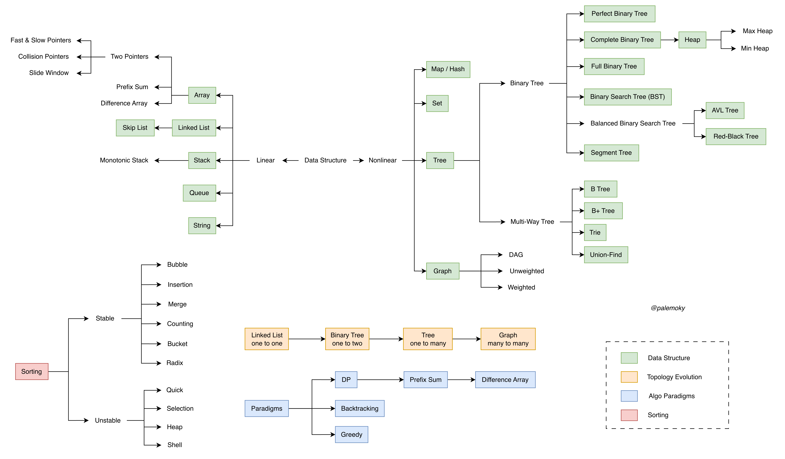

# 算法概览



随着信息社会的飞速演进，数据正以爆炸式的速度增长。为了驯服这股洪流，人类不断突破硬件极限并优化算法，催生了以 Kubernetes 为代表的分布式服务、MapReduce 为代表的分布式计算，以及 Transformer 为代表的深度学习架构。若要真正掌握这些前沿技术，必须向下扎根，深入理解底层原理。因为在任何行业中，真正的核心竞争力始终根植于对底层原理的深刻洞察——这种洞察力是 AI 无法模拟的独特智慧，也是在技术更迭中保持常青的唯一秘诀。

## 学习指南

### 为什么要学习底层原理？

学习计算机科学，应该 **追求树根而非树叶**——掌握操作系统、数据结构、算法、网络等基础知识，而非仅仅停留在上层 API 的使用。这些底层原理如同牛顿三定律之于经典力学：只要计算机仍基于[冯·诺伊曼结构](https://zh.wikipedia.org/zh-hans/%E5%86%AF%C2%B7%E8%AF%BA%E4%BC%8A%E6%9B%BC%E7%BB%93%E6%9E%84)，它们就永不过时。

**基础知识无处不在：**

- **Merkle 树**：Git 版本控制和比特币的基石
- **公钥密码学**：HTTPS 证书、加密货币、数字签名、SSH 登录
- **哈希链表**：Git 的 commit 历史、区块链的数据结构
- **B+ 树**：数据库索引的基础（MySQL InnoDB）

**从技术到哲学：**

深入学习后就会发现，许多算法思想已经上升到哲学层面：空间换时间的权衡、指针操作的精妙、Unix 的设计哲学……这些都是计算机科学中永恒的智慧。

**算法的本质就是聪明地穷举。** 我们通过组合不同数据结构的特性，聪明地穷举问题，从而找到最优解。

!!! tip "学习算法的正确心态"

    **我们是在学习算法，而非发明算法。** 遇到不会的题目，直接看题解或教程是正确的学习方式——许多精妙的算法思想确实难以独立想出。

### 如何高效学习算法？

**1. 利用优质资源**

互联网上有丰富的可视化教程和讲解：

**可视化工具：**

- [算法可视化](https://algorithm-visualizer.org/) / [Visualgo](https://visualgo.net/) - 动态演示算法执行过程
- [视频动画讲解](https://space.bilibili.com/401399175) / [算法小抄](https://space.bilibili.com/14089380/) / [代码随想录](https://space.bilibili.com/525438321) - B站优质教程

**文字教程：**

- [Hello 算法](https://www.hello-algo.com/) - 动画图解、能运行、可提问
- [Labuladong 算法小抄](https://labuladong.online/) - 框架思维、通俗易懂

**2. 先广度后深度**

**第一遍：快速过一遍主要算法类型**

- 建立全局认知：知道每种算法解决什么问题
- 克服畏难情绪：**畏难源于未知，把未知变为已知，难度自然降低**

**第二遍：针对性练习**

- 理解算法原理
- 大量刷题巩固

**3. 正确认识难度**

算法并不难，难的是克服自己的畏难情绪。只要理解原理 + 大量练习，就能掌握。

---

## 核心思维与技巧

### 核心思维模式

1.  **空间换时间**：
    - **数据结构**：哈希表、前缀和、差分数组、记忆化 (DP)。
    - **系统设计**：Buffer (平滑抖动)、Cache (避免重复计算)。
    - **核心**：利用额外存储减少重复计算或加速访问。

2.  **公式推导四步法**：
    1.  **目标**：求什么？
    2.  **变量**：哪些参数在变？
    3.  **时机**：变量何时变化？
    4.  **终止**：何时结束？

3.  **手动模拟 (Visualization)**：
    - 思路卡壳时，**手动模拟小数据**。
    - 画出执行过程：递归树、DP 状态表、指针移动轨迹。

### 工程实践与边界控制

1.  **边界条件检查清单**：

    | **通用边界**                                                         | **特定结构边界**                                                                                 |
    | :------------------------------------------------------------------- | :----------------------------------------------------------------------------------------------- |
    | □ 空 / nil / 0<br>□ 单元素<br>□ 双元素<br>□ 极值 (Max/Min)<br>□ 负数 | □ **树**：空树、单侧树<br>□ **链表**：环、断链<br>□ **串**：回文、字符集<br>□ **图**：孤岛、自环 |

2.  **向上取整 (Ceil) 技巧**：
    在分页 (Page), 分块 (Chunk)时，经常需要计算 $a/b$ 的 **向上取整** 结果（比如10条数据，每页3条，需要分4页）。相比于转换浮点数调用 `math.Ceil`，使用纯整数运算不仅 **性能更高**，且能彻底避免浮点数 **精度丢失** 的风险。

    对于正整数 $a > 0, b > 0$，有两种常见公式：

    | 公式类型            | 核心公式          | 优点           | 缺点/限制                  |
    | :------------------ | :---------------- | :------------- | :------------------------- |
    | **经典公式** (推荐) | `(a + b - 1) / b` | 兼容 $a=0$     | $a$ 接近 MaxInt 时可能溢出 |
    | **防溢出公式**      | `(a - 1) / b + 1` | **无溢出风险** | $a=0$ 时结果错误 (算成1)   |

    **代码示例**：

    ```go
    // 方式一：适用于绝大多数场景（兼容 total=0）
    pageCount := (total + pageSize - 1) / pageSize

    // 方式二：适用于 total 可能非常大且确保 > 0 的场景
    pageCount := (total - 1) / pageSize + 1
    ```

### 编码小技巧

1.  **方向反转变量**：
    - 场景：Z 字形变换、往复运动。
    - 技巧：用 `dir = -1` 配合 `dir = -dir` 替代复杂的 `if-else`。

    ```go
    d := -1
    if i == 0 || i == n-1 { d = -d }
    ```

2.  **逆序修改**：
    - 场景：数组原地移除元素、合并两个有序数组。
    - 技巧：**从后往前** 遍历/填充，避免覆盖未处理元素。

---

## 基础概念

### 指针

指针在计算机中是非常重要的概念，是链表、树、图等重要数据结构的基础。用好指针，不仅能写出高效的代码，也能避免一些常见的错误。

在编程中，对于大的数据对象，采用的也是指针传递。即使普通的变量，在被垃圾回收时，也只是删除了指针，而被使用的内存数据不会被删除（即脏数据），因此每次创建变量时，都需要初始化为干净的内存空间，避免使用脏数据。

### 数组与链表

我们可以把数组想象为一排紧密排列的储物柜，每个储物柜中都可以存储数据。因为柜子是连续摆放的，我们只要知道了这一排柜子的起始位置，就能以 $O(1)$ 的时间复杂度直接计算出任意一个柜子的位置。
而链表则像是一个寻宝游戏。每个藏宝点（节点）里都放着一张纸条，指引你下一个藏宝点在哪里。这些点分散在地图的各个角落（内存非连续），你必须从起点开始，顺着线索一步步寻找，无法直接“空降”到终点。
有了储物柜这个例子，就非常好理解为什么数组下标从 0 开始：**下标代表的是“偏移量”（即需要走的步数）**。

- 访问第一个元素，意味着站在原地不动，偏移量为 0。
- 访问第二个元素，需要走 1 步，偏移量为 1。

正因为这种连续的物理结构，计算机只需知道“起点”和“步数”，就能以 $O(1)$ 的极致速度直接定位到数据：`Addr=Start+Index×Size`。

## 复杂度分析

复杂度分析是算法评估的核心工具，用于衡量算法在 **输入规模趋向无穷大时** 的资源消耗趋势，而非具体的执行时间或内存数值。我们用 **大 O 符号（Big-O）** 表示渐近上界，忽略常数系数与低阶项，通常从**时间**和**空间**两个维度评估算法性能：

| 复杂度        | 名称       | 典型场景（时间）               | 典型场景（空间）                                      |
| :------------ | :--------- | :----------------------------- | :---------------------------------------------------- |
| $O(1)$        | 常数阶     | 哈希表查找、数组随机访问       | 原地算法：双指针、位运算                              |
| $O(\log n)$   | 对数阶     | 二分查找、平衡 BST 操作        | 递归深度为 $\log n$：二分递归、平衡树操作             |
| $O(n)$        | 线性阶     | 单次遍历数组、链表             | 辅助数组、哈希表、BFS 队列、递归深度为 $n$ 的链表遍历 |
| $O(n \log n)$ | 线性对数阶 | 归并排序、堆排序、快速排序期望 | 归并排序的递归展开（同时保留各层临时数组）            |
| $O(n^2)$      | 平方阶     | 冒泡排序、暴力双重循环         | DP 二维状态表、邻接矩阵                               |
| $O(2^n)$      | 指数阶     | 子集枚举、暴力回溯             |
| $O(n!)$       | 阶乘阶     | 全排列暴力枚举                 |

<figure markdown>
  { width=50% }
</figure>

#### 复杂案例分析

**案例 1：最近公共祖先（LCA）+ 路径查询**

给定一棵 $n$ 个节点的树和 $q$ 次路径查询，用**倍增法**预处理：

- 预处理：$O(n \log n)$（对每个节点记录 $\log n$ 级祖先）
- 单次查询：$O(\log n)$（二进制提升跳祖先）
- 总复杂度：$O((n + q) \log n)$

当 $q \approx n$ 时可以简写为 $O(n \log n)$；当 $q \gg n$ 时主项是 $O(q \log n)$。

**案例 2：滑动窗口 + 有序集合（单调队列）**

在长度为 $n$ 的数组上，用大小为 $k$ 的滑动窗口求每个窗口的最大值：

- **暴力**：每个窗口线性扫描 → $O(nk)$
- **单调队列**：每个元素最多入队、出队各一次 → $O(n)$
- **有序集合（如平衡 BST）**：每次插入/删除 $O(\log k)$，共 $n$ 次 → $O(n \log k)$

**案例 3：矩阵二分搜索**

在 $m \times n$ 的"行列均有序"矩阵中搜索目标值：

- **二分每行**：对 $m$ 行各做一次 $O(\log n)$ 二分 → $O(m \log n)$
- **Z 字形遍历**（从右上角开始）：每步排除一行或一列 → $O(m + n)$

这说明同一问题可因算法选择而产生截然不同的复杂度。

**案例 4：Dijkstra 最短路径**

图有 $V$ 个顶点、$E$ 条边：

- **暴力实现**（邻接矩阵）：$O(V^2)$
- **优先队列（二叉堆）实现**：每次松弛入堆 $O(\log V)$，最多 $E$ 次松弛 → $O((V + E) \log V)$
- **斐波那契堆**：减少 `decrease-key` 代价 → $O(E + V \log V)$

稀疏图（$E \approx V$）用堆优化更佳；稠密图（$E \approx V^2$）暴力实现反而更优。

**案例 5：外排序 / K 路归并**

将 $n$ 条数据分成 $k$ 路有序子序列后做归并：

- 每次从 $k$ 路中取最小值（用大小为 $k$ 的小顶堆）：$O(\log k)$
- 共取 $n$ 次：$O(n \log k)$

当 $k = n^{1/2}$ 时，复杂度约为 $O(n \log \sqrt{n}) = O(\frac{n}{2} \log n)$，常用于磁盘外排序场景。

!!! note "时间与空间的权衡"

    复杂度优化往往是**空间换时间**的博弈：

    - 记忆化搜索（Memoization）：$O(n^2)$ 时间 + $O(n^2)$ 空间，换掉指数级暴力；
    - 前缀和：$O(n)$ 预处理空间，换掉每次区间查询的 $O(n)$ 时间；
    - 将归并排序的 $O(n)$ 辅助空间省掉，代价是实现复杂度大幅上升。
