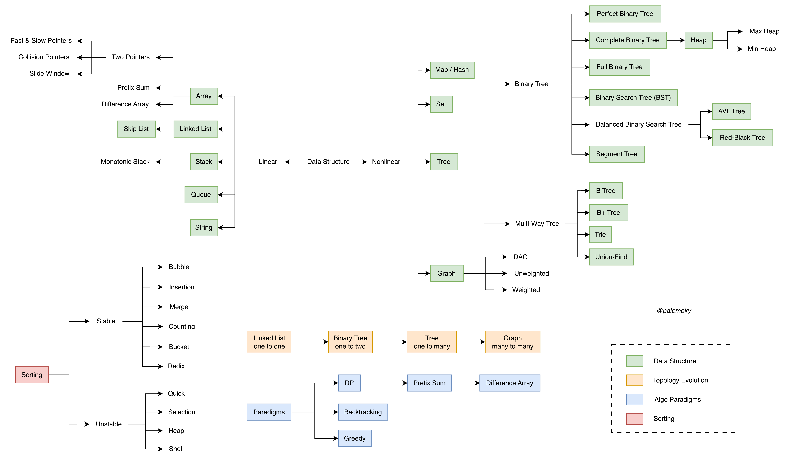
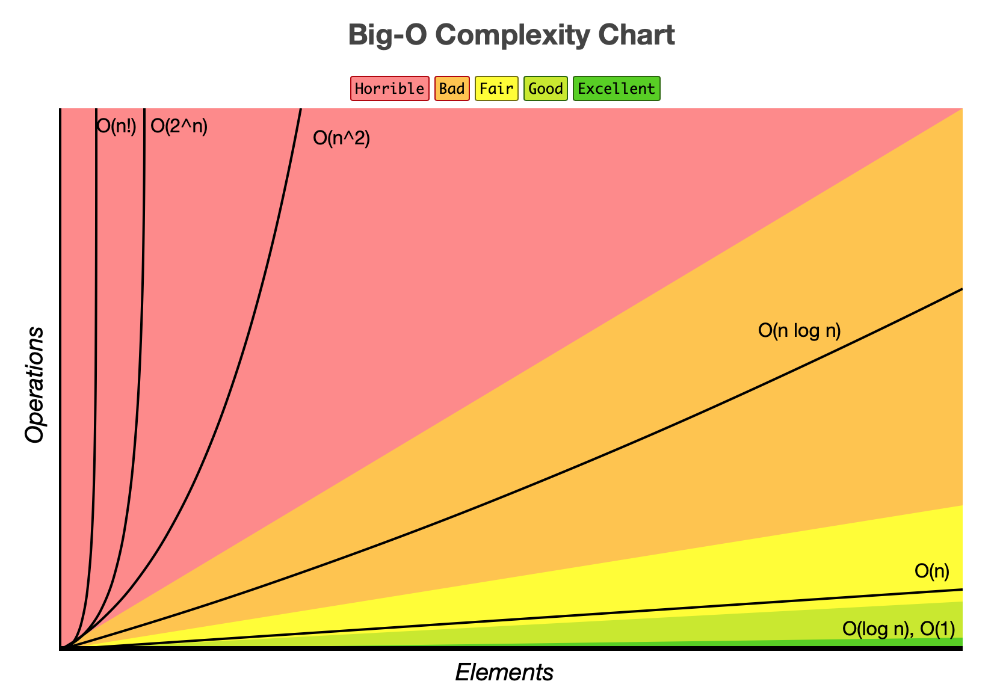

# 算法概览

> **算法的本质就是聪明地穷举。** 我们通过组合不同数据结构的特性，聪明地穷举问题，从而找到最优解。

随着信息社会的飞速发展，数据正以爆炸式的速度增长。为了驾驭这股数据洪流，人类从硬件和软件两个维度不断突破性能瓶颈：

- **硬件**
    - **CPU**：从最初厘米级的电子管到如今 2nm 的数百亿个晶体管的大规模集成电路；主频从 740 kHz 提升到 6 GHz；架构从单核演进到多核，再到性能核心（P-Core）与能效核心（E-Core）的精细化分工
    - **GPU**：从集成显卡到独立显卡，再到 AI 训练与推理专用 GPU
    - **异构计算**：从 CPU 通用计算，到 GPU 并行加速，再到 NPU 等专用芯片的协同
- **软件**
    - 高效的算法将运算量指数级降低
    - 并发编程与异步编程充分利用多核与 I/O 等待
    - 以容器化技术为代表的分布式服务实现弹性扩缩容
    - 以 MapReduce 为代表的分布式计算框架将海量数据分而治之

在以上所有手段中，**算法的 ROI 是最高的**——选择正确且高效的算法，不仅能大幅提升代码执行效率，甚至能显著缩减所需的服务器规模与运营成本。

## 学习指南

### 为什么要学习数据结构与算法？

既然算法的 ROI 最高，那为什么很多人仍然觉得它"学了用不上"？

原因在于，算法并非孤立的解题技巧，而是深深扎根于计算机科学的基础体系之中。学习计算机科学，应该**追求树根而非树叶**——掌握操作系统、数据结构与算法、计算机网络等基础知识，而非仅仅停留在 API 调用和追随技术潮流。这些底层原理如同牛顿三定律之于经典力学：只要计算机仍基于[冯·诺伊曼结构](https://zh.wikipedia.org/zh-hans/%E5%86%AF%C2%B7%E8%AF%BA%E4%BC%8A%E6%9B%BC%E7%BB%93%E6%9E%84)运行，它们就永不过时。掌握了它们，便能读懂各种技术的工作原理，并快速适应层出不穷的新技术。

**数据结构无处不在：**

我们在日常开发中频繁使用的工具，底层都离不开经典的数据结构与算法：

- **哈希表**：几乎所有语言的 Map / Set 实现、数据库哈希索引、DNS 缓存
- **B+ 树**：MySQL InnoDB 索引、文件系统目录结构（NTFS、ext4）
- **红黑树**：Linux CFS 进程调度器、Java `TreeMap`、C++ `std::map`
- **跳表**：Redis 有序集合（ZSet）的底层实现
- **Merkle 树**：Git 内容寻址存储、比特币交易验证
- **布隆过滤器**：Redis 缓存穿透防护、Chrome 恶意网址检测
- **图算法**：地图导航（Dijkstra）、社交推荐（BFS）、搜索引擎排名（PageRank）
- **Trie 前缀树**：搜索引擎自动补全、路由器 IP 最长前缀匹配

**从技术到哲学：**

深入学习后会发现，许多算法思想已上升到哲学层面——空间换时间（哈希表、记忆优化的递归等）的权衡、指针操作的精妙、数学公式跳过遍历一步直达、Unix 的设计哲学……这些思想渗透在各种软件的底层实现中。融会贯通这些思想，才能真正设计与编写出高质量的代码。

### 如何高效学习算法？

**1. 利用优质资源**

互联网上有丰富的可视化教程和讲解：

**可视化工具：**

- [算法可视化](https://algorithm-visualizer.org/) / [Visualgo](https://visualgo.net/) - 动态演示算法执行过程
- [视频动画讲解](https://space.bilibili.com/401399175) / [算法小抄](https://space.bilibili.com/14089380/) / [代码随想录](https://space.bilibili.com/525438321) - B 站优质教程

**文字教程：**

- [Hello 算法](https://www.hello-algo.com/) - 动画图解、能运行、可提问
- [Labuladong 算法小抄](https://labuladong.online/) - 框架思维、通俗易懂

**2. 先广度后深度**

**第一遍：快速过一遍主要算法类型**

- 建立全局认知：知道每种算法解决什么问题
- 克服畏难情绪：**畏难源于未知，把未知变为已知，难度自然降低**

**第二遍：针对性练习**

- 理解算法原理
- 大量刷题巩固

**3. 正确认识难度**

算法并不难，难的是克服自己的畏难情绪。我们是在**学习算法，而非发明算法。**许多算法思想是图灵奖得主耗费多年才得出的，我们只需理解、应用即可。绝大多数算法难在没有见过，以及是否熟练，相信大力出奇迹。

**4. 善用AI**

AI 的普及，极大的降低了学习的门槛，遇到困难时，随时让 AI 为我们讲解难以理解的算法，它会耐心解答我们的各种疑问，并结合一些视频讲解，直至理解为止。

**5. 手动模拟**

代码是动态执行的，我们可以通过手动模拟执行过程来梳理思路，比如指针如何移动，递归何时结束等。

---

## 复杂度分析

复杂度分析是算法评估的核心工具，用于衡量算法在 **输入规模趋向无穷大时** 的资源消耗趋势，而非具体的执行时间或内存数值。我们用 **大 O 符号（Big-O）** 表示渐近上界，忽略常数系数与低阶项，通常从**时间**和**空间**两个维度评估算法性能：

| 复杂度        | 名称       | 典型场景（时间）               | 典型场景（空间）                                      |
| :------------ | :--------- | :----------------------------- | :---------------------------------------------------- |
| $O(1)$        | 常数阶     | 哈希表查找、数组随机访问       | 原地算法：双指针、位运算                              |
| $O(\log n)$   | 对数阶     | 二分查找、平衡 BST 操作        | 递归深度为 $\log n$：二分递归、平衡树操作             |
| $O(n)$        | 线性阶     | 单次遍历数组、链表             | 辅助数组、哈希表、BFS 队列、递归深度为 $n$ 的链表遍历 |
| $O(n \log n)$ | 线性对数阶 | 归并排序、堆排序、快速排序期望 | 归并排序的递归展开（同时保留各层临时数组）            |
| $O(n^2)$      | 平方阶     | 冒泡排序、暴力双重循环         | DP 二维状态表、邻接矩阵                               |
| $O(2^n)$      | 指数阶     | 子集枚举、暴力回溯             |
| $O(n!)$       | 阶乘阶     | 全排列暴力枚举                 |

<figure markdown>
  { width=50% }
</figure>
