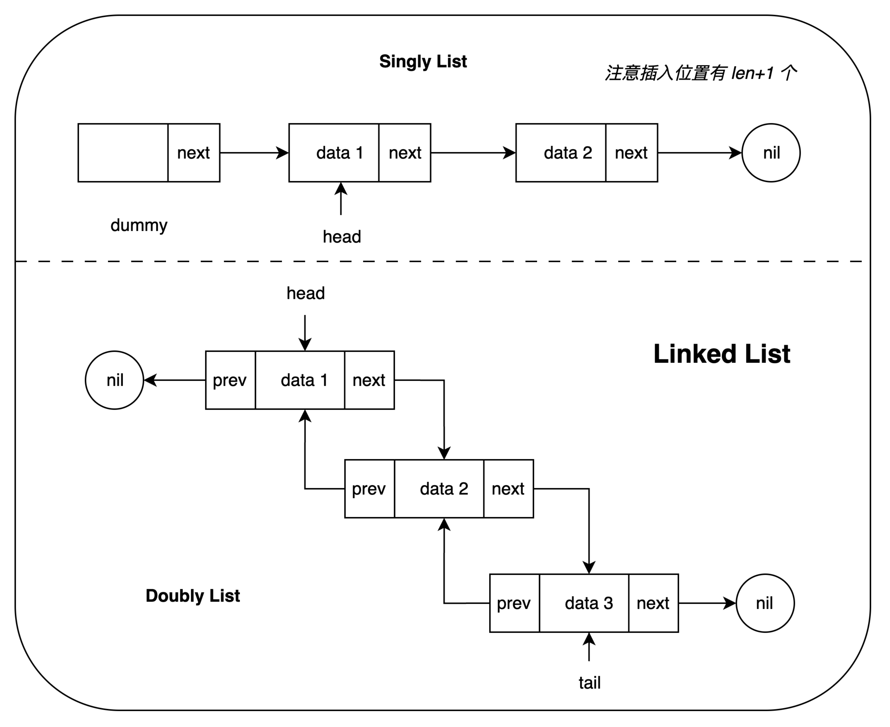

### 链表知识体系与操作指南

本指南旨在全面覆盖链表的核心知识，从基础操作原则到经典算法题型，帮助你构建一个完整、健壮的链表知识体系。

<p align="center">
    
</p>

---

### 第一部分：核心操作原则

在解决任何链表问题之前，请务必掌握以下基本原则和工具。

#### 1. 核心概念

**1.1. 判空 (Emptiness Check)**

- 判断链表是否为空，**唯一正确**的方式是检查头指针：`head == nil`。

**1.2. 虚拟头节点 (Dummy Node)**

- **是什么**：一个位于实际头节点之前的辅助节点。
  ```go
  // 创建一个 dummy 节点，并让它的 Next 指向真正的头节点
  dummy := &ListNode{Next: head}
  ```
- **为什么用**：为了**统一对头节点和非头节点的处理逻辑**。当操作（尤其是插入/删除）可能发生在链表头部时，使用 dummy 节点可以避免编写繁琐的 `if-else` 分支来处理头节点的特殊情况。
- **何时用**：当你发现需要为“操作发生在头部”编写特殊逻辑时，就是引入 dummy 节点的最佳时机。
- **最后一步**：dummy 节点只是一个临时辅助工具，不应成为链表的一部分。操作完成后，**必须返回 `dummy.Next`** 作为新的头节点。

---

#### 2. 核心操作：遍历 (Traversal)

选择正确的遍历条件是链表操作的关键，它决定了你的循环能访问到哪些节点以及循环结束时指针的状态。

| 特性               | `for current != nil` (访问到尾)                   | `for current.Next != nil` (访问到尾前)                                            |
| :----------------- | :------------------------------------------------ | :-------------------------------------------------------------------------------- |
| **循环体访问范围** | 能访问到**所有节点**，包括最后一个。              | 能访问到**除最后一个节点外**的所有节点。                                          |
| **循环结束时状态** | `current` 变为 `nil`。                            | `current` 指向**最后一个节点**。                                                  |
| **主要用途**       | **读取/处理**每个节点的值（如打印、查找、计数）。 | **修改/操作**节点间的链接（如删除、插入）。因为你需要访问到目标节点的前一个节点。 |
| **安全检查**       | 只需在循环前检查 `head == nil`。                  | 必须检查 `head == nil` **和** `head.Next == nil` (即空链表和单节点链表)。         |

---

#### 3. 核心操作：修改 (Modification)

**3.1. 指针操作顺序**

- 在修改 `next` 或 `prev` 指针时，务必**先连接新指针，再断开旧指针**。
- **黄金法则**：确保在覆盖一个指针（如 `node.Next = ...`）之前，所有依赖它的操作（如需要通过 `node.Next` 访问下一个节点）都已完成。画图是避免错误的最好方法。

**3.2. 插入位置的理解**

- 一个长度为 `len` 的链表，有 `len + 1` 个可供插入的位置（从头部之前到尾部之后）。
- 当题目描述“在索引 `i` 处插入”时，通常意味着将新节点插入到原索引 `i-1` 和 `i` 的节点之间。

---

#### 4. 特殊链表：双向链表 (Doubly Linked List)

双向链表在单链表的基础上，增加了对头/尾节点的管理和反向指针 `prev`，需要额外关注：

1.  **头尾指针更新**：对头节点的操作必须更新 `list.Head`；对尾节点的操作必须更新 `list.Tail`。
2.  **指针更新**：修改一个节点时，通常需要更新 **4 个指针**（前一个节点的 `next`，后一个节点的 `prev`，以及新节点自身的 `next` 和 `prev`）。顺序至关重要。
3.  **高效遍历**：如果需要访问索引为 `i` 的节点，可以利用 `list.Len` 进行优化：如果 `i < len/2`，从头部开始遍历；否则，从尾部开始遍历。

---

#### 5. 编码与测试最佳实践

编写链表代码时，你的脑海中必须时刻浮现以下**边界条件清单**：

- **空链表** (`head == nil`)：你的代码能否优雅地处理这种情况？
- **单节点链表** (`head.Next == nil`)：插入、删除或反转操作是否正确？
- **头节点操作**：当要修改的第一个节点就是头节点时，逻辑是否正确？（`dummy` 节点能很好地解决这个问题）
- **尾节点操作**：当要修改的是最后一个节点时，逻辑是否正确？
- **无效输入**：如果题目允许（例如，`n` 超出链表长度），你的代码是否能处理？

---

### 第二部分：经典链表算法题型目录

以下是常见的链表算法题型，以及它们通常应用到的核心原则。

#### 1. 数据结构实现 (基础)

设计一个链表类时，通常需要实现以下基础接口：

- **创建**: `NewList()`
- **添加**: `Prepend(v)`, `Append(v)`, `Insert(idx, v)`
- **删除**: `RemoveFirst()`, `RemoveLast()`, `RemoveAt(idx)`, `RemoveByValue(v)`
- **查询**: `Get(idx)`, `Find(v)`, `Size()`
- **工具**: `Traversal()` / `Print()`

#### 2. 核心算法

##### **反转链表 (Reverse List)**

- **描述**: 将链表 `A->B->C` 变为 `C->B->A`。
- **常见解法**: 迭代法 (使用 prev, current, next 三指针)；递归法。
- **关键技巧**: 指针操作顺序。
- **题目**: [反转链表](../../../solutions/0206_reverse_linked_list/reverse_linked_list.go)

##### **查找中间节点 (Find Middle Node)**

- **描述**: 找到链表的中间节点，若有两个中间节点，则返回第二个。
- **常见解法**: 数组长度的一半或快慢指针法 (慢指针走一步，快指针走两步)。
- **关键技巧**: 快慢指针。
- **题目**: [查找链表的中间节点](../../../solutions/0876_middle_of_the_linked_list/middle_of_the_linked_list.go)

##### **删除倒数第 N 个节点 (Remove Nth Node From End)**

- **描述**: 删除从链表末尾数的第 N 个节点。
- **常见解法**: 快慢指针法 (快指针先走 N 步，然后快慢指针同步前进，直到快指针到达末尾)。
- **关键技巧**: 快慢指针、虚拟头节点 (因为可能删除头节点)。
- **题目**: [删除链表倒数第 N 个节点](../../../solutions/0019_remove_nth_node_from_end_of_list/remove_nth_node_from_end_of_list.go)

##### **删除链表中的重复元素 (Remove Duplicates)**

- **描述**: 从链表中移除重复的节点。
- **常见解法**:
  - **已排序链表**: 一次遍历，比较 `current` 和 `current.Next` 的值。
  - **未排序链表**: 需要额外空间 (如哈希表) 记录已出现的元素。
- **关键技巧**: 遍历条件 (`current.Next != nil`)、哈希表。
- **题目**: 

##### **链表排序 (Sort List)**

- **描述**: 对链表进行排序。
- **常见解法**: 归并排序是链表的最佳选择，利用“查找中间节点”和“合并两个有序链表”作为子问题。
- **关键技巧**: 递归、快慢指针、合并操作。
- **题目**: 

##### **链表分区 (Partition List)**

- **描述**: 给定值 x，将所有小于 x 的节点排在大于或等于 x 的节点之前。
- **常见解法**: 创建两个新链表（一个放小数，一个放大数），遍历原链表，最后拼接。
- **关键技巧**: 虚拟头节点 (为两个新链表创建)。
- **题目**: 

##### **旋转链表 (Rotate List)**

- **描述**: 将链表每个节点向右移动 k 个位置。
- **常见解法**: 计算长度 `len`，将链表连成环，然后找到新的头节点和尾节点，在正确位置断开。
- **关键技巧**: 环形链接、取模运算 (`k = k % len`)。
- **题目**: 

#### 3. 多链表交互

##### **合并两个有序链表 (Merge Two Sorted Lists)**

- **描述**: 将两个已排序的链表合并成一个仍然有序的新链表。
- **常见解法**: 迭代法；递归法。
- **关键技巧**: 虚拟头节点 (用于构建新链表)、双指针比较。
- **题目**: [合并两个有序链表](../../../solutions/0021_merge_two_sorted_lists/merge_two_sorted_lists.go)

##### **判断两个链表是否相交 (Intersection of Two Lists)**

- **描述**: 找出两个单向链表的第一个公共节点。
- **常见解法**: 双指针法 (指针 A 走完链表 A 后指向链表 B 的头；指针 B 同理。若相交，两指针必会在交点相遇)。
- **关键技巧**: 精巧的双指针运用。
- **题目**: 

##### **两个链表所代表的数相加 (Add Two Numbers)**

- **描述**: 每个节点存一位数，将两个链表代表的整数相加。
- **常见解法**: 模拟手动加法，同时遍历两个链表，处理进位。
- **关键技巧**: 虚拟头节点 (用于构建结果)、进位变量。
- **题目**: 

#### 4. 环形链表

##### **判断链表是否有环 (Linked List Cycle)**

- **描述**: 检测链表中是否存在一个环。
- **常见解法**: 快慢指针法 (若有环，快慢指针必相遇)。
- **关键技巧**: 快慢指针。
- **题目**: [判断链表是否有环](../../../solutions/0141_linked_list_cycle/has_cycle.go)

##### **找到环的入口节点 (Linked List Cycle II)**

- **描述**: 如果链表有环，找出环的起始节点。
- **常见解法**: 在快慢指针相遇后，将一个指针放回头节点，然后两个指针都以步速 1 前进，再次相遇点即为入口。
- **关键技巧**: 快慢指针的数学性质。
- **题目**: [找到环形链表的入口](../../../solutions/0142_find_linked_list_cycle_entry/detect_cycle.go)

---

### 第三部分：高级技巧与思维模型

掌握了基础操作和经典题型后，以下思维模型和策略将帮助你应对更复杂或陌生的链表问题。

#### 6. 思维模型：像指针一样思考 (Thinking in Pointers)

链表问题的核心是管理内存地址的引用。你需要建立一个“指针心智模型”：

- **变量不是容器，而是标签**：在 `current = current.Next` 中，你没有“移动”任何东西。你只是把 `current` 这个标签从一个内存地址“撕下来”，贴到了下一个内存地址上。原来的节点依然存在，只是 `current` 不再指向它了。
- **警惕“幽灵引用”**：当你断开一个链接时（如 `prev.Next = current.Next`），`current` 节点可能仍然被其他指针引用（例如，快指针）。理解谁还“持有”着哪个节点是避免逻辑错误的关键。
- **画图，画图，再画图**：这是处理链表问题 **最重要、最有效** 的方法。在白板或纸上画出节点和指针，模拟每一步操作。这能将抽象的指针操作具象化，帮你发现逻辑漏洞。

#### 7. 通用解题策略 (A General Problem-Solving Strategy)

当你遇到一个不熟悉的链表问题时，可以遵循以下步骤：

1.  **明确目标与约束**：仔细阅读题目，你需要原地修改（in-place）吗？空间复杂度有要求吗？
2.  **可视化“快乐路径”**：画一个包含 4-5 个节点的“标准”链表，手动模拟算法的每一步，确保核心逻辑正确。
3.  **主动攻击边界条件**：用你在第一部分学到的“边界条件清单”来审视你的算法：
    - 如果输入是 `nil` 会怎样？
    - 如果只有一个节点会怎样？
    - 你的算法是否需要处理头/尾节点？
4.  **选择你的工具**：
    - 需要处理头节点吗？ -> **虚拟头节点 (Dummy Node)**
    - 需要找到中点/环/倒数第 N 个吗？ -> **快慢指针**
    - 问题具有“子问题”的特征吗？（例如，反转 `head.Next` 是反转 `head` 的一部分）-> **递归**
5.  **编写代码并验证**：在写代码时，脑海中要时刻想着指针的移动。写完后，再次用你的图和边界条件来“跑”一遍代码。
6.  **检查返回值**：如果使用了 dummy 节点，记得返回 `dummy.Next`。

#### 8. 核心模式：递归 (The Recursive Pattern)

递归是解决链表问题的一种非常优雅的方式。其核心思想是：

- **定义函数功能**：明确你的递归函数 `doSomething(head)` 要完成什么任务。例如，“反转从 `head` 开始的链表，并返回新的头节点”。
- **找到基本情况 (Base Case)**：递归的终点是什么？对于链表，通常是 `head == nil` 或 `head.Next == nil`。
- **处理递归步骤 (Recursive Step)**：假设 `doSomething(head.Next)` 已经完美地完成了它的任务（例如，返回了反转后的子链表的头节点），你现在只需要处理 `head` 节点和这个已经处理好的子问题之间的关系。

**应用范例**：反转链表、合并两个有序链表。

#### 9. 补充经典题型 (Additional Classic Patterns)

这些问题通常是多个基础技巧的组合，非常适合检验你的综合能力。

##### **回文链表 (Palindrome Linked List)**

- **描述**: 判断一个链表是否是回文串（例如 `1->2->2->1`）。
- **关键技巧**: 这是一个组合拳：
  1.  用**快慢指针**找到链表中点。
  2.  将链表的后半部分**反转**。
  3.  逐一**比较**前半部分和反转后的后半部分。
  4.  (可选) 将链表恢复原状。

##### **复制带随机指针的链表 (Copy List with Random Pointer)**

- **描述**: 链表每个节点除了有 `next` 指针，还有一个 `random` 指针，可以指向链表中的任意节点或 `nil`。要求深拷贝这个链表。
- **关键技巧**: 如何在复制节点的同时，正确设置 `random` 指针？
  - **哈希表法**: 用哈希表存储 `<原节点, 新节点>` 的映射。第一次遍历创建所有新节点，第二次遍历根据哈希表设置 `next` 和 `random` 指针。
  - **原地修改法 (O(1) 空间)**: 1. 在每个原节点后插入其复制节点 (`A->A'->B->B'`)。 2. 设置复制节点的 `random` 指针 (`node'.random = node.random.next`)。 3. 拆分两个链表。

##### **扁平化多级双向链表 (Flatten a Multilevel Doubly Linked List)**

- **描述**: 一个双向链表，部分节点可能还有一个 `child` 指针，指向另一个双向链表。要求将所有链表“扁平化”成一个单一的双向链表。
- **关键技巧**: 深度优先搜索（DFS）。可以使用递归或迭代（配合栈）来遍历 `child` 指针，并进行链表的拼接。

### Todo

- [ ] 部分反转链表
- [ ] 重排链表
- [ ] 两个链表的第一个公共节点
- [ ] 合并 K 个有序链表
- [ ] 回文链表
- [ ] 链表的两数相加
